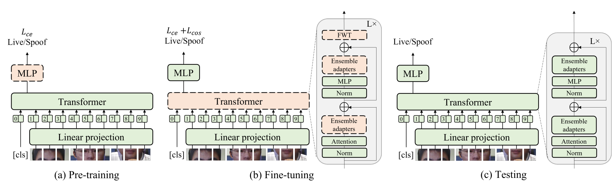
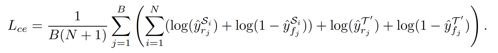
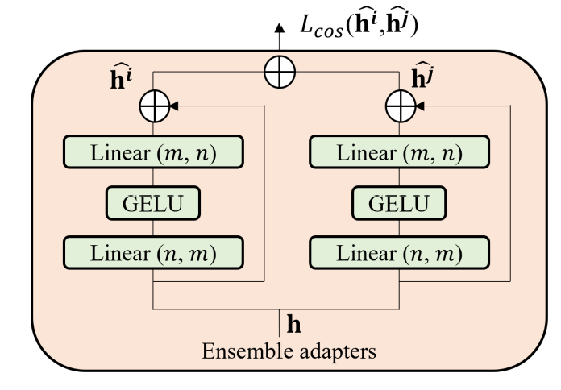
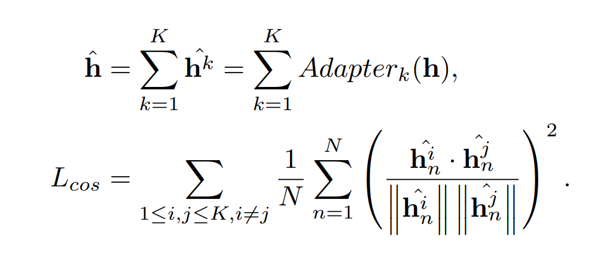
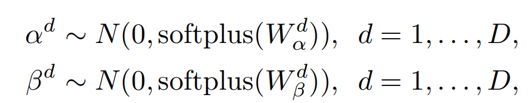
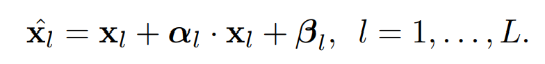

# [Adaptive Transformers for Robust Few-shot Cross-domain Face Anti-spoofing]

최신 FAS 방식은 intra-domain에서는 성능이 좋게나온다. 하지만, cross-domain의 경우에는 결과가 좋지않은 경우가 많다. Robust한 퍼포먼스를 내기 위해선 dataset이 다양한 이미지를 가지고 있어야 한다. 이러한 이미지들은 다양한 센서들로 찍은 복잡한 배경의 이미지여야 한다.

저자는 robust한 FAS를 위해서 adaptive vision Transformer를 소개한다. ViT를 backbone으로 사용하고, ensemble adapter module과 feature-wise transformation layer를 소개한다.

# Introduction

얼굴인식 프로그랭은 같은 센서를 사용하는 제한된 환경에서의 작동을 기반으로 한다. 하지만, 얼굴 이미지가 사용되는 상황은 더 다양하다. 랜즈의 화각이나, 장면의 복잡도, 다양한 기기를 사용할 수 있다. 이러한 다양한 이미지는 mixed data domain이라고 표현할 수 있다.

현재 대부분의 방식은 크게 두가지로. intra-database testing과 Cross-database testing으로 나눠진다. Intra-database testing은 intra-domain에서, Cross-database testing은 cross-domain에서의 Face-Antispoofing을 한다. 조금만 더 자세하게 설명하면 intra-database training을 Training과 evaluation을 같은 domain안에서 하는 방식이다. 하지만 cross-database testing의 경우 다양한 database어서 훈련과 실험을 하는 방식입니다.

최근 intra-database에서의 성능은 최대치에 근접하게 나온다. 이는 재한된 상황헤서잘 evaluate한다는 뜻입니다. 이에 관하여 종은 접근은 많았지만, 이러한 방식들은 cross-database test에서 졸은 결과가 나오지 못합니다.

Cross-domain face anti-spoofing을 할 때, 여러가지 어려운 점이 있습니다.
* **Domain Gap** : Domain Gap은 spoof를 알아차리는 key factor인 visual appearance와 강하게 연관되어 있습니다. Spoofing cue는 다른 camera, illumination, 그리고, 이미지 해상도에 따라 갑작스럽게 변하거나, 사라집니다.
* **Limited Data** :다른 vision task와 비교해보면, FAS dataset은 양이 적다. 적은 데이터로 훈련한 모델은 overfitting이 잘 일어난다. 그래서, 다른 domain에서 일반화가 잘 되지 않는다.

이 논문의 중점은:
* Ensemble adapter를 사용하는 adaptive Tarnsformer와 feature-wise Trasformer를 소개하는 것이다. 이는 적은 이미지의 갯수로 Robust cross-domain face anti-spoofing을 위하는 것이다. 
* Benchmark Data에 Cross-domain face anti-spoofing 문제에서 SOTA를 달성하는 것이다. 이는 real-world application과 intra-database evalutation사이의 차이를 좁이는 일이다.
* Adaptive transformer에 관하여 자세하게 본석하고, model이 설명가능성을 보여주고 face anti-spoofing에 관해서 insight를 주기 위한 목적입니다.

# Related Work

**Face Anti-spoofing** 가장 처음에 있었던 방식은 연속된 사람의 행동이나 미리 정해두었던 사람의 움직임을 기반으로 얼굴이 진짜 인지 가짜인지 확인 하는 방식으로 이루어졌습니다. 하지만 이러한 방식은 영상 재생을 통해서 간단하게 뚤렸고 user interaction으로 인해서 불편함을 야기했습니다. 이러한 방식으로 사람의 특징을 잡아내는 방식으로 진화해왔습니다. 최근 DNN이 Anti-spoofing에 적용되었고 SOTA를 달성하였습니다.

하지만 제한되어 있는 spoofing 데이터로 인해서, 다앙한 supervisory signal을 보조를 사용해서 합쳤습니다. Model interpretability를 증가시키기 위해서 feature disentanglement가 Generative adversarial network의 발전과 함께 소개되었다.

Vision Transformer 기반의 model이 spoofing attack을 감지하기 ㅜ이해서 소개되었습니다. 이 논문에서는 few-shot setting을 기반으로 다양한 dataset에서 추출한 인쇄 그리고 영상 공격을 Robustly 방어하는 adaptive transformer model을 소개합니다.

**Domain generalization** FAS를 위한 Domains generalization은 다양한 데이터셋에서 받아온 정보를 이용해서 훈련하는 것과 보지 못한 타겟 데이터 셋에 대하여 일반화를 하는 것이 목표입니다. 논문에서는 real-world anti-spoofing 문제를 적은 target dataset이 적을 때를 가정하고 해결하려고 합니다. 이 논문에서는 효율적인 방식을 사용하기 위해서 adaptive transformer를 기반으로 만드려고 합니다. 

**Few-shot Learning** Few-shot learning method는 새로운 class들에 대하여 적은 셈플을 통해서 model을 적응시키는 것이 목표입니다. Cross-domain few-shot learning은 새로운 class가 data distribution이 다른 domain으로부터 sample이 된다면 새로운 문제에 직면한다고 이야기합니다. few-shot과 zero-shot에 기반한 Anti-spoofing method는 다양한 spoof 공격에 대응할 수 있도록 소개되었습니다. 하지만 Cross-domain model의 퍼포먼스는 다른 protocol에 의해 안정화가 되어있지 않습니다.

이 논문은 source domain의 data와 target domain의 적은 sample의 균형을 맞춰서 feature들을 훈련합니다. 또한 모델의 안정성을 높이기 위하여, Adapter와 feature-wise transformation을 기반으로 하는 adaptive transformer를 소개합니다.

# Model

이 논문은 다양한 dataset을 사용하는 것을 기준으로 설명합니다. 이러한 Dataset은 다양한 domain과 target dataset으로 이루어져 있습니다. 각각의 source dataset은 진짜 이미지와 가짜 이미지가 섞여 있습니다. Few-shot cross-domain anti-spoofing의 목표는 source domain의 대이터와 target domain에서 주는 작은 셈플 data를 가지고 target domain에 일반화를 잘하는 classification model을 배우는 것입니다.

## Vision Transformer

이 논문은 Vision transformer를 backbone으로 사용합니다. 입력갑은 작게 나눠지고 Flatten된 2D patch로 변화합니다. Positional Encoding은 learnable positional embeding을 사용합니다. 모델은 크게 Image representation을 얻기 위한 ViT과 classification prediction을 하기 위한 Multiple perceptron head로 이루어 져있습니다. 

각각의 Training iteration에서 sorce domain과 적은양의 target domain에서 같은 양의 live와 spoof 이미지를 추출합니다. 훈련을 할때는 Cross Entropy loss가 사용되며 그 식은 아래와 같이 정의됩니다.

여기서 B는 Sample size, N은 Source domain의 갯수, y는 예측값, S는 Source domain, T는 target Domain, R는 사실값, F는 가짜를 의미합니다.

## Ensemble Adapter

가장 기본적인 transfer learning 기술은 ImageNet으로 pretrain되어 있는 backbone이 추출한 feature를 기반으로 anti-spoofing data를 사용해서 classifier를 훈련시키는 것이다. 하지만 이러한 방식은 Face-spoofing task에 좋은 performance를 보여주지 못한다.
* 범용적인 dataset을 사용해서 pre-train된 backbone은 anti-spoofing facial data에 대하여 잘 변화하지 못합니다.
* Pre-trained backbone network가 추출하는 Feature는 High-level이다. 그렇기에 Face anti-spoofing에 잘 적용할 수 없습니다. 이는 face anti-spoofing의 경우에는 low-level information의 차이를 확인해야하기 때문입니다.

Classifier와 backbone을 anti-spoofing 데이터에 Fine-tuning하는 것이 더 좋은 결과를 가지고 옵니다. 하지만 이러한 좋은 퍼포먼스는 source domain에 한정되어 있습니다. Target domain의 경우에는 안정성이 떨어집니다.

논문은 이러한 instability에 대하여 두가지 원인이 있다고 예측합니다.
* Fine-tuning을 하면서 과거의 pre-trained한 backbone을 까먹는 다는 것입니다.
* Target sample과 source domain간의 domain gap이 큽니다. 이로 인해서 Target sample은 decision boundary 근처에 모여있게 되고 그로 인해서 uncertainty가 높습니다.

가장 기본적인 solution은 대부분의 Backbone을 고정시키고 일부분만 fine-tuning하는 것입니다.

### Adaptive module

자연어 처리에서 adapter BERT는 pre-trained된 BERT모델은 전체 모델을 훈련시키지 않고 다양한 task에 훌룡하게 적용시켰습니다. 빗스하게 이 논문에서도 adapter layer를 사용해서 안정성을 높이려고 합니다.

위의 이미지에서 adapter는 bottleneck구조로 이루어져있습니다. n dimension인 입력값은 작은 dimension인 m으로 변환을 한다. 그 후에 GELU라는 Activation fucntion을 적용합니다. 그 후에 다시 m dimension을 n dimension으로 변환합니다.

Adapter는 skip connection을 가지고 있습니다. 그렇기에 Projection head의 값을 0에 가깝게 조정하면, adapter는 identity fucntion과 거의 일치한다고 할 수 있습니다.

모델의 전체 구조를 다시 살펴보면, Adaptive module은 각각의 transformer block에 적용되었습니다. Fine-tuning stage에서, transformer backbone을 고칩니다. 그리고 adaptive module의 weight을 수정합니다. Adapter는 전체 모델에 비해서 적은 양의 parameter를 가지고 있기 대문에 optimization은 어렵지 않게 할 수 있을 것입니다.

또한 Skip-connection으로 인해서 pre-trained 모델에서 크게 벗어나지 않을 것입니다. 그렇기에 네트워크 전체가 새롭게 변하는 일은 사라지고 그로 인해서 안정성이 올라갈 것 입니다.

Adapter는 pre-trained된 transformer의 feature distribution을 FAS data에 맞게 변화합니다. Pre-trained transformer representation의 분해능과 일반화 성능을 유지할 수 있게 도와줍니다.

### Ensemble adapters and cosine similarity loss.

Ensemble adapter module은 더 높은 정확도와 훈련 불안정성을 낮춥니다. 이 논문에서는 일반적인 adapter를 ensemble adapter로 바꾸었습니다. Ensemble adapter는 K 개의 adapter를 가지고 있습니다. 각각의 ensemble adapter module에 **h** 입력을 받습니다. 그리고 각각의 출력값 **h^k**가 합쳐져 다음 레이어로 넘어갑니다.

Multiple adapter는 중복된 정보를 배웁니다. 이러한 결과는 feature의 분해능을 올리지 못하기에 성능 증가가 일어나지 않습니다.

Mulitple adapter로부터 다양한 feature를 배우기 위해서 논문은 cosine similarity loss를 사용합니다. Cosing Loss는 출력값끼리의 값이 다르도록 강제합니다. 그로인해서 다양한 feature를 배울수 있도록 만듭니다.

Cosing loss는 아래와 같이 정의 할 수 있습니다.

이 수식에서 논문은 N개의 토큰을 입력 받고 feature dimension이 D라고 가정합니다.

## Feature-wise Transformation

목표는 Source dataset과 적은 양의 target domain의 부분집합을 사용해서 Target domain에 일반화를 잘하는 모델을 만드는 것입니다. Target domain과 source domain의 데이터량의 차이때문에, 모델은 overfitting에 약합니다.

이 논문은 feature-wise transformation을 사용합니다. 이는 affine transformation을 이용하는 방식으로 scaling 하고 bias term은 Gaussian Distribution을 기반으로 만들고 있습니다.

여기서 W는 훈련가능한 sampling hyperparameter이고 D는 dimension이다. 이렇게 구해진 값을 ㅣ용해서 affine transformation을 사용해 아래와 같은 intermediate feature를 구합니다.

실제로 affine transformation을 하는 경우에는 전체 patch embedding에 같은 affine transformation을 사용합니다.

이 논문에서 FWR를 각각의 transformer block에 삽입했습니다. 하지만 FWT는 훈련할때만 사용이 되고 Testing을 할때는 사용되지 않습니다. FWT는 feature-level data-augmentation이라고 생각하면 됩니다. 이를 통해서 training sample의 다양성을 적용하도록 하는 것입니다. 이는 overfitting 문제를 줄여주고 안정성과 정확도를 올려줍니다.

## Adaptive Transformer

Adaptive transformer는 세가지 단계로 나누어져있습니다.
* Pre-training : ViT backbone을 고정한체로 ImageNet으로 pre-trained한 값을 Transfer합니다. 그리고 MLP head만 Binary Cross Entropy를 사용해서 훈련합니다.
* Fine-Tuning : Ensemble adaptor module과 FWT 레이어를 각각의 Transformer Block게 삽입합니다. 그리고 Ensemble adaptor와 FWT 레이어만 훈련합니다. 이 훈련은 Cross entropy와 Cosine loss가 변하지 않을때 까지 유지합니다.
* Testing : FWT 레이어를 제거하고 Ensemble adaptor는 유지합니다.