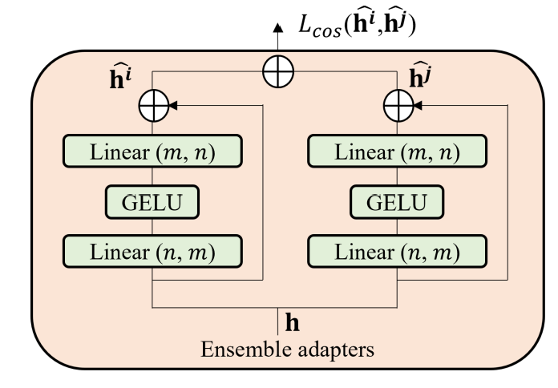

# [Adaptive Transformers for Robust Few-shot Cross-domain Face Anti-spoofing]

Recent Face anti-spoofing methods perform well under the intra-domain setups. For Robust performance, dataset should contain larger appearance variations of images with complex scenes with different sensors.

Author proposed adaptive vision transformers for robust cross-domain face anti-spoofing. Using ViT as a Backbpone, introducing ensemble adapters module and feature-wise transformation layers.

# Introduction

Face authentication is mainly applied to controlled scenarios with fixed sensors. Face images may be acquired from wider angles, complex scens and different devices, which can be regraded as a set of mixed data domains.

Existing method use intra-database testing and cross-datatbase testing to evaluate the intra-domain and cross-domain face anti-spoofing. The former one trains and evaluates models on data split from the same database, while the latter one does from different databases.

Recent methods have already shown saturated performance on intra-database evaluations in well controlled scenarios. Although significant profress has been made, existing methods do not perform well on cross-dataset tests.

There are a few challenges for cross-domain face anti-spoofing applications:
* **Domain gap** : The domain gap is highly correlated to the key factor of recognizing spoof: visual appearance. Spoofing cures can dramatically change or disappear with different camera devices, illuminations and image resolutions.
* **Limited Data** : Compared to datasets for other vision tasks, commonly used datasets for face anti-spoofing are considerably smaller in scale. Models trained with limited data can easily over-fit the training data. Therefore, the model generalize poorly to other domains.

The main contributions of of this work are:
* Proposed adaptive transformers with ensemble adapters and feature-wise transforms for robust cross-domain face anti-spoofing with a few samples.
* Achieve state-of-the-art cross-domain face anti-spoofing results on widely-used benchmark datasets. This Closes the gap between intra database evaluation and performance in real-world applications
* Conduct in-depth analysis of adaptive transformers and show model explainability with insights for face anti-spoofing.

# Related Work

**Face Anti-spoofing** Early work exploits spontaneous human behavior or predefined movements to address face interaction. Due to clear weakness in video playing attacks and inconvenience from user interaction, recent approaches evolve into modeling material properties. Recently deep neural networks have been applied to anti-spoofing and acheived state of the art performance than conventional methods

As limited spoof data is available for learning classifiers or deep neural networks, auxiliary supervisory signals have been introduced to infuse the models with prior knowledge. To improve model interpretability. feature disentanglement is proposed along with the advances in the gnerative adversarial networks

A model based on a vision transformer is proposed to detect spoofing attack. This work propose an adaptive transformer model to robustly handle challenging print and replay attacks across different datasets using a few-shot setting.

**Domain generalization** Domain generalization for face anti-spoofing aims to learn a model from multiple source datasets, and the model should generalize to the unseen target dataset. Several approaches based on adverarial training and triplet loss have been developed to learn a shared feature space for multiple source domains that can be generalized to the target domain. Meta-learning formulation are exploited to simulate the domain shift at training time to learn a representative feature space.

The paper tackle a real-world anti-spoofing problem when only a few images are available from target datasets. The paper propose an effective cross-domain few-shot framework based on an adaptive transformer that achieves state-of-the-art performance

**Few-shot Learning** Few-shot learning methods aim to adapt models to novel classes from a few samples from each class. Cross-domain few-shot learning further addresses the problem when the novel classes are sampled from a different domain with different data distribution.

Anti-spoofing methods based on few-shot and zero-shot learning are proposed to detect multiple spoof attacks. Cross-domain model performance is unstable under different protocols.

The paper proposed learn features from balanced data from the source domains and a few samples from the target domain. The paper also propose a adaptive transformer based on a adapter and a feature-wise transformation to improve model stability.

# Model

In the work, the paper assume using multiple dataset which have different doamins and one target dataset. Each source dataset consist of real and fake data. The goal of few-shot cross-domain anti-spoofing is to learn a classification model that generalize to the target domain by accessing source datasets as well as a few samples from the target set.

## Vision Transformer

The paper adopt the vision transformer as the backbone module. The input image is split and reshaped into a sequence of flattened 2D patches. For positional encoding, the paper used learnable positional embedding to the patch embedding. The paper use ViT to obtain the image representation and a multiple perceptron head to get the classification prediction.

At each training iteration, sample the same amount of live and spoof images from source domain and a small set of target domain. For training cross entropy loss is used and defined as below.

The B is the Sample size, N is the Source Domain, and y is a prediction. S is the domain for source, and T is for target. r is real, and f is false.

## Ensemble Adapter

