# [Deep Learning for Face Anti-Spoofing: A Survey](https://arxiv.org/pdf/2106.14948.pdf)

# Introduction

Face Recognition은 Presentation Attack에 취약합니다. 이러한 공격의 종류들로는 인쇄된 매체들, 또는 디지털 영상, 화장, 그리고 3D 마스크 등이 있습니다. 안전한 Face Recognition system을 만들기 위해서 수많은 연구원들이 PAs를 막기 위해서 노력하고 있습니다.

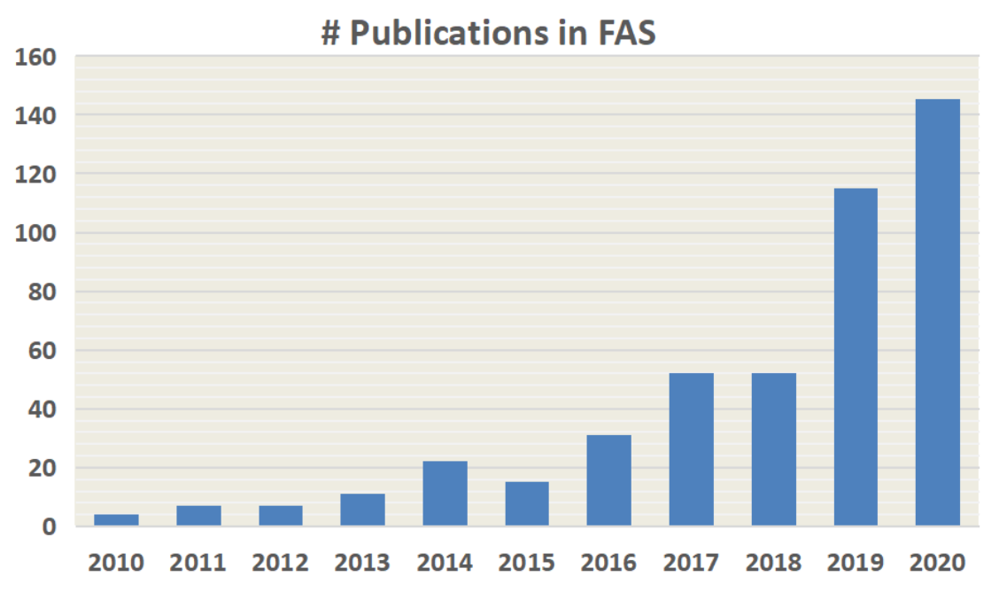

위의 그래프에서 확인 할 수 있다 싶이, 최근 몇년간 나온 논문의 수가 증가한 것을 확인 할 수 있습니다.

FAS의 초기단계에서는 Handcrafted Feature를 이용해서 Presentation Attack Detection(PAD)를 했습니다. 이러한 Traditional한 방식은 전무 human liveness를 알 수 있는 것을 기반으로 만들어 졌습니다. 몇가지를 나열해보면, 눈 깜박임, 얼굴-머리 움직임(끄덕임, 미소), 시선 추적, 그리고 remote physiological signals가 있습니다. 이러한 정보들은 영상을 통해서 확인이 가능합니다. 그렇기 때문에 실제로 상업용으로 사용하기에는 약간의 무리가 있습니다. 또한 이러한 방식은 영상을 사용하는 것으로 무력화가 됩니다.

Classical Handcrafted Descriptors (LBP, SIFT, SURF, HOG, and DoG)는 다양한 색 영역(RGB, HSV, and YCbCr)에서 효율적인 spoofing pattern을 추출합니다.

몇몇 hybrid (handcrafted + Deep Learning)와 end-to-end deep learning은 Static 또는 dynamic한 PAD를 위해서 사용됩니다. 대부분의 FAS는 Binary Classification을 사용합니다. CNN with binary loss는 몇몇의 유용한 것을 확인할 수 있습니다. 예를 들어서 Screen bezel을 찾을 수는 있다. 제대로된 spooning pattern을 찾을 수는 없는 경우가 많다. 

Pixel-wise Supervision은 Fine-grain하고, context-aware한 신호를 찾는 다. 예를 들어서 Pseudo depth label, reflection map, binary mask label, 그리고 3D point Cloud map이 있다.

Generative deep FAS는 사용되었지만 아직은 연구해야될 분야가 많이 있다. 아래의 테이블을 확인해보면 최대 50개 만 연구된 것을 알 수 있다.

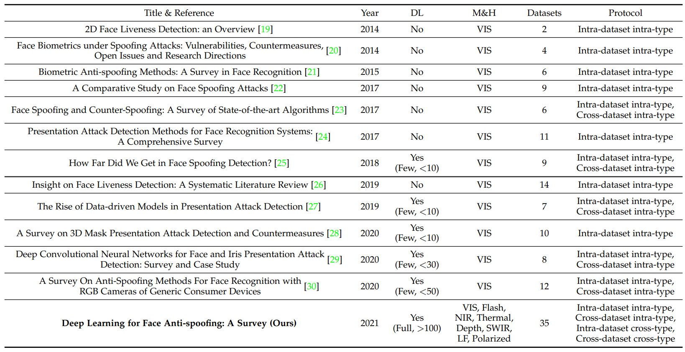

# Background

## Face Spoofing Attacks

Automatic Face Recognition(AFR)에 대한 공격은 크게 digitial Manipulation과 Physical presentation으로 나뉠수 있다. Digital Manipulation은 디지털 환경에서 복제를 하는 것이다. Physical presentation attack은 물리적인 물질을 이용해서 얼굴을 만들어서 공격을 하는 것이다.

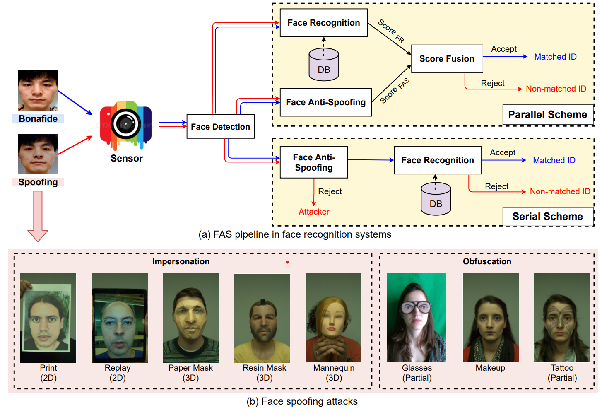

위의 이미지에서 보인것 처럼, FAS를 AFR에게 적용하는 방식은 크게 두가지로 나뉩니다.

 * 하나는 병렬연산입니다. 이때 FAS와 AFS를 따로 Score를 계산을 합니다. 그 이후에 그 두개의 Score를 결합하여 이미지가 실제 이미지인지 아니지 파악하는 것입니다.
 * 다른 하나는 직렬연산입니다. 처음에 PA을 detect하고 Spoofing 이미지를 Reject합니다. 그 뒤에 Face Recognition을 합니다.

그 아래에 있는 이미지(b)는 여러가지 spoofing attack type을 표현합니다. 이러한 방식은 공격하는 사람의 방식에 따라서 두가지로 나뉩니다.

 * Impersonation : 다른사람의 얼굴을 사용해서 AFR을 속이는 방식입니다. 사진, 디지털 화면, 그리고 3D 마스크등을 사용하는 방식입니다.
 * Obfuscation : 얼굴의 일부분을 가리는 방식으로 공격자의 identity를 속이는 방식입니다. 짙은 화장을 하거나, 선글라스를 끼거나, 아니면 가발을 쓰는 방식입니다.

또한 Geometric property로 PA를 분류해보면, 2D와 3D 공격으로 분류할수 있다.

 * 2D PA는 사진이나 영상을 보여주는 형식으로 되어 있습니다.
   * 평면/곡면 사진
   * 눈,입 구멍이 뚤린 사진
   * 영상
 * 3D PA는 3D 인쇄 기술이 발전하면서 생긴 새로운 공격방식입니다. 이러한 마스크들은 색, 질감 그리고 geometry를 사실적으로 표현합니다. 마스크들을 여러가지 제질로 만들어집니다.
   * Hard/Rigid mask : paper, resin, plaster, plastic
   * flexible soft mask : silicon, latex

얼굴을 가리는 영역에 따라서도 나눌 수 있다.
 * Whole attacks은 가장 흔한 방식의 공격이다.
    * Print photo
    * Video replay
    * 3D mask
 * partial attacks은 흔하지 않은 방식의 공격입니다.
    * Part-cut print photo
    * Eyeclasses
    * Partial tattoo

## Dataset for Face Anti-Spoofing

Deep Learning을 기반으로 하는 방식은 훈련을 할때와 검증할때 다양하고 많은 양의 데이터가 필요합니다.

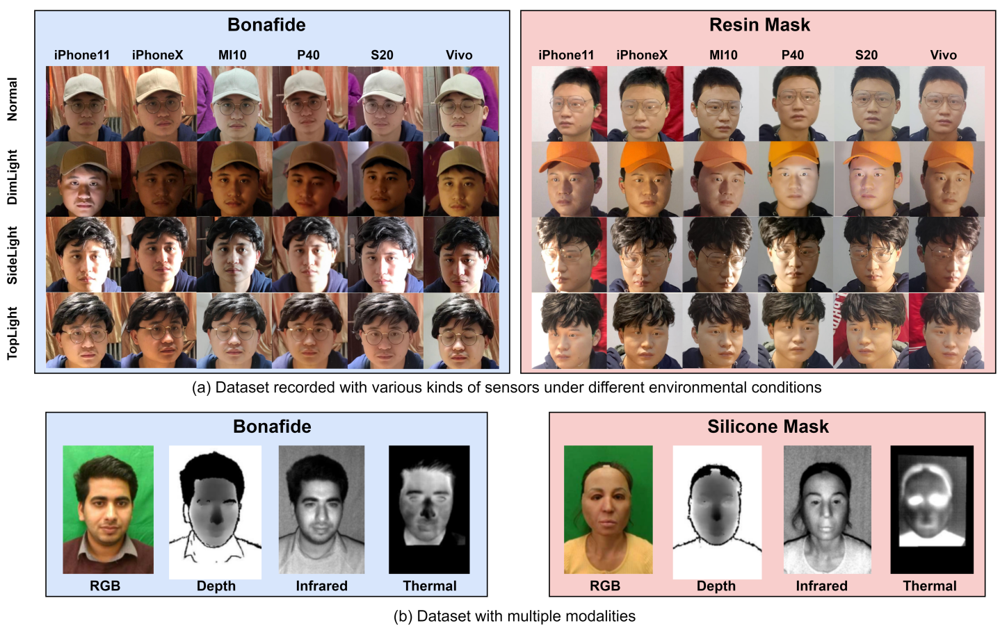

위의 이미지에서 보는것처럼, 다양한 종류의 데이터들이 있습니다. 위에서 보여진것 처럼 RGB를 비슷한 환경에서 찍은 사진이 있을 수 있고, 아니면 여러가지 센서들을 이용해서 데이터들이 있을 수 있습니다.

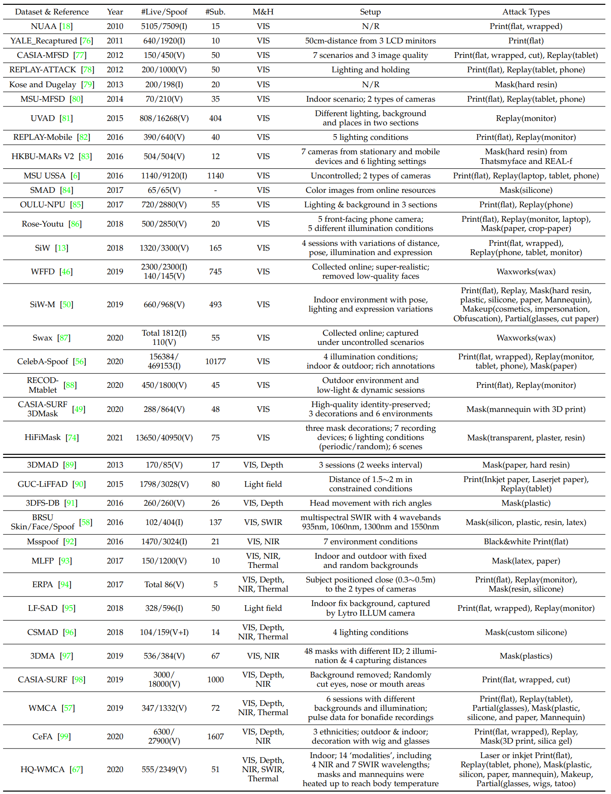

이 위의 이미지는 여러가지 데이터셋을 표현하는 이미지입니다. I/V는 각각 이미지와 비디오를 뜻합니다.

이러한 데이터셋을 만드는 세가지 트랜드가 있습니다.

 * Large scale data amount
   * CelebA-Spoof와 HiFiMask dataset은 600000개 이상의 이미지와 50000개 이상의 비디오를 가지고 있습니다. 이 데이터의 대부분은 PA들입니다.
 * 다양한 데이터 분포
   * 일반적인 사진이나 비디오 뿐만아니라 새로운 공격 방식들도 많아졌습니다.
 * mutliple modalities and specialized sensors
   * 일반적인 RGB데이터 뿐만아니라 다양한 센서를 사용합니다.
     * NIR
     * Depth
     * Thermal
     * SWIR
     * Other (Light field Camera)

## Evaluation Metrics

FAS system은 bonafide와 PA의 acceptance와 rejection을 기반으로 연산합니다. 가장 기본적인 두가지는 False Rejection Rate와 False Acceptance Rate를 가장 많이 쓴다.

FAR는 Spoffing attack을 사실이라고 판정한 비율이다. FRR는 실제 데이터를 가짜라고 판별한 비율이다.

FAS는 국제적인 기준 ISO/IEC DIS 30107- 3:2017 standards를 기반으로 다양한 시나리오에서의 퍼포먼스를 측정한다.

Intra- 와 Cross-Testing 에서 가장 많이 사용되는 것은 Half Total Error Rate(HTER), Equal Error Rate(EER), 그리고 Area Under the Curve(AUC)이다.

HTER는 FRR과 FAR의 평균을 사용합니다. EER는 HTER의 특별한 값입니다. 이는 FAR과 FRR가 같은 값을 가지고 있을 때를 나타냅니다. AUC는 bonafide와 spoofing 간의 분리도를 나타냅니다.

Attack Presenataion Classification Error Rate(APCER), Bonafide Presentation Classification Error Rate (BPCER) 그리고 Average Classification Error Rate (ACER)
또한 intra-dataset testing에 사용됩니다.

BPCER와 APCER 는 각각 bonafide classification error와 Attack classification Error를 의미합니다. ACER는 BPCER와 APCER의 평균값고, intra-dataset의 reliability를 평가하는데 사용됩니다.

## Evaluation Protocols

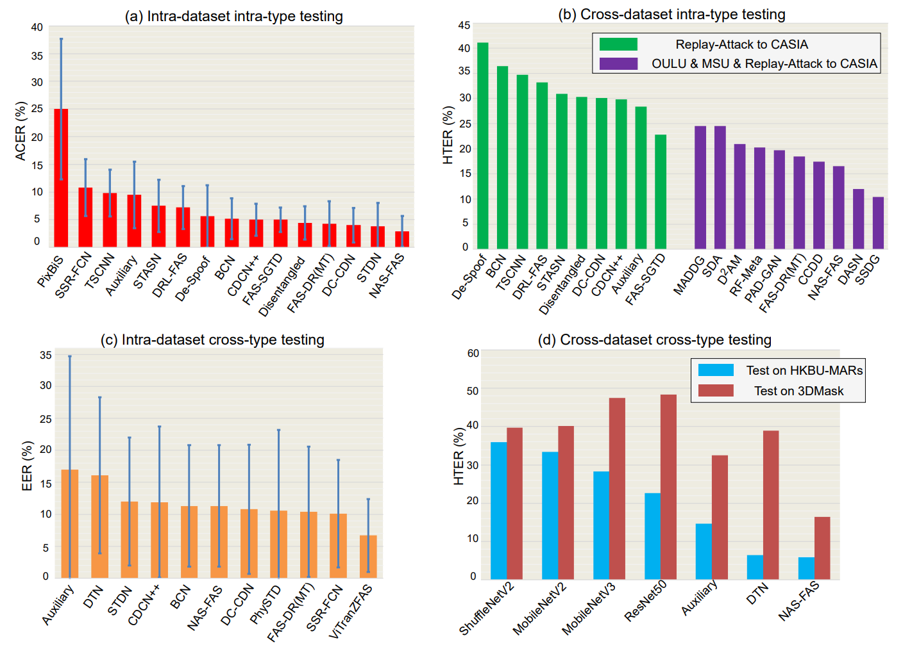

### Intra-Dataset Intra-Type Protocol

Intra-dataset intra-type protocol는 환경의 변화가 거의 없는 상황에서 FAS Dataset를 평가하는 방식으로 많은 환경에서 사용되고 있습니다. 

Training과 Testing data가 같은 Dataset에서 추출되었기에, 그들은 녹화된 환경이나, 객체의 행동에 관하여 비슷한 domain distribution을 가지고 있습니다. Deep Learning 기술의 강한 discriminative feature representation ability 덕분에 좋은 퍼포먼스를 보여줍니다. 이는 외부 환경, 카메라 변화, 그리고 공격방식이 크게 변하지 않는 이상 좋은 결과물을 내줍니다.

### Cross-Dataset Intra-Type Protocol

Cross-dataset은 일반화가 잘 되어 있는지를 확인하는 것입니다. 이 방식은 하나 또는 여러개의 dataset에서 훈련을 하고 unseen datasets을 가지고 결과물을 검증하는 방식을 사용합니다.

### Intra-Dataset Cross-Type Protocol

이 방식은 하나의 공격방식을 제외하고 훈련합니다. 그리고 나중에 그 공격방식을 몰랐을때 그를 분별할 수 있는지 실험하는 방식입니다.

### Cross-Dataset Cross-Type Protocol

Cross Dataset Cross Type Protocol은 일반화를 확인하는 방법으로 unseen domain과 unknown attack types에 대하여 검증하는 방식입니다.

# Deep FAS with Commercial RGB Camera

상용 RGB 카메라는 많은 real-world application에 사용되고 있습니다. 이를 이용한 방식은 크게 3가지로 나뉠수 있습니다. 하나는 Hybrid type으로 Handcrafted method와 Deep learning을 합치는 방식입니다. 다른 하나는 end-to-end supervised deep learning입니다. 마지막으로 generalized deep learning method가 있습니다. 

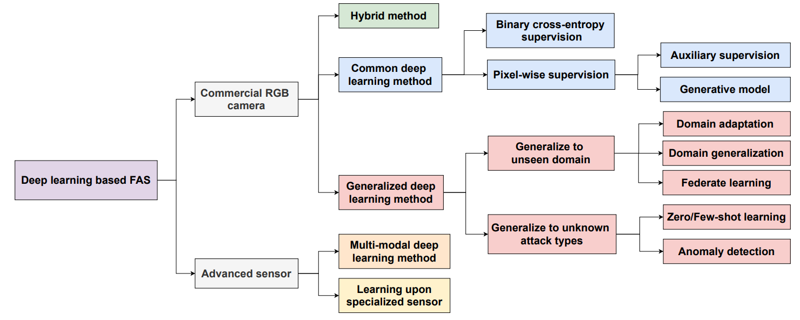

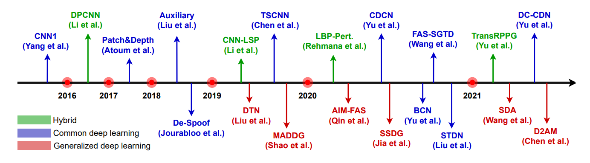

## Hybrid Method

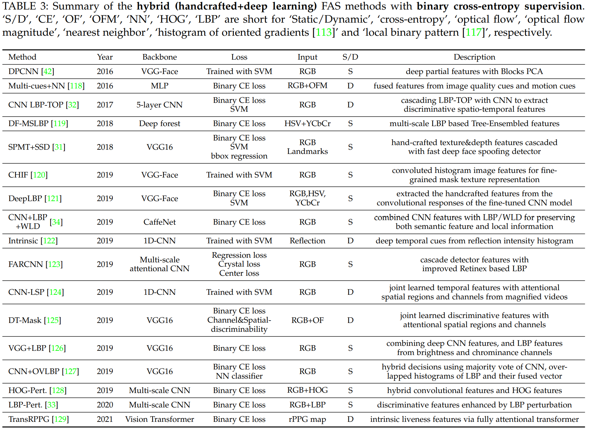

DL과 CNN은 여러가지 영역에서 좋은 결과물들을 많이 만들어냈습니다. 하지만 FAS의 경우 overfitting 문제가 많이 발생하였습니다. 이는 Training data의 양이 너무 적고 다양성이 부족하기 때문입니다. 그렇기에 Handcrafted feature들을 사용해서 bonafide와 PA를 구분하는 방식을 사용했습니다. 최근 들어 이러한 방식을 DL과 같이 사용하는 방식이 늘었습니다. 이러한 Hybrid 방식은 크게 3가지로 나뉩니다.

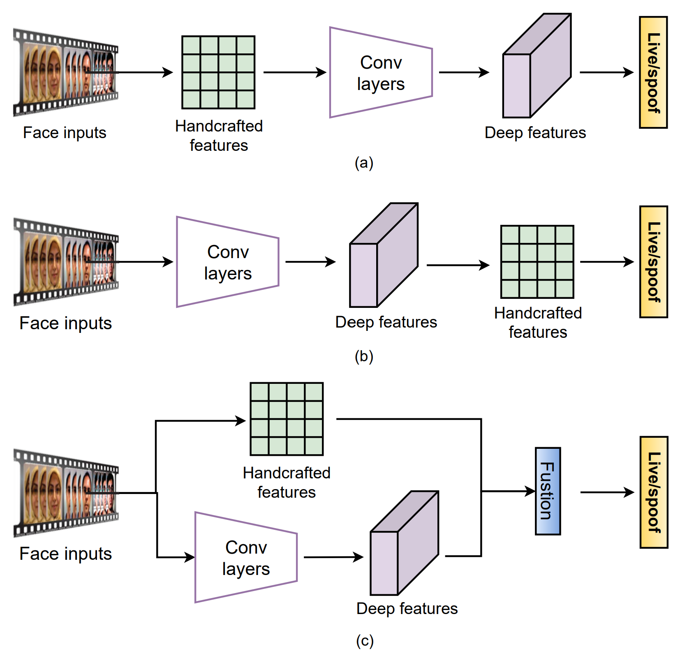

첫번쨰 방법은 Handcrafted feature를 input으로 받은 후, CNN을 사용해서 semantic feature representation을 가졌습니다.

두번째 방식은 Deep convolution feature에서 Handcrafted feature를 추출하는 방식입니다.

마지막 방식으로는 Handcrafted 방식과 Deep convolution을 따로 한 다음에 그 두개를 합치는 방식을 사용합니다.

## Common Deep Learning Method

일반적인 DL은 input에서 spoof detection으로 한번에 이루어지도록 되어 있습니다. 이러한 방식은 크게 3가지로 나뉘어 있습니다.

 * direct supervision with binary cross-entropy loss
 * pixel-wise supervision with auxiliary task
 * generative models.

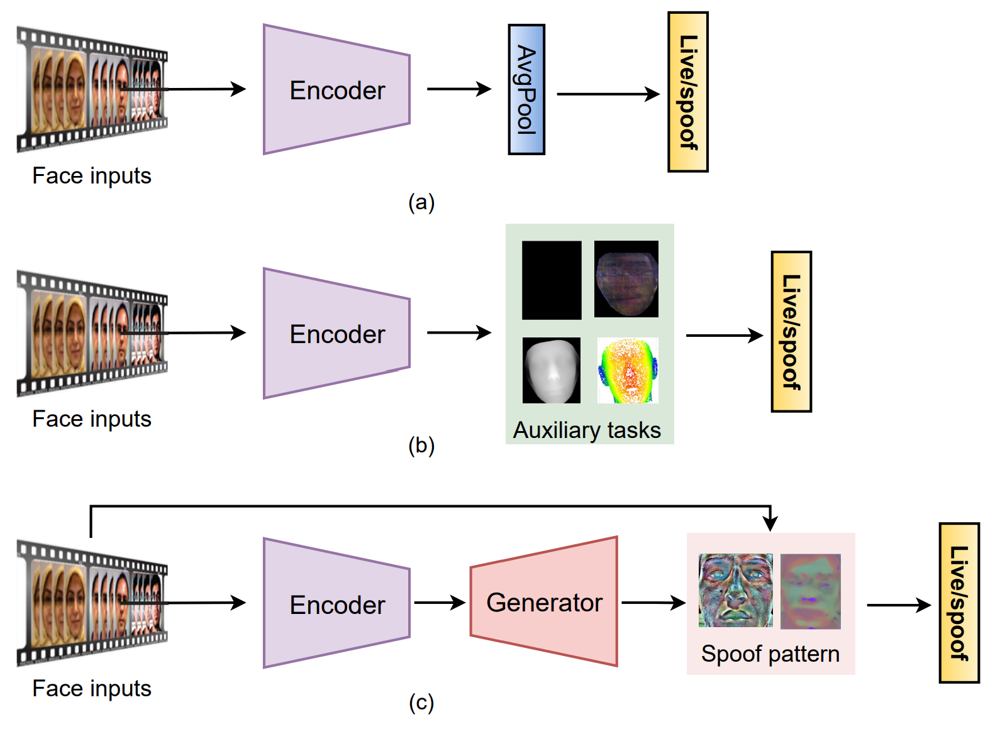

### Direct Supervision with Binary Cross-Entropy loss

FAS를 가장 간단한 방식으로 살펴보면 Binary Classification으로 나타낼수 있습니다. 이때 Binary Cross Entropy를 사용하는 경우가 가장 많지만, 다른 Loss function도 사용하는 경우가 있습니다.

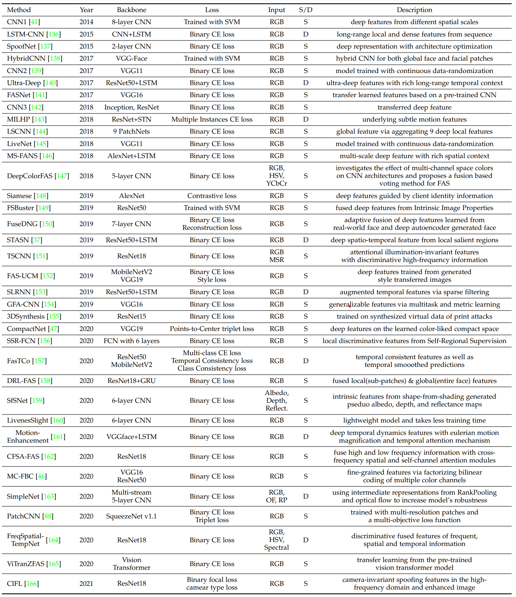

## Pixel-wise Supervision

Pixel-wise supervision은 일반적으로 더 fine-grain하고 Contextual task-related한 특징들을 찾을 수 있습니다. 이러한 Pixel-wise supervision은 크게 두가지 방식으로 나뉩니다. 하나는 auxiliary supervision 시그널을 차는 방법이 있고, 다른 하느는 generative model을 사용하는 방식이 있습니다. 위의 사진에서 b와 c가 각각을 설명합니다.

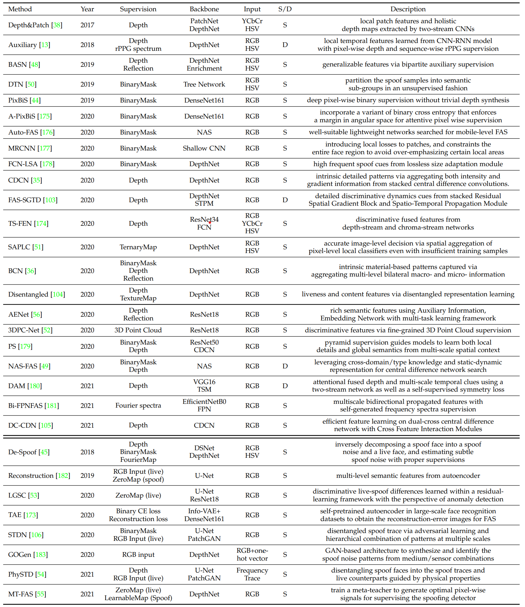

### Pixel-wise supervision with Auxiliary Task

기반지식에 의하면 대부분의 PA들(사진이나 영상)들은 평면이 많이 있습니다. 그렇기에 Pseudo depth를 측정하여 실제 사람인지 아니면 PA인지를 확인하는 방식으로 분류합니다. 또 다른 방식으로는 Binary Mask를 훈련하는 방식이 있습니다.

### Pixel-wise supervision with Generative Model
 
Generative Model은 encoding decoding 방식으로 다양한 spoofing pattern을 찾고 그를 기반으로 FAS를 합니다.

## Generalizing Deep Learning Method

일반적인 방식의 E2E DL 기반의 FAS는 unseen domain이나 unknown attack에 일반화를 잘 하지 못하는 경향이 있습니다. 이러한 문제를 해결하기 위해서 크게 두가지 방식으로 나누어서 해결합니다. Unseen domain에 대하여 domain adaptation이나 generalization technique를 사용하고, Unknown attack에 대하여 zero/few-shot learning이나 anomaly detection을 사용합니다.

### Generalization to Unseen Domain

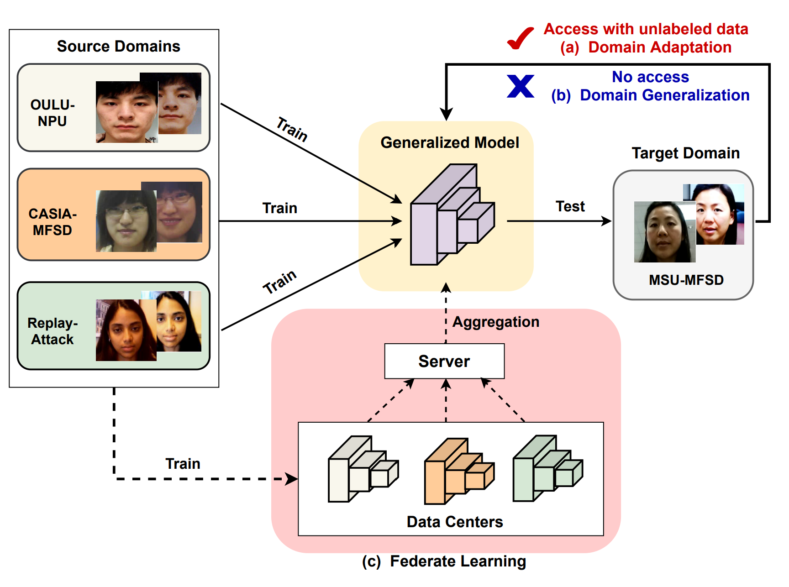

Domain adaptation technique은 목표한 domain에 정보를 가지고 source와 Target domian간의 차이를 좁힙니다. Domain Generalization은 여러 Source를 사용하여 generalized 한 feature representaion을 배웁니다. 이때 target domain에 대한 정보를 가지고 있지 않습니다. Federate learning framework은 Data의 privacy를 존중하면서 Generalization을 성취하는 방식으로 만들어졌습니다.

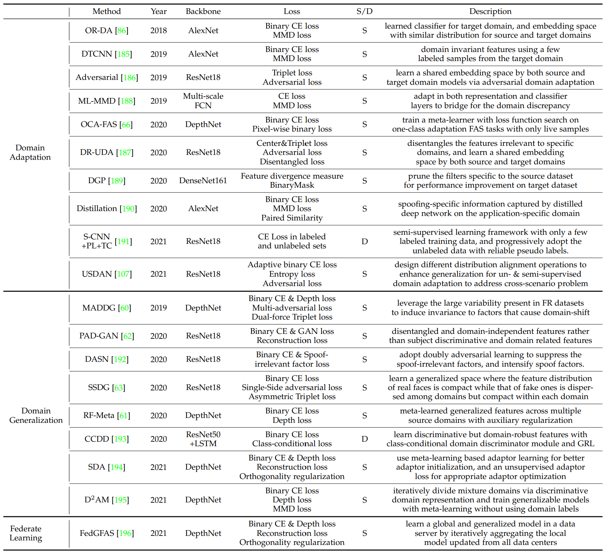

#### Domain Adaptation

Domain Adaptation technique은 source와 target domains사이의 차이를 좁힙니다. Source와 Target feature들은 Learned Feature space에 분포하도록 만듭니다. 만약 이 두개가 비슷한 distibution에 존재한다면 Classifer은 정확하게 Live/Spoof를 분류할수 있습니다. 하지만 이러한 방식으로 문제를 풀기에는 수많은 unlabeled data를 모아야하는데 이는 어렵고 비쌉니다.

#### Domain Generalization

Domain generalization은 Seen data와 unseen이지만 관련된 data간에 generalized feature space가 존재한다고 가정을 합니다. 그럼 seen source data를 통해서 훈련한 model은 unseen target domain에 일반화를 잘 할 것입니다.

이 분야는 최근 몇년간 연구되어 가는 분야입니다. Domain generalization은 FAS model을 unseedn domain에 이점이 있습니다. 하지만 seen data에 관해서 능력이 떨어지는지 검증이 되지 않았습니다.

#### Federate Learning

FAS model을 일반화하는 다른 방식은 여러가지 네트워크를 통해서 각각의 domain을 훈련하는 방식입니다. Federate Learning은 분산되어 있는 private-preserving ML 기술입니다. 이러한 방식은 데이터를 가지고 있는 다양한 Data owner들이 data privacy를 지키기 위해서 만들어졌습니다.

더 자세하게 말하면, 각 data center에서 FAS model을 훈련하고, 서버는 이들의 모델을 받아 업데이트를 합니다. Inference 할때는 서버를 사용해서 결과를 확인 합니다.

이러한 방식은 Data의 privacy를 가질 수 있지만, Model의 privacy를 무시하는 방식입니다.

### Generalization to Unknown Attack Types

FAS model은 새로운 PA에 대해서는 약합니다. 이를 해결하기 위한 두가지 방식이 있습니다. 하나는 zero/few-shot learning이고 다른 하나는 anomaly detection.

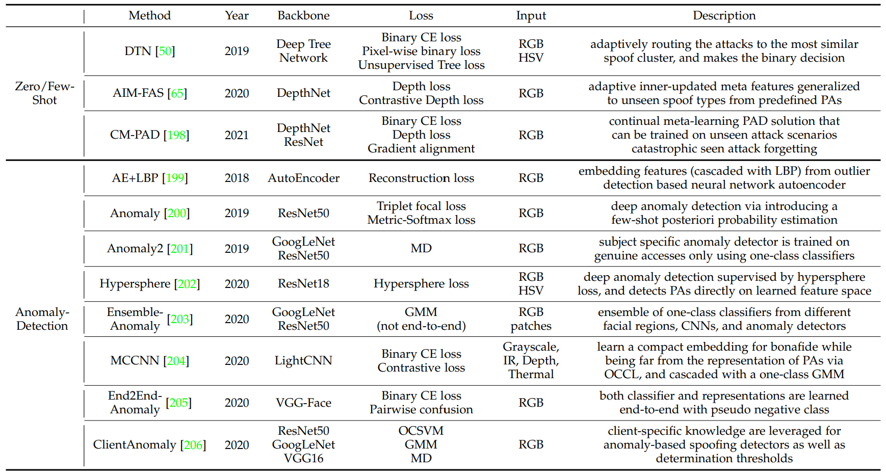

#### Zero/Few-Shot Learning

Zero-Shot Learning는 가지고 있는 PA랄 사용해서 일반화를 하고 unknown novel PA를 구분하는 방식으로 이루어집니다. Few-Shot learning은 가지고 있는 PA와 아주 적은량의 new attack 데이터를 가지고 변화에 적응하도록 합니다.

이러한 방식은 attack type을 전혀 모르고 있는 상황에서는 소용이 없습니다. 또한 bonafide와 비슷환 외모를 가지고 있는 Attack type(화장, 문신, 가발)에 대해서는 인식을 하기 어려운 경우가 많습니다.

#### Anomaly Detection

Anomaly detection은 Live sample이 normal class에 분류되고 그들은 비슷한 feature representaion을 가지고 있고 Spoof sample의 경우에는 다양한 공격 방식으로 여러가지 feature들이 분산되어 있다고 가정합니다. Anomaly detection은 one class classifier로 live sample을 cluster하도록 훈련합니다. 그리고 이 클러스터에서 벗어나는 것들을 attack으로 정의하도록 합니다.

Anomaly detection은 discrimination degradation현상을 겪습니다.

# Deep FAS with Advanced Sensor

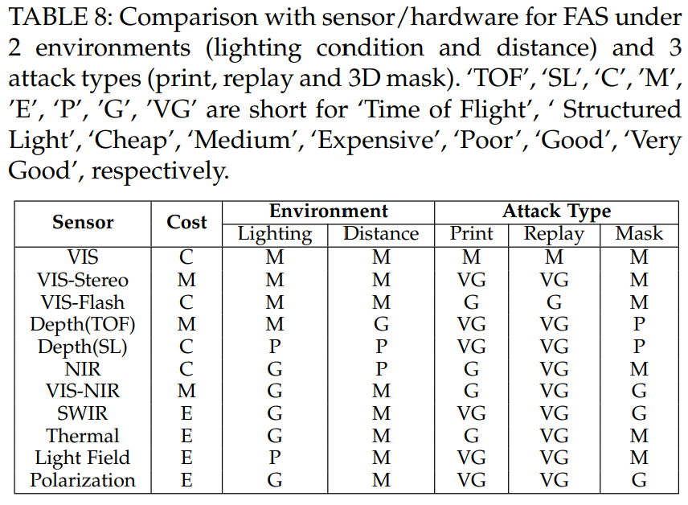

## Uni-Modal Deep Learning upon Specialized Sensor.

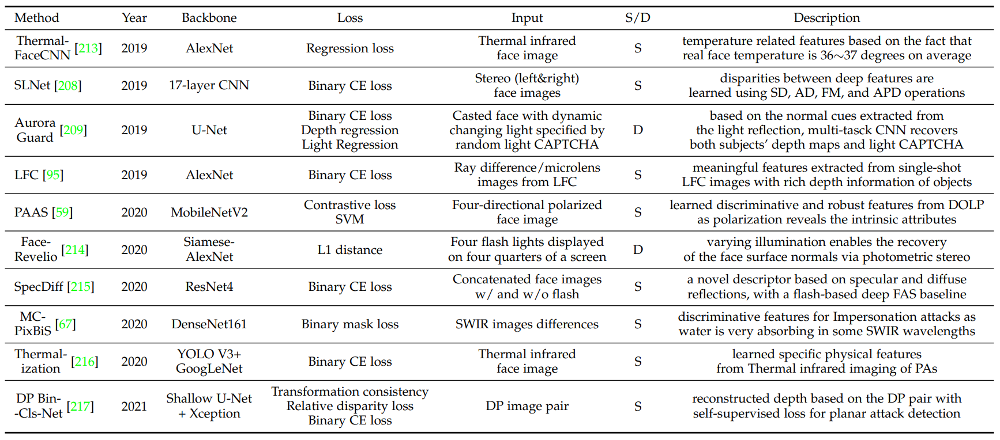

## Multi-Modal Deep Learning

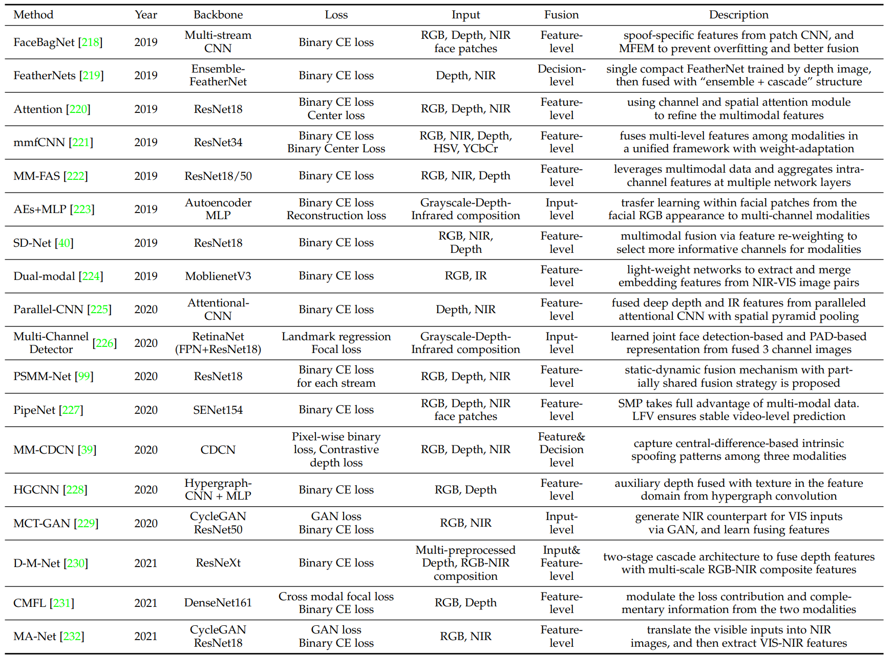

Multi-modal FAS 방식의 경우 경제적으로 많은 돈이 들어갑니다. 그렇기에 가성비가 있는 모델의 경우 real-world application에 사용됩니다.

### Multi-Modal Fusion

Mainstream multi-modal FAS은 대부분 feature level fusion을 사용합니다. 몇몇의 경우에는 input-level이나 decision level fusions을 사용합니다.

### Cross-Modal Translation

가끔 modality가 missing되는 Issue가 있을 경우가 존재합니다. 이러한 때를 대비해서 몇몇 네트워크는 cross-modal translation 기술을 사용합니다.