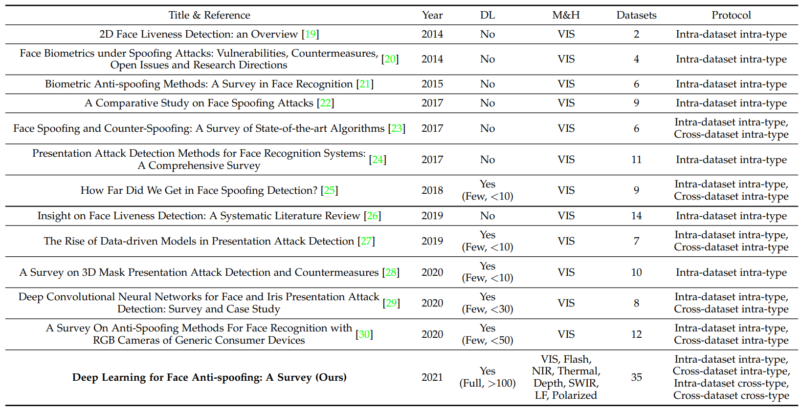
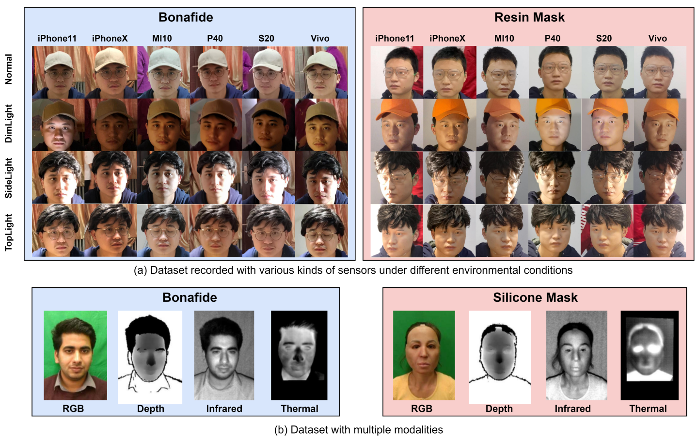

# [Deep Learning for Face Anti-Spoofing: A Survey](https://arxiv.org/pdf/2106.14948.pdf)

# Introduction

Face recognition systems are vulnerable to presentation attacks (PAs) ranging from print, replay, makeup, 3D-masks. For secure face recognition system, researchers are actively searching to prevent the PAs.

As shown in the graph, the number of publications have been increased in recent years.

In early stages of FAS, handcrafted feature based methods have proposed for presentation attacks detections(PAD). Most traditional algorithms are based on detecting human liveness cues and handcrafted features. These methods includes eye-blinking, face and head-movements(e.g. nodding and smiling), gaze tacking, and remote physiological signals(e.g. rPPG). These are captured from videos which is inconvenient for practical deployment. Moreover, these liveness cues are easily mimicked by video attacks.

Classical handcrafted descriptors (LBP, SIFT, SURF, HOG, and DoG) are designed for extracting effective spoofing patterns form various color spaces (RGB, HSV, and YCbCr).

Few hybrid (handcrafted + Deep Learning) and end-to-end deep learning based methods are proposed for both static and dynamic face PAD. Most works treet FAS as a binary classification problem. However CNN with binary loss might discover some arbitrary cues (e.g. screen bezel) but not the faithful spooning pattern.

Pixel-wise supervision provides more fine-grain context-aware supervision signals. Pseudo depth labels, reflection map, binary mask label, and 3D point cloud maps, are typical pixel-wise auxiliary supervisions.

A few generative deep FAS methods model the intrinsic spoofing patterns via relaxed pixel-wise reconstruction constaints. These models have limited numbers of deep learning methods.

# Background

## Face Spoofing Attacks

Attacks on automatic face recognition (AFR) system usuallay divide into two categories: digital manipulation and physical presentation attacks. Digital manipulations uses digital virtual domain. Physical presenatation attack present face upon physical mediums in front of physical face presentation attacks.

As Shown in the images, there are two ways to integrate FAS with AFR:

 * Parallel fusion with predicted scores from FAS and AFR. The combined new final score is used to determine if the sample comes from a genuine user or not
 * Serial scheme for early face PAs detection and spoofing rejection, thus avoiding face accessing the subsequent face recognition phase.

The image (b) represent some spoofing attack types. According to attacker's intention, face PAs can be divided into two typical cases

 * Impersonation : spoof to be recognized as someone else via copying genuine user's factial attributes to special mediums such as photo, electronic screen, and 3D mask
 * Obfuscation : hide or remove the attacker's own identity using various methods such as glasses, makeup, wig, and disguised face

Based on the Geometric property, PAs are broadly classified into 2D and 3D attacks.

 * 2D PAs are carried out by presenting facial attributes using photo or video to the sensors
    * Flat/Wrapped printed photos
    * Eye/mouth-cut photos,
    * Digital replay of videos
 * 3D PAs have become a new type of PAs as 3D printing technology. Face Masks are more realistic in terms of color, texture, and geometry. These masks are made of different materials
    * Hard/Rigid mask : paper, resin, plaster, plastic
    * flexible soft mask : silicon, latex

Based on the facial region covering, PAs be also separated as whole or partial attacks.

 * Whole attacks are common
    * Print photo
    * Video replay
    * 3D mask
 * partial attacks are uncommon
    * Part-cut print photo
    * Eyeclasses
    * Partial tattoo

## Dataset for Face Anti-Spoofing

Large-scale and diverse dataset are pivotal for deep learning based methods during both training and evaluating phase.

As shown in the images thereare different kinds of dataset, It might contain just RGB images with similar setting or might have multiple modalities.

I and V in the "#Live/Spoof" denotes 'images' and 'video'

There are three main trends for dataset progress:

 * Large scale data amount
    * CelebA-Spoof and HiFiMask dataset contains more than 600000 unages and 50000 videos, where most of them are PAs
 * Diverse data distribution
    * Besides common print and replay attacks (recorded in indoor), novel attack types are introduced.
 * mutliple modalities and specialized sensors
    * Apart from traditional RGB, recent dataset consider other sensors
        * NIR
        * Depth
        * Thermal
        * SWIR
        * Other (Light field Camera)

## Evaluation Metrics

FAS system focuse on the concept of bonafide and PA acceptance and rejection. Two basic metrics False Rejection Rate and False Acceptance Rate are widely used.

FAR is the ratio of incorrectly accepted spoffing attacks. FRR is the ratio of increectly rejected live accesses.

FAS follows ISO/IEC DIS 30107- 3:2017 standards to evaluate the performance of the FAS systems under different senarios.

The most commonly used metrics in intra- and cross-testing scenarios ais Half Total Error Rate(HTER), Equal Error Rate(EER), and Area Under the Curve (AUC).

HTER is found out by calculating the average of FRR and FAR. EER is a specific value of HTER at which FAR and FRR have equal values. AUC represents the degree of separablility between bonafide and spoofings.

Attack Presenataion Classification Error Rate(APCER), Bonafide Presentation Classification Error Rate (BPCER) and Average Classification Error Rate (ACER) suggested in ISO standard are also used for intra-dataset testing.

BPCER and APCER measure bonafide aand attack classification error rates, respectively. ACER is calulated as the mean of BPCER and APCER, evaluating the reliability of intra-dataset performance.

## Evaluation Protocols

### Intra-Dataset Intra-Type Protocol

Intra-dataset intra-type protocol has been widely used in most FAS datasets to evaluate the model's discrimination abuility for spoofing detection under scenarios with slight domain shift.

As the training and testing data are from the same datasets, they share similar domain distribution in terms of the recording environment, subject behavior. Due to strong discriminative feature representation ability via deep learning, many methods have reached satisfied performance (<5% ACER) under small domain shifts about external encironments, attack mediums and recording camera variation.

### Cross-Dataset Intra-Type Protocol

Cross-dataset level domain generalization ability measurement. This protocol tests on one or several datasets and then tests on unseen datasets.

### Intra-Dataset Cross-Type Protocol

The protocol adopts 'leave one attack type out' to validate the model's generalization for unknown attack types. One kind of attack type only appears in the testing stage.

### Cross-Dataset Cross-Type Protocol

Cross Dataset Cross Type Protocol to measure the FAS model's generalization on both unseen domain and unknown attack types.

