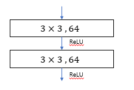
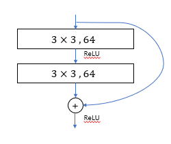

# [Deep residual learning for image recognition](https://arxiv.org/pdf/1512.03385.pdf)

인공신경망의 깊이가 깊어질수록 인공신경망을 훈련시키는 것에 대한 어려움을 해소하기 위해서 저자 Keiming He는 [Deep residual learning for image recognition](https://arxiv.org/pdf/1512.03385.pdf) 논문을 통해서  Residual Unit을 소개했습니다. 새로운 기반 기술인 Residual Unit은 인공신경망의 훈련을 쉽게 만들었습니다.

# Residual Network을 사용하는 이유

인공신경망의 훈련이 끝에 다가올때 degradation 문제가 발생합니다. 다른 말로는 gradient vanishing이라고 하는데, 인공신경망의 깊이가 깊어질수록, 미분값이 점차적으로 작아집니다. 그레서 출력값이 인공신경망의 wieght에 다른 영향력을 행사하지 못하는 것을 의미합니다.

저자의 말에 따르면, degradation은 overfitting이 아니며, 인공신경망의 깊이를 늘릴 수록, training error가 높아지는 것을 의미합니다.

# Deep Residual Learning이란?

## Residual Learning.

)를 인공신경망의 수식이라고 표현하자. 이때 )는 하나의 레이어이거나 혹은 여러가지 레이어들을 한 번에 표현한 것이라고 할 수 있다. 이때  는 이 레이어의 입력값이다.

우리가 만약 )의 근사값을 구할수 있다면, 이 함수에 대한 나머지 값도 구할수 있습니다. 그 값은 =H(x)-x)라고 표현합니다.

나머지값이 =H(x)-x)이고, 원래의 함수값이 ) 이니 이 두개의 식을 이용해서 우리는 원래 구하고자 했던 함수 값 =F(x)+x)를 구할 수 있습니다.

With the residual Learning reformulation, if the identity mapping is optimal, the solvers may simply derive the weights of the multiple non-linear layers to zero.

## Identity mapping by shortcuts
 
Residual Block is defined as +x). In this equation, x is input layer and y is output layer. ) is residual mapping to be learned.

There is a different way to define residual block. The equation is &plus;W_s&space;\cdot&space;x). Where  is used when matching dimensions.

Also for )  could be multiple layers.

For example, if using single layer, equation would be .

If using two layers, equation would be .

## Network Architectures

### Plain Network

Plain network is inspired by the philosophy of VGG networks

 1. For the same output feature map size, the layers have the same number of filters.  
 2. If the feature map size is halved, the number of filter is doubled so as to preserve the ime complexity per layer

Downsampling is done by using convolutional layer that have stride of 2

### Residual Network

Compared to Plain network, difference is that residual network have shortcut connects

Identity shortcut is inserted when input and output have same dimensions

When dimensions increase, consider two options:
 1. Using identity mapping with extra zero entried for increasing dimensions
 2. The projection shortcuts in equation 2, which is added weights for identity matrix. For example, 1x1 convolutions with stride 2 to match dimensions.

## 참조
https://m.blog.naver.com/laonple/221259295035  
https://sike6054.github.io/blog/paper/first-post/  
https://github.com/taki0112/ResNet-Tensorflow  