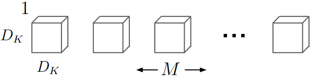
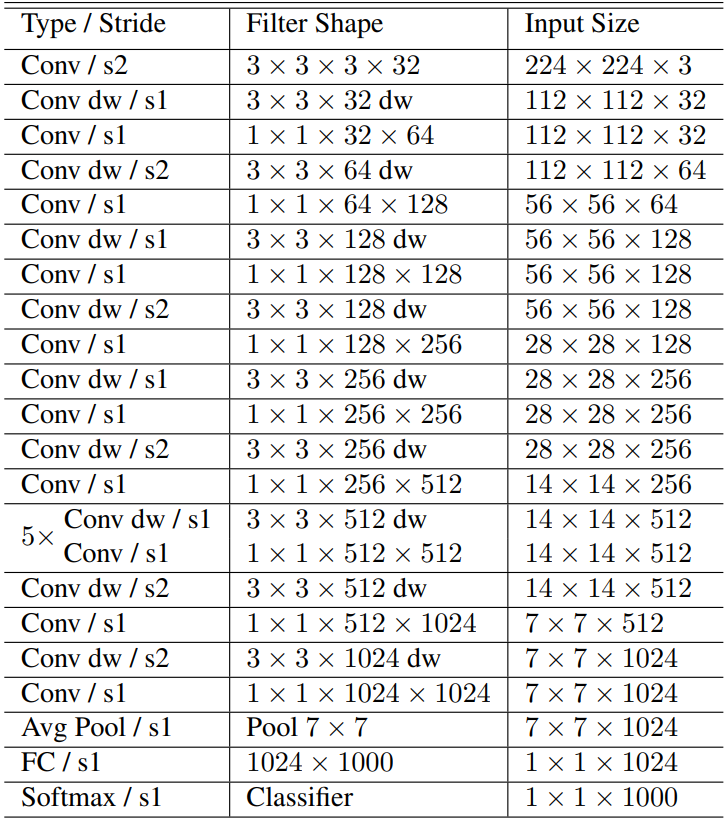
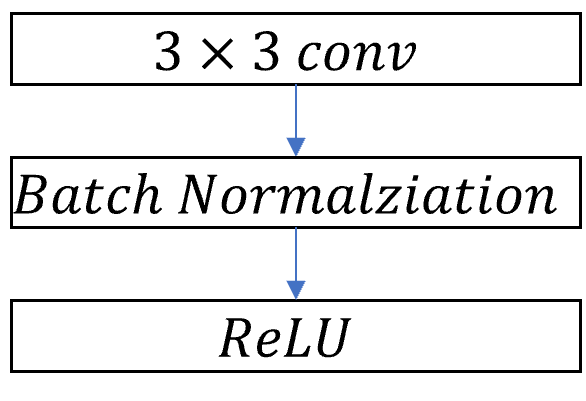

# [MobileNets:Efficient Convolutional Neural Networks for Mobile Vision Application](https://arxiv.org/pdf/1704.04861.pdf)

Depthwise separable convolutions를 사용한 간소화된 architecture를 기반으로 MobileNet은 가벼운 DNN을 만드려고 합니다. 이 논문에서 저자는 두가지 global hyperparameter를 소개합니다. 이 두개의 hyperparameter는 효율적으로 정확도와 latency를 교환합니다.

# Introduction

AlexNet이 ImageNet Challenge: ILSVRC 2012를 이기고 난 이후, Convolutional Neural Network는 컴퓨터 비전에서 범용적으로 사용되는 기술이 되었습니다. 이 이후로 인공신경망 설계의 전체적인 추세는 깊고 복잡한 신경망을 통해서 높은 정확도를 얻는 것을 목표로 하고 있습니다. 하지만 정확도를 증가시키는 발전은 높은 계산 복잡도를 통해서 이루어지고 있습니다. 실생활 속에서, 예를 들어 로보틱스, 자율주행 자동차, 그리고 증강현실에서, 물체 인식은 빠른시간 내에 계산되어야 합니다.

이 논문에서 저자는 효율적인 신경망 구조와 두개의 hyperparameter를 소개합니다. 이를 통해서 아주 작고 연산 속도가 빠른 모델을 만듭니다. 이는 모바일 기기들과 임베디드 비전 프로그램의 설계 요건에도 맞는 인공신경망 입니다.

# Prior Work

작고 효율적인 인공신경망을 만드는 방법은 여러가지가 있습니다. 다양한 방식들은 두가지의 커다란 분류로 나뉠수 있습니다:

* 미리 훈련된 신경망을 압축하는 방식
* 작은 인공신경망을 훈련하는 방식

이 논문에서 저자는 새로운 부류의 인공신경망 구조를 제시합니다. 이 구조는 모댈 게발자로 하여금 자신들의 어플리케이션의 자원 제한에 맞는 작은 인공신경망을 고를 수 있게 만들어 줍니다. MobileNet의 가장 기초적인 초점은 레이턴시를 최적화 하는 것은 물론 작은 신경망을 만드는 것입니다.

## Training small networks

MobileNet은 depthwise separable convolution에 기반하여 만들어 졌습니다. Depthwise separable convolutiondms Inception 모델에서 첫 몇게의 레이어에서 연산을 줄이기 위해서 사용되었습니다. Flatten Network는 인공신경망을 fully factorized convolution을 기반으로 만들어졌고, extremely factorized network에 대한 가능성을 보여주었습니다. Factorized Networks는 small factorized convoutions와 topological conncetions의 사용을 소개했습니다.  Xception Network는 depthwise separable filter를 증가시킴에 따라서 Inception V3 모델을 능가하는 결과를 보여주었습니다. Squeezenet은 bottlenet 방식을 사용해서 아주 작은 신경망을 만들었습니다. 다른 방식으로는 structured transform networks와 deep fried convnet이 있습니다.

작은 신경망을 훈련시키는 또 다른 방식으로는 커다란 인공신경망을 통해서 작은 신경망을 훈련시키는 방식도 있습니다.

## Obtaining small networks by factorizing or compressing pretrained networks.

Quantization, hashing, pruing 그리고 vector quantization과 허프만 코딩을 사용하는 압축은 다양한 논문에서 확인 할 수 있습니다. 게다가, 다양한 Factorization은 미리 훈련된 신경망의 연산을 더욱더 빠르게 만들어 줍니다.

# MobileNet Architecture

## Depthwise separable Convolution

MobileNet 모델은 depthwise separable convolution을 기반으로 만들어졌습니다. Depthwise separable model은 factorized convolution의 한 방식으로 기본적인 convolution을 depthwise convolution과  convolution인 pointwise convolution으로 분해한 것입니다.

### Standard Convolution

기본적인 convolution은 입력값을 필터를 적용함과 동시에 합쳐서 단 하나의 단계로 출력값으로 변환합니다. 우리가 만약 입력 feature map을 으로 출력 feature map을 으로 표현한다면 기본 convolution layer의 kernel 크기를 다음과 같이 표현할 수 있습니다.

위의 이미지에서 보인것 처럼, 기본 convolutional layer는 필터크기가 으로 표현 될 수 있습니다. 여기서  는  filter kernel의 크기,  는 input Channel의 크기. 는 output Channel의 크기입니다..

Kernel의 크기와 입력값의 크기를 알고 있다면, 우리는 기본적인 convolutional layer의 연산량을 대략적으로 계산 할 수 있는데, 그 수식은 아레와 같습니다.

### Depthwise Separable convolution

기본적인 Convolution과는 다르게 depthwise separable convolution은 두개의 레이어로 분류할수 있습니다.
* 필터를 위한 Depthwise convolution
* 하나로 합치기 위한 Pointwise convolution

Depthwise convolution은 depthwise separable convolution에서 필터하기 위한 단계입니다. 이 단계에서 하나의 필터가 하나의 입력 Channel에서 적용됩니다. 아래의 이미지와 같이, kernel 크기는 가 됩니다.

Depthwise convolution 필터의 연산량은 기본 convolution layer보다 비교했을때 매우 작습니다. 왜냐하면 모든 입력값들을 필터하기 위한 추가적인 parameter가 필요 없기 때문입니다. 연산량을 수식으로 표현한다면 아래와 같습니다.

Pointwise convolution은 depthwise separable convolution에서 필터된 값들을 합치는 단계입니다. 이 단계에서  convolution이 모든 필터 값들을 합치는데 사용됩니다. 이때 kernel 크기는 입니다

Pointwise convolution 필터의 연산량은 입력값과 출력값에 비례합니다. 하지만 Kernel 크기와는 무관합니다. 이때의 연산량은 아래의 수식으로 표현됩니다.

Depthwise convolution과 pointwise convolution의 합을 구하면, depthwise separable convolution의 총 연산량을 구할 수 있습니다. 이때의 합은 아래의 수식으로 표현됩니다.

### Reduction in Computation.

연산량을 계산한 두 개의 식으로 부터 우리는 depthwise separable convolution을 사용할때와 standard convolution을 사용할때의 연산량을 비교할 수 있습니다. 이를 통해서 depthwise separable convolution이 얼마만큼 연산을 줄일 수 있는지 계산 하게 되면,

MobileNet의 Kernel 크기가 입니다. 그럼으로, MobileNet은 대략 8배에서 9배 정도로 연산을 적게 합니다.

## Network Structure and Training

MobileNet의 기본적 구조는 depthwise separable convolution을 기반으로 만들어졌습니다. 이때 가장 첫번째 layer만은 Full convolution을 사용합니다. 마지막의 fully connected layer를 제외한 모든 layer는 batch normalization과 ReLU non-lineality가 뒤따릅니다. 마지막 레이어인 Funnly Connected layer는 softmax layer를 사용합니다. Downsamping은 depthwise convolution의 stride를 바꾸는 것으로 합니다. 가장 첫번째 layer인 standard convolution layer에서의 downsampling도 stride를 바꾸는 것으로 대신합니다. 마지막 average pooling은 공간 해상도를 1로 바꾸어 마지막 layer인 fully convolutional layer의 입력방식에 맞추어 줍니다. depthwise convolution과 pointwise convolution을 다른 layer라고 생각했을때 MobileNet은 총 28개의 layer로 이루어 져있습니다.

Standard Convolutional layer | Depthwise Separable Convolutional Layer
-----------|-----------
 | 

위의 이미지는 standard convolution layer와 depthwiese separable convolutional layer의 차이점을 보여줍니다. 위에서 표현한것 처럼 standard convolution은 한단계에서 모든 것을 연산합니다. 반면, depthwise seaprable convolution은 depthwise separable convolution을 통해서 channel별로 filter하고 pointwise convolution을 통해서 입력값들을 합쳐 출력값으로 변환합니다.

효율적인 신경망은 단순히 Mult-Adds갯수만으로 정의되지 않습니다. 하지만 얼마나 효율적인 연산으로 실행되는 지가 더 중요합니다. 예를 들어서 sparse matrix연산은 dense matrix 연산보다 항상 빠르지 않습니다.

## Width Multiplier: Thinner Models

Although the MobileNet architecture is already small and low latency, many times a specific use case or application may require the model to be smaller and faster. To construct smaller and less computantionally expensive models, author introduce width multiplier.

The role of the width multiplier  is to thin a network uniformly at each layer. For a given layer, with width multiplier , the number of input channles M will become , and visa-versa for the output channel. Thus tthe compuational cost will be following.

Where  is the value between 0 and 1. When , it is baseline MobileNet, and when , it is reduced MobileNets.

Using Width Multiplier, Computational Complexity is quadracially reduced by the factor of 

## Resolution Multiplier: Reduced Representation

Resolution Mutliplier  is applied to the input image and the internal representation of every layer to reduce the computation.

If we both apply width multiplier  and resolution Multiplier  then computational complexity for a single depthwise separable convolutional layer would be following.

# Experiment

Effect of depth wise convolution and the choice of shrinking by reducing the width of the network rather then the number of layers.

## Model Choices

First comparing the mobilenet with depthwise separable convolutions with a model built based on full convolutions. 

Looking at the above image we could see that using depthwise separable convolution uses approximately nine times less computation but only reduces 1% accuracy.

Comparing thinner models with width multiplier to shallower models using less layers. To make MobileNet shalloweer, the 5 layers of separable filters with feature size  in Mobile net is removed.

Looking at the table, both thinner and shallower model have similar computation numbers, such as Multi-adds and number of parameters. However, thinner model have 3% more accurate than using shallower model.

## Model shrinking hyperparameters

The accuracy, computation and size trade offs of shrinking the MobileNet architecure with the width multiplier . Accuracy drops smoothly with lower width multiplier until the number of parameter is extremely small at . At this point, number of parameter is extremely small thus have problem in finding correct classifier.

The accuracy, computation and size trade offs of shrinking the MobileNet architecture with the resolution multiplier . Accuracy drop smoothly as the resolution decreases.

If we see the above graph, we compare computational complexity which is based on width multiplier and resolution multiplier and the accuracy. We could see the trend that larger computational number higher the accuracy for ImageNet benchmark. Must know that x axis are logarithmic.

The above graph compare the number of parameters and the accuracy. There is a trend that more number of parameters, better accuracy. Also notice that the number of parameters does not depend on the input resolutions.

If we compare MobileNet to other popular neural networks, we would get above table. MobileNet have similar accuracy rate with VGG 16, but mobile net have approximately 32 times smaller in parameter size and 27 time smaller in computation. Also GoogleNet have approximately 3 times the computation and 1.5 times the parameters size than MobileNet but have lower accuracy rate.

MobileNet using width multiplier of 0.5 and reduced resolution  is better then both Squeezenet and AlexNet. Squeezenet have similar computation size but have 22 time more computation then MobileNet have 3% lower accuacy rate. Also AlexNet is 45 time more parameter and 9.4 time more computation have 3% less computation.

## Fine grained Recongition

Training fine grained recognition on the stanford Dogs dataset. MobileNet can almost achieve the state-of-art result using 9 times less computatoins and 7 times parameter size.

## [Link to Neural Net](../)
## [Link to Korean version](./Korean/)
## [Link to MobileNet V2](./V2/)