# [MobileNetV2: Inverted Residuals and Linear Bottlenecks](https://arxiv.org/pdf/1801.04381.pdf)

In this paper, author describes a new mobile architecture, MobileNetV2, that improves the performance of mobile models on multiple tasks and benchmarks.

# Introduction

Neural networks have revolutionized many areas of machine intelligences, enabling superhuman accuracy for challenging image recognition tasks. The drive to improve accuracy often comes at a cost: modern state of art networks require high computational resources beyond the capabilities of many mobile and embedded applications.

This paper introduces a new neural network architecture that is specifically tailored for mobile and resource constrained environments. To retain the same accuracy while decreasing the number of operations and memory usage, author introcues a novel layer module: inverted residual with linear bottleneck.

# Related Work

There has been a lot of progress in algorithmic architecture exploration including hyperparameter optimization, various methods of network pruning, and connectivity learning. There are different work to change the connetivity structure of the internal convolutional blocks.

The new direction of bringing optimization methods include genetic algorithms and reinforcement learning to architectural search. However, drawback of these methodes is that the resulting network end up very complex.

The network presented in this paper is designed based on [MobileNetV1](../). 

# Preliminaries, discussion and intuition

## Depthwise separable convolution

Depthwise Separable Convolutions are a key building block for many efficient neural network architectures. The basic idea is to replace a full convolutional operator with a factorized version that split convolution into two separate layers.

  1. Depthwise convolution
  2. pointwise convolution

For more detail, follow [this link](../)

## Linear Bottlenecks

Consider a deep neural network consisting of n layers  each of which has an activation tensor of dimensions . The set of layer activations(for any layer ) forms a "manifold of interest" which could be embedded in low-dimensional subspaces. In other words, the information encoded in d-channel pixels of a deep convolutional layer actually lie in some manifold, which in turn is embeddable into a low-dimensional subspace.

In general if a result of a layer transformation ) has a non-zero volume , the points mapped to interior  are obtained via a linear transformation  of the input is limited to a linear transformation. In other words, deep networks only have the power of a linear classifier on the non-zero volume part of the output domain.

On the other hand, when ReLU collapses the channel, it is inevitabley loses information in that channel. However, if we have lots of channels, there is a structure in the activation manifold that information might still be preserved in the other channel. The bottom image represent this example.

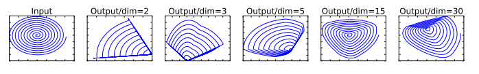

In these example, the initial spiral is embedded into an n-dimensional space using random matrix  followed by ReLU, and then projected back to the 2d space using . When , there is an information loss where certain point of the manifold collaps into each other. While for  to 30, the transformation is highly non-convex.

To summarize, there are two properties that are indicative of the requirement that the manifold of interest should lie in a low-dimensional subspace of the higher-dimensional activation space:

1. If the manifold of interest remains non-zero volume after ReLU transformation, it corresponds to a linear transformation.
2. ReLU is capable of preserving complete information about the input manifold, but only if the input manifold lies in a low-dimensional subspace of the input space.

Assuming the manifold of interest is low-dimensional, we are able to capture manifold of interest by inserting linear bottleneck layer into the convolutional blocks. Through experiment
, using linear layer is crucial as it prevents non-linearities from desctorying too much information.

## Inverted residuals

Inspired by the intuition that the bottlenecks actually contain all the necessary information, while an expansion layer acts merely as an implementation detail that accompanies a non-linear trasnformation of the tensor, uses shortcuts directly between the bottlenecks.

Residual block | Inverted Residual Block
--------------|---------------
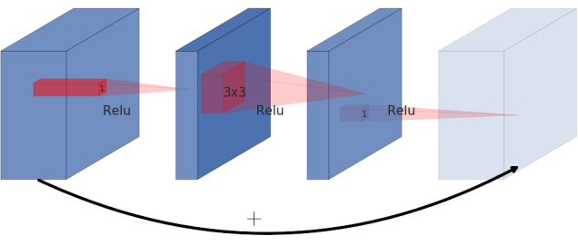 | 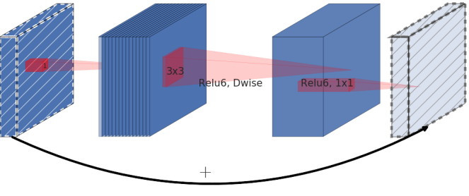

Residual block is normally represented as the left image. It is represented with wide -> narrow -> wide, creating a bottleneck structure. However, in this paper, author presents inverted residual where structure is narrow -> wide -> narrow. The diagonally hatched layer do not use non-linearlities to reserve the information loss by using non-linearlity.

The use of shortcut in the inverted residual block is same as the [ResNet](../ResNet/) to improve the ability of a gradient to propagate across multiplier layers.

Inverted Residual block uses less memory as well as having improved performance.

### Running time and parameter count for bottleneck convolution

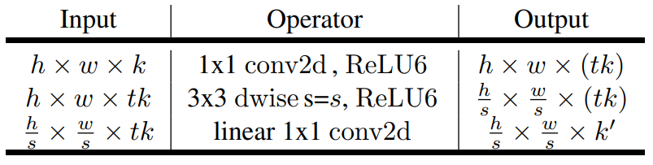

Above table represent the basic implementation structure of inverse Residual Block. For block size , expansion factor  and kernel size  with  input channels and , total number of multiply add required is

)

This number is higher than Depthwise Separable Convolution([described in this page](../)) because of extra layer of  convolution. However, using bottleneck residual block is more compact because of smaller input and output dimensions.

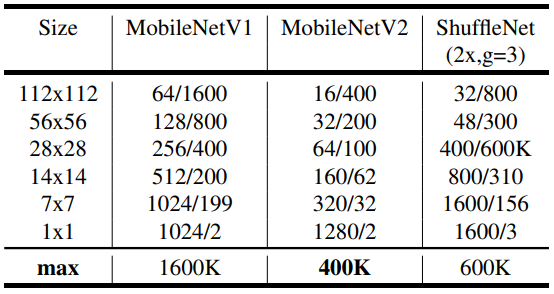

Above table descibes the max number of channels/memory that needs to be macterialized at each spatial resolution for different architectures. In this situation, it is assume to use 16-bit  float for activation.

As described above, mobileNetV2 uses less memory compared to MobileNetV1. For ShuffleNet, author used 2x, g=3 that matches the performance of MobileNetV1 and MobileNetV2.

# Model Architecture

*Detailed information about the building block is describe above.*

The architecture of MobileNetV2 contains the initiall fully convolutional layer with 32 filters, followed by 19 residual bottleneck layers descibed in the table below.

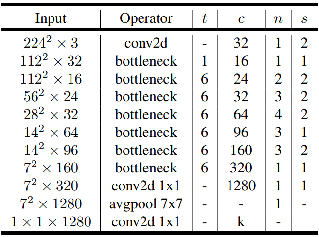

c is the number of output channel, n number of repeatition for building block, s stride of the first layer, otherwise stride is 1. t is the expanstion factor.

For non-linearlity, author chose ReLU 6, when x less then 0, returns 0, when x between 0 and 6, returns x, when x is greater than 6, returns 6.

# Implementation Notes

## Memory efficient inference

In most of the famous machine learning platform, network implementation builds a directed acyclic compute hypergraph G. In the graph G, the edge represents the operation and the node consists of tensor of intermediate computaiton. Though these graph, the memory usage can be calculated as following.

&space;=&space;%5Cmin_%7B%5Cpi&space;%5Cin&space;%5CSigma(G)%7D&space;%5Cmax_%7Bi&space;%5Cin&space;1&space;...&space;n%7D&space;%5Cleft&space;%5B&space;%5Csum_%7BA%5Cin&space;R(i,%5Cpi,&space;G)%7D%7CA%7C&space;%5Cright&space;%5D&space;&plus;&space;size(%5Cpi_i))

Where ) is the intermediate tensors that are connected to any of .  is the size of tensor, and ) is the total amound of memory in internal storage for operation.

Since there is no other structure rather than residual connection(identity shortcut), memory needed in this neural network is addition of input, output and the tensor size. Therefore, it could be presented as below.

=%5Cmax_%7Bop%5Cin%20G%7D%5Cleft%5B%20%5Csum_%7BA%5Cin%20op%7D%7CA%7C%20&plus;%20%5Csum_%7BB%5Cin%20op%7D%7CB%7C%20&plus;%20%7Cop%7C%20%5Cright%5D)

### Bottleneck Residual Block

In the MobileNetV2, the architecture is defined as the image above. The operation could be represented ad following equation, =&space;\left&space;[&space;A&space;\circ&space;N&space;\circ&space;B&space;\right&space;]x)

A and B is linear transformation. N is a non linear per-channel transformation. . In this situation, the memory required to compute ) can be as low as )), where s is one side of input tensor, s' is a side of output tensor, k is input channel size, k' is output channel size.

From this equation, the inner tensor  can be represented as concatenation of t tensors wite size of n/t. Following representation below.

=\sum_{i=1}^{t}(A_i\circ&space;N\circ&space;B_i)(x))

From this equation, when n=t, calculating one channel at a time, we only need to keep one channel of the intermediate representation at all time, saving memory significantly.

However, there are two constaints that enables the trick of reducing memory.

1. the inner transformation(which includes non-linearlity and depthwise) is per-channel
2. consecutive non-per-channel operators have significiant ratio of the input size to the output

Using differnt t does not effect the total calculation time, but have effect the runtime by increasing cache misses which cause significant increase in runtime. Using t between 2 to 5 is most helpful of reducing memory usage and utilzing efficient calculation.
 
# Experiments

## ImageNet Classification

### Training setup

The model is trained using Tensorflow. Optimizer is RMSPropOptimizer with decay and momentum set to 0.9. Batch normalization is used after every layer and standard weight decay is set to 0.00004. Initial learning rate is 0.045, and learning rate decay is rate of 0.98 per epoch. 16 GPU asynchronous workers and a batch size of 96.

### Result

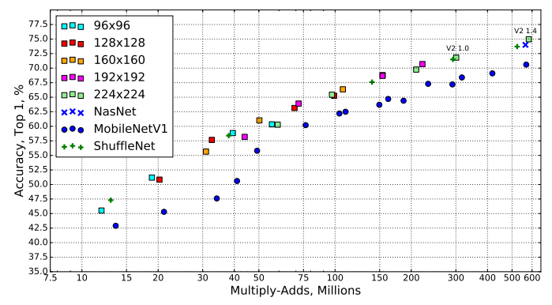

This graph represents all possible result of the MobileNetV2, MobileNetV1, ShuffleNet, Nas Net. For these networks, multiplier of 0.35, 0.5, 0.75, and 1 is used for all resulutions, and additional 1.4 is used on MobileNetV2 for 224 to obtain better result.

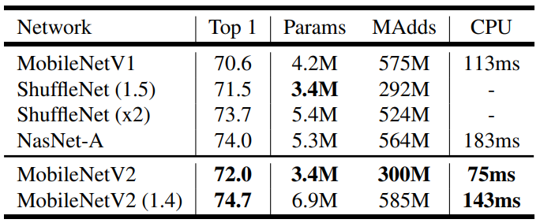

From some of the selected model, we get the number of parameters and the Multi-adds. Last coloumn is implimentation of network in Google Pixel 1 using Tensorflow Lite. The number for shuffleNet is not reported because shuffling and group convolution algorithm are not yet supported.

Above table explains, that MobileNet V2 have higher accuracy rate compared to mobileNet V1 and faster computation time. Also comparing NasNet-A and MobileNetV2(1.4), MobileNet have higher accuracy and is 30% faster than NasNet-A.

## Object Detection

### SSD Lite

In this papaer, we introduce a mobie friendly variant of regular SSD(single shot detector). SSD Lite replace all the regular convolutions with separable convolutions(depthwise followed by pointwise) in SSD prediction layers.

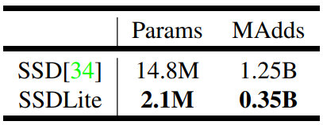

Comparison of the size and computational cost between SSD and SSDLite configured with MobileNetV2 and making predictions for 80 classes. SSDLite is approximately 7 times smaller in parameter size and 4 times smaller in computation.

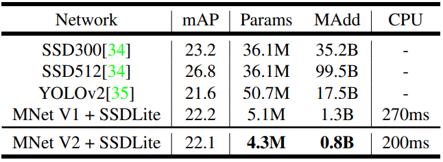

MobileNetV2 with SSDLite makes a decent predection using much less parameters and Multi-add computation. Compared to MobileNetV1, it have similar accuracy but MobileNetV2 computes littlebit faster than MobileNetV2. Also comparing with YOLOv2, MobileNetV2 is 20 times more efficient and 10 times more smaller while still outperforms YOLOv2.

## Semantic Segmentation

Compare MobileNetV1 and MobileNetV2 with DeepLabv3 for the task of mobile segmantic segmentation. DeepLabv3 use atrous convolution a powerful tool to explicitly control the resolution of computed feature maps and builds five parallel heads including (a) Atrous Spatial Pyramid Pooling module(ASPP) containing three  convolution with different atrous rates, (b)  convolution head, and (c) Image-level features.

Three design variation is tested in this paper.

1. Different feature extractor
2. Simplifying the DeepLapv3 heads for faster computation
3. Different inference strategies for boosting performance

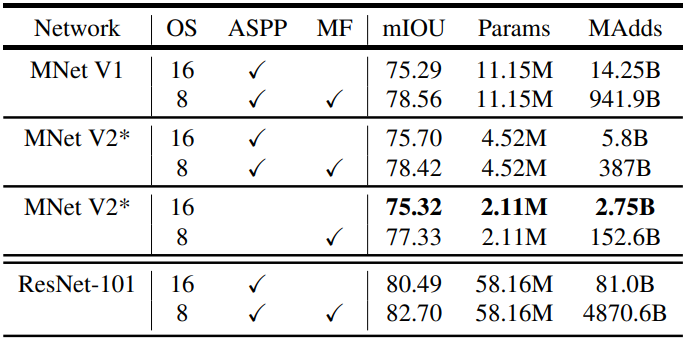
**MNetV2\*** Second last feature map is used for DeepLabv3 head.
**OS**: output stride
**ASPP**: Atrous Spatial Pyramid Pooling
**MF**: Multi-scale and left-right flipped input

Observation on the table
1. the inference strategies, including multi-scale inputs and adding left-right flipped images, significantly increases multi-add computation thus not suitable for on-device applications.
2. using  is more efficient than 
3. MobileNetV1 is 5 to 6 times more efficient compared to ResNet-101
4. Building DeepLabv3 on top of the second last feature map of the MobileNetV2 is more efficient than on the original last-layer feature map.
5. DeepLabv3 heads are computationally expensive and removing the ASPP module significanlty reduces the Multi-add computation with only slight preformance degradation

# Reference

[Toward Data Science](https://towardsdatascience.com/mobilenetv2-inverted-residuals-and-linear-bottlenecks-8a4362f4ffd5)

[Hongl tistory 1](https://hongl.tistory.com/195)
[Hongl tistory 2](https://hongl.tistory.com/196)

## [Link to Neural Net](../../)
## [Link to MobileNet](../)