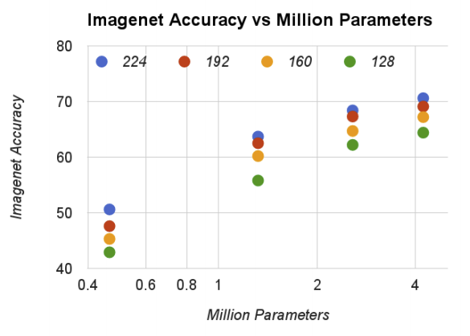

# [MobileNets:Efficient Convolutional Neural Networks for Mobile Vision Application](https://arxiv.org/pdf/1704.04861.pdf)

MobileNets are based on streamlined architecutre that uses depthwise separable convolutions to build light wieght deep neural networks. In this paper, author introudce two global hyper parameters that efficiently trade off between latency and accuracy

# Introduction

Convolutional neural networks have become ubiquitous in computer vision after AlexNet became famous by winning the ImageNet Challenge: ILSVRC 2012. The general trend of the neural network ever since was to make deeper and more complicated networks to achive higher accuracy. However, these advances to improve accuracy had a trade off of having higher computational complexity. In real world applications, such as robotics, self-driving car and augmented reality, the recongintion tasks need to be carried out in a timely fashion of computiation.

In this paper author discribes an efficinet network architecture and a set of two hyper-parameters in order to build very small, low latency models that can be easily matched to the design requirement for mobile and embedded vision applications.

# Prior Work

There are many ways to build small and efficient neural networks. These different approaches could be generallized into two big categories:

* Compressing pretrained networks
* Training small networks

In this paper, author proposes a class of network architectures that allows model developer to specifically choose a small network that matches the resource restriction for their applications. MobileNets primarily focus on optimizing for latency but also yield small network

## Training small networks

MobileNets are build primarily from depthwise separable convolutions which is subsequently used in Inception models to reduce the computation in the first few layers. Flatten networks build a netwrok out of fully factorized convolutions and showed the potentional of extremely factorized networks. Factorized Networks introduces a small factorized convolutions as well as the use of topological connections. Xception network demonstrated how to scale up depthwise separable filters to out perform Inception V3 networks. Squeezenet uses a bottlenect approach to design a very small network. Other reduced computation networks are structured transform networks and deep fired convnets.

## Obtaining small networks by factorizing or compressing pretrained networks.

Compression based on product quantization, hashing, and pruning, vector quantization and Huffman coding have been proposed in the literature. Moreover, Various Factorization have been proposed to speed up pretrained netowrks.

Another method for traing small networks is distillations which uses a larger network to teach a smaller network.

# MobileNet Architecture

## Depthwise separable Convolution

MobileNet model is based on depthwise separable convolutions which is a form of factorized convolutions which factorize a standard convolution into a depthwise convolution and  convolution called pointwise convolution.

### Standard Convolution

Standard convolution both filters and combies inputs into a new set of outpus in one step. If we denote the input feature map as  and output feature map as , then we could calculate the kernal size for standard convolutional layers.

As shown in the image above, Standard convolutional layer have the filter size of .  is the size of the filter kernel   is the size of input Channel.  is the size of output Channel.

Using the size of the Kernel and the size of input, we could calculate the computational cost of Standard convolutional layers.

### Depthwise Separable convolution

On the other hand the depthwise separable convolution splits this into two layers:
* Depthwise convolution for filtering
* Pointwise convolution for combining

Depthwise convolution is the filtering step in depthwise separable convolution. In this step, a single filter is applied per each input channel. As shown in the image below, kernel would be .

Computational cost of depthwise convolution filter is extremely small compared to standard convolution because it does not need extra parameters for filtering all input channels.

Pointwise convolution is the combining step in depthwise separable convolution. In this step,  convolution is applied to combine the result of depthwise convolutional layer. The kernel size of the this would be .

Computational cost of pointwise convolution filter is dependent on the input size and the output size but not dependent on the kernel size.

Total Computational cost of depthwise separable convolutional layer is sum of depthwise convolutional layer and pointwise convolutional layer. Thus it would be:

### Reduction in Computation.

From both computational cost equation, we are able to find the reduction ratio in computation when using depthwise separable convolution compared to standard convolutional layer.

Since MobileNet is uses kernel size of 3, (), MobileNet uses 8 to 9 times less computaion than using standard convolutions.

## Network Structure and Training

MobileNet structure is built on depthwise separable convolutions except for the first layer which is a full convolution. All layers are followed by a batch normalization and ReLU non-lineality with the exception of the final fully convolutional layer which has no nonlinearity and feeds into a softmax layer for classification. Downsampling is handled with strided convolution in the depthwise convolutions as well as in the first layer. A final average pooling reduces spatial resolution into 1 before the fully connected layer. Counting depthwise and pointwise convolutions as separate layers, MobileNet has 28 layers.

Standard Convolutional layer | Depthwise Separable Convolutional Layer
-----------|-----------
 | 

The image above represent how the layers in the standard convolution and depthwise separable convolutional layer is different. Standard convolution, as described in the Depthwise separable convolution section, uses one large convolutional filter for all output dimensions. However, depthwise separable convolution uses depthwise convolution for filtering the input image by channel wise, then use pointwise convoluiton for combining the layers.

Efficieint Network is not simply defined by the number of Mult-Adds, but it is dependent on how efficiently operation is implimented. For instance, unstructured sparse matrix operations are not typically faster than dense matrix operation until a very high level of sparsity.

## Width Multiplier: Thinner Models

Although the MobileNet architecture is already small and low latency, many times a specific use case or application may require the model to be smaller and faster. To construct smaller and less computantionally expensive models, author introduce width multiplier.

The role of the width multiplier  is to thin a network uniformly at each layer. For a given layer, with width multiplier , the number of input channles M will become , and visa-versa for the output channel. Thus tthe compuational cost will be following.

Where  is the value between 0 and 1. When , it is baseline MobileNet, and when , it is reduced MobileNets.

Using Width Multiplier, Computational Complexity is quadracially reduced by the factor of 

## Resolution Multiplier: Reduced Representation

Resolution Mutliplier  is applied to the input image and the internal representation of every layer to reduce the computation.

If we both apply width multiplier  and resolution Multiplier  then computational complexity for a single depthwise separable convolutional layer would be following.

# Experiment

Effect of depth wise convolution and the choice of shrinking by reducing the width of the network rather then the number of layers.

## Model Choices

First comparing the mobilenet with depthwise separable convolutions with a model built based on full convolutions. 

Looking at the above image we could see that using depthwise separable convolution uses approximately nine times less computation but only reduces 1% accuracy.

Comparing thinner models with width multiplier to shallower models using less layers. To make MobileNet shalloweer, the 5 layers of separable filters with feature size  in Mobile net is removed.

Looking at the table, both thinner and shallower model have similar computation numbers, such as Multi-adds and number of parameters. However, thinner model have 3% more accurate than using shallower model.

## Model shrinking hyperparameters

The accuracy, computation and size trade offs of shrinking the MobileNet architecure with the width multiplier . Accuracy drops smoothly with lower width multiplier until the number of parameter is extremely small at . At this point, number of parameter is extremely small thus have problem in finding correct classifier.

The accuracy, computation and size trade offs of shrinking the MobileNet architecture with the resolution multiplier . Accuracy drop smoothly as the resolution decreases.

If we see the above graph, we compare computational complexity which is based on width multiplier and resolution multiplier and the accuracy. We could see the trend that larger computational number higher the accuracy for ImageNet benchmark. Must know that x axis are logarithmic.

The above graph compare the number of parameters and the accuracy. There is a trend that more number of parameters, better accuracy. Also notice that the number of parameters does not depend on the input resolutions.

If we compare MobileNet to other popular neural networks, we would get above table. MobileNet have similar accuracy rate with VGG 16, but mobile net have approximately 32 times smaller in parameter size and 27 time smaller in computation. Also GoogleNet have approximately 3 times the computation and 1.5 times the parameters size than MobileNet but have lower accuracy rate.

MobileNet using width multiplier of 0.5 and reduced resolution  is better then both Squeezenet and AlexNet. Squeezenet have similar computation size but have 22 time more computation then MobileNet have 3% lower accuacy rate. Also AlexNet is 45 time more parameter and 9.4 time more computation have 3% less computation.

## Fine grained Recongition

Training fine grained recognition on the stanford Dogs dataset. MobileNet can almost achieve the state-of-art result using 9 times less computatoins and 7 times parameter size.

## [Link to Neural Net](../)
## [Link to MobileNet V2](./V2/)