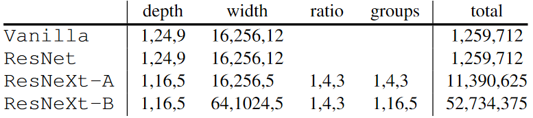

# [On Network Design Spaces for Visual Recognition](https://arxiv.org/pdf/1905.13214.pdf)

이 논문에서 저자는 인공신경망의 성능을 비교하는 새로운 방식을 소개합니다. 전에 사용하던 point와 curve estimate 와는 다르게, distribution estimate은 model family의 설계에 대한 더 완전한 모습을 보여준다.

# Introduction

최근 논문들은 실증적 조사를 통해서 인공신경망의 구조에 대한 연구를 합니다. 이들은 더욱 더 나은 관찰 방식을 찾기 위해서 노력합니다.

초기 연구단계에서는 간단한 방식을 사용했습니다. 인공신경망의 성능을 간단한 point estimate로 계산했습니다. 만약 새로운 인공신경망의 error가 다른 benchmark dataset에서 더 낮게 나오면, 이 인공신경망의 성능이 인공신경망의 복잡도에 관계없이 더 좋다고 여겼습니다.

최근에는 더 향상된 방식인 Curve Estimate를 사용합니다. 이 방식은 다양한 design tradeoff에 대해서 탐구합니다. 이때 다양한 handful of models from a loosely defined model familes를 예를 들어 설명합니다. 그리고 error와 model complexity를 사용해서 선을 그립니다. 이를 통해서 하나의 model family가 다른 model family와 비교해서 전체적으로 낮은 error를 가지고 있다면 더 우수하다고 생각합니다. 위의 그래프를 확인하면, ResNeXt가 ResNet보다 더 좋다고 여겨집니다. 왜냐하면, ResNeXt가 전체적으로 낮은 error를 가지고 있기 때문입니다.

하지만 이러한 방식에도 단점은 있습니다. Curve estimate는 다른 confounding factor를 고려하지 않습니다. Confounding factor가 model family 마다 다를 수도 있도, 어떠한 model family에게는 차선의 선택일 때도 있습니다.

다른 변수들을 고정시키고 하나의 network hyperparameter를 변화시키는 것 보다, 모든 network hyperparameter를 변화시키면 어떻겠습니까? 이러한 방식은 confounding factor의 영향을 없애줍지만, 무한대에 가까운 model을 만듭니다. 그렇기에 저자는 새로운 방식의 비교방식을 소개합니다: distribution estimates.

선택된 몇게의 모델을 비교하는 Curve Estimate와는 다르게 distribution estimate는 design space(parameterize 가능한 인공신경망 구조)에서 model을 선택합니다. 이를 통해서 error rate와 model complexity사이의 distribution을 확인할 수 있습니다.

이러한 방식은 model family의 character에 중점을 둡니다. 그렇기에 이러한 방식은 model 탐색을 위한 design space에 관한 연구를 가능하게 합니다.

# Related Work

### Reproducible research

최근 추세는 기계학습의 재현가능성이 높은 것을 권장합니다. 그래서 저자는 시각인식 분야의 model architecture를 평가하는 더 강력한 methodology를 소개하는 목표를 공유합니다.

### Empirical studies

Deep network에 관한 이론적인 이해의 부족으로 인해서, 개발을 보조하기 위한 deep network의 large-scale studies를 실시하는 것은 필수 불가결한것입니다. Empirical studies와 강력한 methodology는 더 강력한 인공신경망을 만들기 위한 진전에 아주 중요한 역할 을 합니다.

### Hyperparameter search

일반적은 Hyperparameter 탐색 기술은 힘든 model tuning 과정을 다룹니다. 하지만 이 논문에서 저자는 직접적으로 전체적인 model distribution을 다루기에 중요하지 않습니다.

### Neural Architecture search

NAS는 인공신경망 구조를 배우는 것에 효과적이라는 것이 증명되었습니다. NAS는 두개의 구성으로 되어있습니다. Network design space와 탐색 algorithm. 대부분의 NAS 관련 논문들은 search algorithm에 집중합니다. 하지만 이 논문에서는 model design space의 정의에 집중합니다.

### Complexity measures

이 논문에서 저자는 confounding factor를 조절하면서 network design space의 해석에 집중합니다. 저자는 일반적으로 사용되는 복잡도 계산 방법인 model parameter 수와 multiply-add 연산의 수를 활용합니다.

# Design Spaces

## Definitions

### Model Family

Model Family는 연관된 인공신경망 구조들을 묶은 무한에 가까운 거대한 집합입니다. 대체적으로 이들은 고차원적인 설계 구조나 설계 원칙(예를 들어 residual connection)을 공유합니다.

### Design Space

Model family에 Empirical Study를 한다는 것은 매우 어렵습니다. 왜냐하면 model family는 대략적으로 정의되있고 대체적으로 자세하게 설명되지 않습니다. 이러한 추상적인 model family들 사이를 구별하기 위해서 Design Space가 소개되었습니다. Design space는 model family로부터 예시화 가능한 구체적인 인공신경망의 집합입니다.

Degisn space는 2개의 구성으로 이루어져 있습니다.
1. Model faimly의 parameterization
2. 각각의 hyperparameter에 가능한 값의 집합

### Model Distribution

Design space는 기하급수적인 숫자의 인공신경망 model을 포함하고 있습니다. 이에 철저한 조사를 하는 것은 적절하지 못합니다. 그렇기에 design space에서 저자는 고정된 model의 집합을 만들고 평가합니다. 그 뒤로 통계학적인 해석을 사용합니다. 어떠한 standard distribution은 물론 NAS 처럼 learned distribution 또한 이 paradigm에 통합될 수 있습니다.

### Data Generation

Network Design Spaces를 해석하기 위해서 저자는 각각의 design space로부터 수많은 model을 sample 하고 평가합니다. 이를 통해서 저자는 empirical study에 사용할 훌녀된 모델의 dataset을 만듭니다.

## Instantiations

### Model Family

저자는 3개의 기본적인 model family에 대하여 연구합니다.
1. Vanilla model family(VGG에서 영감을 얻은 feedforward 인공신경망)
2. ResNet model family
3. ResNeXt model family

### Design space

위의 표에서 보는 것처럼 저자는 stem을 포함하여 3개의 stage와 head를 가진 인공신경망을 사용했습니다.

* ResNet design space에서 하나의 block은 2개의 convolution과 하나의 residual connection으로 이루어 져 있습니다.
* Vanilla design space는 ResNet design space와 같지만 residual conneciton이 없습니다.
* ResNeXt design space는 bottleneck block과 group을 사용합니다.

이 표는 각각의 모델에서 사용할 hyperparameter를 적은 것입니다. 여기서  표기법을 사용했습니다. n개의 hyperparameter를 a와 b 사이에서 log-scale uniform 하서 선택합니다. 3개의 독립적인 stage는 이러한 hyperparameter를 각자 block의 개수 와 channel의 개수, 를 선택하게 됩니다. 

이를 통해서 전체 가능한 모델의 수는 group이 없을 경우 ^3) 그룹이 있을 경우 ^3) 개가 있습니다.

### Model Distribution

저자는 위에서 설정된 각각의 design space에서 hyperparameter를 uniform하게 선택하여 model distribution을 만들었습니다.

### Data generation

저자는 CIFAR-10 dataset을 이용해서 훈련을 하였습니다. 이러한 방식은 large-scale 해석을 가능하게 하고 가끔은 recognition network의 성능평가를 위해서 사용하기도 합니다. 위의 표에서 설정된 hyperparameter를 이용해 모든 design space 에서 25000개의 model을 선택해서 평가를 위해 사용되었습니다.

# Proposed methodology

## Comparing Distribution

새로운 인공신경망 구조를 개발할때, 전문가는 grid search 나 manual search를 사용해서 탐색을 합니다. 여기서 선전된 모델은 가장 낮은 error를 가집니다. 마지막 model은 전체 design space의 point estimate입니다.

Point estimate를 사용해서 design space를 비교하는 것은 잘못되었습니다. 이러한 방식은 design space로 부터 크기가 다른 두개의 model set을 비교하면 알 수 있습니다.

### Point estimates

첫번째 Baseline model set B는 ResNet design space로 부터 uniformly random 하게 100개를 선택한 것입니다. 두번째 model set M은 100개를 선택한 것이 아니라 1000개를 선택한 것입니다. Baseline과 비교해서 M이라는 model을 개발하는 것에 더 많은 노력을 줄수도 있고, 아니면 M이라는 모델을 만들기 위한 computational resource를 더 썼을 가능 성도 있습니다.

인공신경망의 훈련이 끝나고, M의 최소 error가 B의 최소 error 보다 작습니다. 이를 통해서 point estimate는 M을 Baseline model 인 B보다 더 낳다고 생각합니다.

이러한 실험을 연속적으로 실행하면 위와 같은 실험 결과가나옵니다. 이 분표표는 B와 M의 최솟값의 차를 수회 반복해서 나타낸 결과 입니다. 이 실험은 25000개의 만들어진 모델에서 random하게 sample한 것으로 가장한것입니다.

위에서 본 것처럼 90%의 결과에서 M의 최솟값이 B의 최솟값보다 낮았습니다. 하지만 B와 M모두가 같은 Design space에서 나온 것입니다. 그렇기에 point estimation을 쓰는 것은 잘못된 결론을 내리기 쉽습니다.

### Distribution

저자는 point estimate를 사용하는 대신에 distribution estimate를 사용하는 것이 더 탄탄한 결론을 내릴 수 있다고 주장합니다.

Distribution을 비교하는 방식으로 저자는 empirical distribution function(EDF)를 사용합니다. n개의 model이 있다고 가정을 하고, 그 i 번쨰 모델의 error가 라면, error EDF는 아래와 같은 수식으로 정의 됩니다.

=%5Cfrac%7B1%7D%7Bn%7D%5Csum_%7Bi=1%7D%5E%7Bn%7D%7B1%5Be_i%3Ce%5D%7D)

위의 수식은 error가 e 보다 작은 model을 0과 1사이의 값으로 나타낸 것입니다.

위에서 정의 한 B와 M을 사용하여 EDF를 그렸습니다. 앞에 작게 나타는 부분은 low error를 나타내는 부분이 적다는 것을 의미하고, 10%이상의 error 보다 큰 model 또한 적은 것을 알려주었습니다.

질적으로 본다면 B와 M간의 error EDFs의 차는 그다지 보이지 않습니다. 이를 통해서 B와 M이 같은 model space로부터 나왔다는 것을 확인 할 수 있습니다.

수치적으로 본다면, Kolmogorove-Smirnov test를 이용해서 확인을 합니다. Kolmogorove-Smirnov test는 null hypothesis를 위한 nonparametric statistical test로 두개의 sample이 같은 distribution에서 왔다는 것을 증명하는 방법입니다. 먼저 두개의 distribution fuction, 와 이 주어진다면, KS statistic의 D 값은 이렇게 정의됩니다.

-F_%7B2%7D(x)%5Cright%7C)

이 수식을 통해서 D는 두 EDF 간에 최대값의 차를 확인 합니다. D의 값이 작으면, 와 가 같은 distribution에서 선택된 것을 확인 할 수 있다. 실험 결과로 KS의 D값을 확인 해보면,  and a p-value of 0,60였습니다. 이를 통해서 B와 M이 같은 모델임을 확인 할 수 있습니다.

## Controlling for Complexity

Distribution을 비교하는 것이 Design Space 에 관한 더 튼튼한 결론을 이야기 해주지만, 비교는 confounding factor들이 다 조절된 상태에서 해야 합니다. 이는 model의 error가 다른 변수에 의해서 변화되지 않도록 하기 위함입니다.

이때 관련 있는 confounding factor는 model complexity 입니다. 이 다음으로는 complexity를 조절하는 방법에 대하여 연구할 것입니다.

### Unnormalized comparison

가장 왼쪽의 graph가 ResNeXt-A와 ResNeXt-B의 error EDF를 나타낸 것입니다. 이둘의 차이는 hyperparameter의 차이밖에 없습니다.

이 이미지를 확인해보면, 질적인 차가 확연히 보입니다. ResNeXt-B가 더 나은 design space입니다. 모든 Error에 대해서, ResNeXt-B의 EDF가 모든 error threshold이때 ResNeXt-A보다 높습니다. 

이를 통해서 같은 model family로부터 다른 design space가 다른 error distribution을 만드는 것을 보여줍니다.

### Error vs Complexity.

다양한 논문을 통해서 우리는 인공신경망의 모델의 error가 복잡도와 관련이 있다는 사실을 알고 있습니다. 더 복잡한 인공신경망이 대체적으로 더 높은 정확도를 가진다.

이 두 그래프를 확인하면, 각 훈련된 model의 error가 complexity에 비례하여 표현된 것을 나타냅니다. 복잡도는 parameter의 수나 FLOPs의 수로 계산되었습니다. 높은 복잡도의 모델이 낮은 정확도를 가질 때가 있지만, 대부분 높은 정확도를 가지는 모델은 높은 정확도를 가지고 있습니다.

### Complexity distribution

ResNeXt-A와 ResNeXt-B의 차이는 그 둘의 complexity distribution에 의해서 나타난 것일 수도 있습니다.

위의 그래프를 확인해보면, ResNeXt-A가 덜 복잡한 모델의 수가 더 많고, ResNeXt-B의 경우 복잡한 모델이 더 많습니다. 이는 ResNeXt-B의 높은 정확도는 복잡도의 영향을 받은 것일 수도 있습니다.

### Normalized Comparison

저자는 confounding effect인 model distribution의 complexity의 차이를 없에기 위한 normalization을 소개합니다. 

n개의 model이 주어졌을 때, 복잡도가 라고 가정한다면 각 모델에 인 weight 를 추가하여 complexity를 조절합니다.

이를 통해서 normalized complexity EDF를 

=%5Csum_%7Bi=1%7D%5E%7Bn%7D%7Bw_i1%5Bc_i%3Cc%5D%7D)

로 정의 하고, 비슷하게 normalized error EDF를 

=%5Csum_%7Bi=1%7D%5E%7Bn%7D%7Bw_i1%5Be_i%3Ce%5D%7D)

이와 같이 정의합니다.

두개의 model이 주어졌을 때, 각각의 weight가 %5Capprox%20C_2(c))을 모든 c의 값에서 만족하도록 하는 값을 찾습니다. 만약 모든 weight를 찾았다면,  and 값의 차가 model complexity를 제외한 다른 영향력을 보여줍니다.

Unnormalized comparison에서 보여주는 이미지를 확인해보면, 중앙과 오른쪽이미지가 parameter와 flops에 의해서 normalized 된 것을 보여줍니다. 가장 왼쪽의 이미지와 비교했을 때 둘의 차이가 줄어들었지만, 약간의 차이가 남아 있습니다. 이러한 차이는 ResNeXt-A와 ResNeXt-B의 group의 크기와 width의 크기의 차로 생각되어집니다.

## Characterizing Distribution

Full error distribution을 검증하는 것의 장점은 minimum achievable error를 확인하는 것 이상을 알 수 있습니다. Distribution을 검증하는 것은 design space에 대해서 더 자세한 정보를 알려줍니다.

### Distribution shape

왼쪽 이미는 Vanilla와 ResNet design space의 EDF를 표현한 그래프입니다. ResNet의 경우 80%이상의 경우가 8%이하의 error rate를 가지고 있습니다. 하지만 Vanilla design space의 경우 훨씬 적은 15%정도의 model만 8%의 정확도를 가집니다. 이를 통해서 더 좋은 ResNet model을 찾는 것이 좋은 Vanilla model을 찾는 것 보다 쉽습니다.

### Distribution area

EDF를 max 까지의 함수 아래의 면적을 구하는 것으로토 나타낼 수 있습니다. 이를 통해서 우리는 

/%5Cepsilon%20%5Ctextrm%7Bd%7De%7D=1-%5Csum%20w_i%5Cmin%5Cleft(1,%5Cfrac%7Be_i%7D%7B%5Cepsilon%7D%5Cright))

를 구할 수 있습니다. 하지만 이 면적은 EDF의 좁은 부분 밖에 보여주지 못합니다.

### Random Search Efficiency

더 좋은 모델을 찾기 위한 더 쉬운 방법은 Random search efficiency를 찾는 방법입니다.

Random search experiment를 모의 실험하기 위해서 m의 값을 n개의 총 model중에서 선정해 최소 error를 선택합니다. 이러한 방식을 n/m번 반복해서 평균값을 매번 반복해줍니다. 복잡도의 confounding effect를 없에기 위해서 weight 값을 모든 model에게 선택합니다.

위의 이미지에서 오른쪽 이미지를 확인 할 수 있습니다. Vanilla와 ResNet 모두 random search를 통해서 구한 것입니다. 이를 통해서 ResNet이 더 좋은 결과를 가지는 것을 확인 할 수 있습니다.

## Minimal Sample Size

실제 상황에서는 더 적은 distribution을 사용해야 할 때 가 있습니다. 이러한 것을 확인하기 위한 시험을 합니다.

### Qualitative analysis

왼쪽의 이미지는 ResNet design space에서 다양한 sample수를 뽑은 것입니다. Sample의 수가 10개정도면 EDF가 상당히 많은 Noise를 가지고 있습니다. 100부터는 상당히 쓸만한 정도이고, 1000정도가 되면 다른 것들과 별 차이가 없습니다. 그래서 저자는 100에서 1000개의 sample을 사용하는 것을 추천합니다.

### Quantitative analysis

수치적인 해석을 보아도 비슷한 결과가 나옵니다. KS Statistic D의 값을 25000개의 모델에서 선정핸 것입니다. Sample의 수가 1000이 넘어가면 수치가 상당히 줄어 0.1 이하가 되는 것을 알 수 있습니다. 이를 통해서 qualitative analysis와 같이 100개에서 1000개의 sample만 선정하면 됩니다.

### Feasibility discussion

100개에서 1000개의 모델을 훈련하는 것이 실현 가능한가에 대한 질문이 들어올 수 있습니다. 저자는 500개의 CIFAR-10모델을 훈련하는 데 걸리는 시간이 250GPU hour가 걸린다고 합니다. 하지만, ResNet-50을 ImageNet에 훈련하는 것은 192GPU hour가 걸립니다.

이를 통해서 CIFAR-10같이 작은 문제를 해결하는 것은 중간크기의 문제인 ImageNet에 실험하는 것보다 더 연산량이 줄어드는 거슬 알 수 있습니다.

다시 요약하면, 이러한 방식은 평범한 상황에서는 가능하다고 이야기 가능합니다.

# Case Study: NAS

Distribution estimation의 case study로 저자는 인공신경망 탐색(NAS)의 논문에 관한 실험을 합니다.

NAS는 두가지 핵짐 구성으로 이루어졌습니다.
1. design space
2. design space의 탐색 algorithm

## Design Spaces

### Model family

NAS model은 하나의 computation unit을 반복적으로 쌓는 것으로 시작합니다. cell이 행하는 연산이 다르고 어떻게 연결하는 방식 또한 다릅니다.

Cell은 자신 이전에 있는 2개의 cell 에서 입력을 받아옵니다. cell 은 몇개의 node로 구성되어 있고 각각의 node는 이전 두개의 node로 부터 입력을 받습니다. 그리고 각각의 input에 연산을 적용한다음, 두개의 연산을 합칩니다.

### Design Space

다섯개의 NAS model family, NASNet AmoebaNet, PNAS, ENAS, DARTS가 선택되었습니다. 위의 표에서 보는 것처럼 대부분의 경우 5개의 Cell로 제한 되었습니다. 출력 L은 loose node를 의미하고 A는 모든 노드를 의미합니다.

모든 인공신경망이 조금씩 다릅니다. 그렇기에 DARTS에서 사용된 방식으로 전체적으로 통합했습니다.

인공신경망의 깊이와 가장 첫번째 필터의 width는 고정되었습니다. 하지만 이러한 방식은 model complexity에 영향을 줍니다.

위에서 보는 것처럼, 각각의 모델이 다 다른 복잡도를 가지고 있습니다. 이러한 방식을 조절하기 위해서 저자는 w와 d의 값을 (와 )으로 조절하였습니다.

### Model distribution

저자는 uniformly random하게 sample 하였습니다. w와 d의 값 또한 uniformly sample 하였습니다.

### Data Generation

각각의 NASnet이 CIFAR-10에 1000개의 model을 훈련하였습니다. 둘다 제한된 parameter와 flops에서 1000개의 모델이 되도록 설게하였습니다.

## Design Space Comparison

### Distribution comparison

위의 normalized error EDF를 확인할 수 있습니다. NASNet과 AmoebaNet이 가장 안좋은 결과를 가지고 있습니다. DARTS가 가장 좋은 결과를 가지고 있는 것 또한 확인 할 수 있습니다. ENAS와 PNAS는 비슷합니다. 하지만 ENAS가 중간 값에 더 좋고 PNAS가 lower/higher performing model을 가지고 있습니다. 

저자는 이러한 성능의 향상은 design space의 개선으로 이루저 졌다고 생각합니다.

### Random Search efficiency

위의 그래프를 통해서 두가지를 확인 할 수 있습니다.

1. random search efficiency의 순서가 EDFs의 순서와 똑같다
2. Design space의 차이가 성능의 차이로 이루어진다.

## Comparisons to Standard Design Spaces

NAS design space에서 최상의 결과를 낸 DARTS와 가장 안좋은 결과를 낸 NASNet을 일반적인 ResNeXt와 비교해보았습니다. ResNeXt-B의 경우 parameter로 normalize 한 경우 DARTS와 비슷한 결과를 낸 것을 확인 할 수 있습니다. 하지만 FLOPs로 normalize 한경우 ResNeXt-B가 살짝 결과 가 안좋습니다.

이 결과는 Design space의 설계가 중점이 됩니다. 또한 손수 하거나 data를 사용해서 design space를 설계하는 것은 미래의 작업을 위해서 좋은 방향이 됩니다.

## Sanity Check: point Comparison

저자는 이런한 현상이 사실을 확인하기 위해서 deep supervision과 Cutout, modified DropPath를 사용해서 DARTS, ResNeXt 그리고 ResNet-110을 사용해서 비교한 것입니다. 이러한 결과는 위의 표에서 확인 할 수 있는데, 이러한 효과를통해서 ResNeXt가 DARTS가 비슷한 error rate를 가지는 것을 확인 할 수 있습니다.

# Conclusion

저자는 model design space를 해석하는 비교하는 새로운 방식을 소개합니다. 이러한 빙식은 다른 model type나 domain, task에 적용할 수 있습니다.

## [Link to NeuralNet](../../)
## [Link to English Version](../)