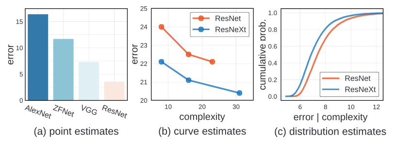

# [On Network Design Spaces for Visual Recognition](https://arxiv.org/pdf/1905.13214.pdf)

In this paper, author introduce new comparison paradigm of distribution estimates. Compared to comparing point and curve estimates of model familes, distribution estimates paint a more complete picture of entire design landscape

# Introduction

There has been a general trend toward better empiricism in the literature on network architecture.

In the early development stages, the simple method was used. The progress of the neural network was measured by simple point estimates. The architecture was makred superiror if it achieved lower error on a benchmark dataset, often irrespective of model complexity.

The improved methodoloy adopted in more recent work compares curve estimates.  This methods explore design tradeoffs of network architectures by instantiating a handful of models from a loosely defined model familes and tracing curve of error vs. model complexity. In this estimation, one model family is considered superior if it acheives lower error at every point along a curve. In this example, ResNeXt are considered better than ResNet because, ResNeXt have lower error in all the point.

However, there is some draw back in using this methodology. Curve estimates does not consider confounding factors, which may vary between model familes and may be suboptimal for one of them.

Rather than varying a single network hyperparameter while keeping all others fixed, what if instead we varu all relevant network hyperparameters? However, this is not feasible, because there are often infinite number of possible models. Therefore, author introduce a new comparison paradigm: that of distribution estimates.

Unlike Curve estimates where  they compare a few selected members of a model family, distribution estimates sample modles from a design space, parameterizing possible architectures, giving rise to distrivutions of error rates and model complexities.

This methodology rocuses on characterizing the model family. Thus enable research into designing the design space for model search.

