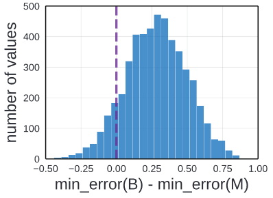
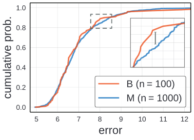

# [On Network Design Spaces for Visual Recognition](https://arxiv.org/pdf/1905.13214.pdf)

In this paper, author introduce new comparison paradigm of distribution estimates. Compared to comparing point and curve estimates of model familes, distribution estimates paint a more complete picture of entire design landscape

# Introduction

There has been a general trend toward better empiricism in the literature on network architecture.

In the early development stages, the simple method was used. The progress of the neural network was measured by simple point estimates. The architecture was makred superiror if it achieved lower error on a benchmark dataset, often irrespective of model complexity.

The improved methodoloy adopted in more recent work compares curve estimates.  This methods explore design tradeoffs of network architectures by instantiating a handful of models from a loosely defined model familes and tracing curve of error vs. model complexity. In this estimation, one model family is considered superior if it acheives lower error at every point along a curve. In this example, ResNeXt are considered better than ResNet because, ResNeXt have lower error in all the point.

However, there is some draw back in using this methodology. Curve estimates does not consider confounding factors, which may vary between model familes and may be suboptimal for one of them.

Rather than varying a single network hyperparameter while keeping all others fixed, what if instead we varu all relevant network hyperparameters? However, this is not feasible, because there are often infinite number of possible models. Therefore, author introduce a new comparison paradigm: that of distribution estimates.

Unlike Curve estimates where  they compare a few selected members of a model family, distribution estimates sample modles from a design space, parameterizing possible architectures, giving rise to distrivutions of error rates and model complexities.

This methodology rocuses on characterizing the model family. Thus enable research into designing the design space for model search.

# Related Work

### Reproducible resarch

There has been an encouraging recent trend toward better reproducibility in machine learning. Thus author share the goal of introducing a more robust methodology for evaluating model architectures in the domain of visual recognition

### Empirical studies

In the absence of rigorous theoretical understanding of deep networks, it is imperative to perform large-scale studies of deep networks to aid development. Empricial studies and robust methodology play in enabling progress toward discovering better architectures.

### Hyperparameter search

General hyperparameter search techniques address the laborious model tuning process in machine learning. In this work, author propose to directly compare full model distributions not just their minima.

### Neural architecture Search

NAS has proven effective for learning networks architecctures. A NAS instantiation has two components: a network design space and a search algorithm. Most work on NAS focuses on the search algorithm. However, in this work, author focus on characterizing the model design space.

### Complexity measures

In this work, author focus on analyzing network design space while controlling for confounding factors like network complexity. Author adopt commonly-used network complexity measures, including number of model parameters or multiply-add operations. 

# Design Spces

## Definitions

### Model family

A model family is large (possibly infinite) collection of related neural network architectures, typically shraing some high-level architectural structures or design principles (residual connections)

### Design Space

Performing empirical studies on model families are difficult since they are broadly defined and typically not fully specified. To make disctinctino between abstract model families, design space is introduces. Design space is a concrete set of architectures taht can be isntantiated from the model family.

A design space consist of two components
1. parameterization of a model family
2. a set of allowable values for each hyper parameters.

### Model distribution

As design space an contain an eponential number of candidate models, exhaustive evaluation is not feasible. Therefore, from a design space, author sampled and excaluated a fixed set of models, giving rise to a model distribution. Then, author use classical statistics for analysis. Any standard distribution, as well as learned distributions like in NAS, can be integrated into our paradigm.

### Data Generation

To analyze network design spaces, author smaple and evaluate numerous models from each design space. In doing so, author generate datasets of trained models upon which we perform empirical studies.

## Instantiations

### Model family

Author study three standarad model families:
1. Vanilla model family (feedforward network loosely inspired by VGG)
2. ResNet model family
3. ResNeXt model family

### Design space

As shown in the table above, author used networks consisting of a stem, followed by three stages and a head, as described in the table above.

* For ResNet design space, a single block consists of two convolutions and residual connection.
* Vanilla design space uses an identical block structure as ResNet but without residual connection.
* In the Case of ResNeXt design spaces, we use bottleneck blocks with groups.

This table above specify the set of allowable hyperparameters for each. The notation,  means we sample, n values sapced about evenly in log spaces in the range a to b. From these value, we select independently for three network stages, number of blocks , and the number of channels per block .

From these number, the total number of models  is ^3) for models without groups and ^3) for models with groups.

### Model distribution

Author generate model distributions by uniformly sampling hyperparameters from the allowable values for each design spaces.

### Data generation

Author uses image classification models trained on CIFAR-10. This setting enables large-scale analysis and is used often used as a testbed for recognition networks. From the above table, author selected 25k models and used to evaluate the methodology

# Proposed Methodology

## Comparing Distribution

When developing a new network architecture, human experts employ a combination ffrom a design spacce, and select the model achieving the lowest error. The final model is a point estimate of the design space. 

Comparing design spaces via point estimates can be misleading. This is illustrated by comparing two sets of models of different sizes sampled from the same design space.

### Point estimates

The baseline model set (B) by uniform sampling 100 architecure from ResNet design space described above. The second model set(M) uses 1000 samples instead of 100. The difference in number of samples could arise from more effort in the development of M over the baseline, or simply access to more computational resources for generating M. These imbalanced comparisons are common in the practice.

After traing, M's minimum error is lower than B's minimum error. Since the best error is lower, a naive comparison of point estimates concludes that M is superior. 

Repeating this experiment yield the same results. Above iamge represent the difference in the minimum error of B and M over multiple trials. This experiment was simulated by repeatedly sampling B and M from the pool of 25k pre-trained models.

In 90% of the cases M has a lower minimum than B, often with large margin. However, M and B were drawn from the same design space. Thus using point estimation can be misleading.

### Distributions

Author argues that one can estimate more robust conclusion by directly comapraing distributions rather than point estimates such as minimum error.

To compare distributions, author use empirical distribution functions(EDFs). Given the set of n models, with errors , the error EDF is given as following:

=%5Cfrac%7B1%7D%7Bn%7D%5Csum_%7Bi=1%7D%5E%7Bn%7D%7B1%5Be_i%3Ce%5D%7D)

This equation represent the fraction of models with error less than e.

Using B and M, author plotted the empirical distribution instead of just their minimum errors. The small tail to the bottom left indicate a small population of models with low error and the long tail on the upper right shows there are few models with error over 10%.

Quantitatively there is little visible difference between the error EDFs for B and M, suggesting that these two set of models were drawn form an identical design space.

To make quantitative comparison, use Kolmogorove-Smirnov test, a nonparametric statistical test for the null hypothesis that two samples were drawn from the same distributions. Given  and , the KS statistic D is defined as:

-F_%7B2%7D(x)%5Cright%7C)

D measures the maximum vertical discrepancy between EDFs(the zoomed panel in the graph); small value suggest that  and  are sampled from same distribution. In this experiement, the KS test gives  and a p-value of 0,60. Thus from this result we could assume that B and M follow the same distribution.

### Discussion

The above example demonstate the necessity of comparing distributions rather than point estimates, as the latter can give misleading results in even simple cases.

The most work reports results for only a small number of best models, and rarely reports the number of total points explored during model development, which can vary substantially.

