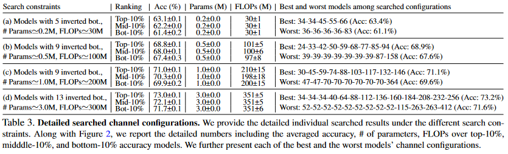

# [Rethinking Channel Dimensions for Efficient Model Design](https://arxiv.org/pdf/2007.00992.pdf)

연산량이 제한 된 모델을 만드는 것은 상당히 어렵습니다. 이 논문에서 저자는 현제 나와 있는 인공신경망들의 정확도가 design convention에 의해서 제한 된다고 이야기합니다. 이 논문을 통해서 저자는 정확도를 올리는 design에 대하여서 설명합니다. 

# Introduction

가벼운 인공신경망을 설계하는 것은 연구자와 실무자 모두에게 중요한 일입니다. 유명한 인공신경망들은 비슷한 설계전략을 사용합니다. Low-dimension의 입력값을 class의 개수보다 더 많은 수의 channel을 가지도록 증폭시킵니다. 가벼운 인공신경망은 이러한 전략에 bottleneck을 결합시켜, 연산 효율을 올립니다. 대체적으로 대부분의 네트워크들은 low-dimension에서 시작해 high-dimension으로 증가시키는 방향으로 만들어집니다. **아래에 있는 이미지를 확인하세요**

위에서 표기된 channel configuration은 MobileNetV2(../MobileNet/Korean/V2/)에서 확인 할 수 있습니다. 이러한 channel dimension의 설계방식은 가벼운 인공신경망의 설계의 토대가 되었습니다. 인공신경망 구조 검색(Network Architecture Search(NAS))방식의 인공신경망들도 이러한 channel 설계방식을 기반으로 약간의 병형을 통해서 만들어졌습니다. 그리고 대부분의 검색은 인공신경망을 구성하는 building block에 한정되었습니다.

저자는 현제 compact한 인공신경망의 channel 구조가 표현력을 제한 한다고 추론하였습니다. 이는 compact한 신경망이 FLOP-효율성에만 집중하기 때문이라고 표현합니다. 이를 통해서 저자는 더 효과적인 구성이 있을 것이라고 예측합니다.

저자는 정확도의 향상을 얻을 수 있는 가벼운 인공신겸망의 효과적인 channel configuration에 대해서 연구합니다. 레이어의 표현력은 출력 행렬의 계수(Rank)에 의해서 표현된다는 가정을 기반으로, 저자는 위에서 이야기한 channel configuration 보다 더 높은 정확도를 가진 channel configuration을 탐색하였습니다. 

이 논문은 아래와 같은 정보들을 가지고 있습니다.

1. 레이어의 설계
2. Channel configuration을 위한 효과적이고 간단한 parameterization 인공신경망 구조의 탐색
3. 제안된 인공신경망의 ImageNet에 관한 실험 결과
4. 이 인공신경망을 다른 작업에 전이한 결과.

# Related Work

AlexNet, VGG, GoogleNet, 그리고 ResNet가 나타난 이후로, 연산량이 적은 가벼운 인공신경망이 제안되었습니다. Depthwise Convolution이라는 새로운 연산자를 사용해서, 몇몇 인공신경망들은 효율적인 연산을 성취했스	ㅂ니다. Depthwise convolution은 많은 양의 훈련가능한 parameter 수를 줄였고, FLOPs 또한 상당히 줄였습니다. 인공신경망 탐색(NAS model)도 가벼운 인공신경망을 만들기 위해서 나온 것입니다. 인공신경망의 넓이 깊이 그리고 해상도를 조절하는 EfficientNet는 최상의 결과를 만들어내는 인공신경망입니다.

이 논문에서는 inverted bottleneck의 효과적인 channel configuration을 찾는 것에 집중하고 있습니다. 이는 NASnet에서 building block을 찾는 것과는 다른 방식입니다.

# Designing an Expansion Layer

이 부분에서는 레이어의 표현력을 생각하면서 어떻게 레이어를 설계하는 방법을 연구합니다. 이는 전체 인공신경망을 설계하는데 가장 필수적인 것입니다.

## Preliminary

### Estimating the expresiveness

Softmax layer는 logit을 entire class probability로 바꾸는 것을 어려워 할 수 있습니다. 이는 Rank deficiency 때문입니다. 마지막 classifier의 입력값이 저차원인 것과, softmax에서 log-probability를 구할때 nonlinearlity가 사라는 것때문에 Rank deficiency가 일어난다고 했습니다. 이를 통해서 행렬의 표현력을 증가시키는 것이 인공신경망의 정확도의 향상을 얻을 수 있습니다. 이를 통해서 특정한 layer의 표현력을 조절한다면 인공신경망의 성능을 향상시킬수 있습니다. [이 논문에서 확인할 수 있습니다.](https://arxiv.org/pdf/1711.03953.pdf)

표현력을 추정하는 방법은 model compresison work에서 연구되었습니다. 논문에서는 인공신경망을 low-rank approximation을 통해서 레이어 레벨에서 압축하였습니다. 압축량은 각 feature 마다의 singular value를 연산하는 것으로 확인하였습니다. [이 논문에서 확인할 수 있습니다.](https://arxiv.org/pdf/1411.4229.pdf)

이 두가지 논문을 기반으로, 저자는 추론합니다. 행렬의 계수는 인공신경망의 표현력과 매우 관련이 있고, 이에 관해서 연구를 하는 것은 효과적인 layer의 설계 지침을 제공합니다.

### Layer Designs in practice

ResNet 계열의 인공신경망들은([1](../ResNet/Korean), [2](../ResNet/Korean/V2), [3](../ResNet/Korean/ResNext)) bottleneck block을 사용합니다. Bottleneck 구조는 입력 channel을 두배씩 늘려서 마지막 레이어의 channel의 수가 class의 갯수를 넘기는 것을 목표로 하였습니다. 이보다 더 효율적인 인공신경망들은, inverted bottlenck의 channel의 크기를 천천히 늘립니다. 또한 마지막에서 두번쩨 레이어에서는 channel dimension의 크기를 키워 사용합니다. Bottleneck과 Inverted Bottlenek 모두 미리 정해진 expansion ratio를 가진 convolutional expansion layer를 포함하고 있습니다.

저자는 다양한 인공신경망 모델에서 사용된 기본 구조에 대해서 의문을 가집니다. **여기서 사용된 기본구조의 레이어는 정확하게 설계가 되어있고, 새로운 인공신경망은 이러한 기본구조를 기반으로 만들면 되는 가?**

## Empirical Study

### Sketch of the Study

Lets first explore the design guide of a single expansion layer that expands the input dimension.

This experiment explores the trend between the rank ratio and the dimension ratio. The rank is originally bounded to the input dimension, but the subsequenct non-linear function will increase the rank above the input dimensions. However, a certain network fails to expand the rank close to the output dimensions and the feature will not be fully utilized. The study uncovers the effect of complicated nonlinear functions such as ELU and SiLU(Swish-1) and where to use them when designing lightweight models.

### Materials

Generate a network with the building block consists of

1. a single  convolution or  convolution
2. an inverted bottleneck block with a  convolution or  depthwise convolution

Building blocks is presented by following equation:

) where weight  and the input 

From this equation,  denotes different kinds of nonlinear function with normalization(in this paper used Batch Normalziation).  is randomly sampled to realize a random-sized network.  is proportionally adjusted for each channel dimension ratio() in the range .  denotes the batch-size, where .

After the building block is calculated, author computes the *rank ratio* ()/d_%7Bout%7D)) for each model and average them. For inverted bottleneck, input and output is assumed to be the input of the first convolution and output after the addition operation of the shortcut.

### Observations

Above image represents the rank changes with respect to the input channel dimension on average. Dimension ratio is on x axis is reciprocal of expansion ratio.

From the figure, we observe the following:

1. **Drastic Channel expansion harms the rank**
2. **Nonlinearities expand rank**
3. **Nonlinearities are critical for convolutions**

### What we learn from the observations

1. an inverted bottleneck is needed to design with the expansion ratio of 6 or smaller values at the first  convolution
2. each inverted bottleneck with a depthwise convolution in a lightweight model needs a higher channel dimension ratio
3. a complicated nonlinearity such as ELU and SiLU needs to be placed after  convolution or  convolution

### Verificaiton of the study

Author provide experimental backup to support current idea. The model trained in this paper consists of two inverted bottlenecks to ajust dimension ratio of IBs and the first  convolutions in each IB. Starting from the baseline with the low DR 1/20. Modified by increasing DR of the first  convolution to 1/6; 2) increasing DR at every IB from .22 to .8; 3) replacing the first ReLU6 with SiLU in each IB.

The above table presents the result. As each factor is included the rank and the accuracy increase together.

# Designing with Channel Configuration

## Problem Formulation

The goal of this paper is to reveal an effective channel configuration of designing a network under the computational demands. This problem can be formulated by following:

),%5C:%5C:%5C:%5Ctextrm%7Bs.t.%20%20%7Dc_1%5Cleq%20c_2%5Cleq%5Ccdots%5Cleq%20c_%7Bd-1%7D%5Cleq%20c_d,%20%5Ctextrm%7BParams%7D(N)%20%5Cleq%20P,%20%5Ctextrm%7BFLOPs%7D(N)%5Cleq%20F)

The funciton  denotes the top-1 accuracy of the model.  is ouput channel of i-th block among d building blocks.  and  each denotes parameter size and FLOPs. The channel dimension is monotonically increasing as denoted in Table 1(Image in the Introduction). 

In this paper, author consider FLOPs rather than inference latency because of it's generality. Moreover, compared to NASnet, which finds Network with fixed channel width, this model search for  while fixing the Network.

## Searching with channel parameterization

Parameterized channel dimensions as &plus;b), where a and b are to be searched. ) is a piecewise linear function by picking a subset of ) up from . 

The search is done on CIFAR-10 and CIFAR-100 data as done in NAS methods. To control the variables, other is set to have fixed channels. Also expansion ratio for the bottleneck layer is fixed to 6.

Optimization is done alternatively by searching and training a network. Each model searched is trained for 30 epochs for faster training and early stopping strategy. Each training is repeated three times for averaging accuracy to reduce the accuracy fluctuation caused by random initialization.

## Search Results

As shown in the image, in this paper, author searched for four different constraints described in the Table 3. From these constrains, author collected top-10%, middle-10%, and bottom-10% to compare the model interms of accuacy.

From the Figure 2, author have found that linear parameterization has higher accuracy rates while maintatining similar compuational costs. The Blue line is similar to the conventional configuration described in the Table 1. Though this experiment, we must select new channel configuration rather than conventional channel configuration.

## Network Upgrade

From the baseline MobileNetV2 which introduced the convention of channel confoiguration, the author only reassigned output channel dimension of inverted bottlenecks by following the parameterization. The design schemetic is similar to the MobileNetV2. Using same stem( convolution with BatchNormalization and ReLU6) and inverted bottleneck with the expansion ratio 6. Same large expansion layer at the penulimate layer. After replacing ReLU6 with SiLU, adopted SE in the inverted Bottlenecks

Based on the experiment found above at section 3, ReLU 6 is replaced only after the first  convolution in each inverted bottleneck. Depthwise convolution has dimension ratio of 1 thus does not replace ReLU6.

# Experiment

## ImageNet Classificstion

### Training on ImageNet

The model is trained on ImageNet dataset using standard data augmentation and Stocastic Gradient Descent and mini batch size of 512 on four GPUs. The result of this Network with comparison is shown in the table below.

Looking at the table, ReXNet have the highest accuracy among the model searched by NAS.

### Comparison with Efficientnets

Comparing with ReXNet and EfficientNets about model scalability with performances.

The graph version of above table is presented below.

Comparing EfficiencyNet and ReXNet, ReXNet is generally more accurate and have lower latency.

## COCO object detection

### Training SSDLite

Using the ReXNet backbone through object detection on the COCO dataset in SSDLite.

### Training Faster RCNN

Adopted RCNN to explore maximal performance of ReXNet.

## Fine-grained classification

Finetune the ImageNet-pretrained models on the datasets Food-101, Stanford Cars, FGVC Aircraft, and Oxford Flowers to verify the transferability.

## COCO Instance Segmentation

Use Mask RCNN to validate the performance of ReXNets on instance segmentation.

# Discussion

### Fixing network depth and searching models

Linear channel parameterization by searching for new models under different constraints. Fixing network depth as 18 and 30, and given constraints with FLOPS. Above image presents that linear channel configurations outperforms the conventional configuration for vairous computational demends.

## Link to NeuralNet(../../)
## Link to English Version(../)