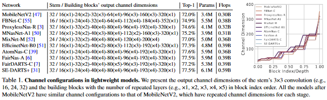

# [Rethinking Channel Dimensions for Efficient Model Design](https://arxiv.org/pdf/2007.00992.pdf)

Designing an efficient model within limited computational cost is challenging. Author argues the accuracy of a lightweight model has been further limited by the design conventions.

# Introduction

Designing a lightweight network architecture is crucial for both researcher and practitioners. Popular network share similar strategy where a low-dimensional input-channel is expanded by a few channel expansion layers toward surpassing the number of classes. Lightweight models also follow this strategies with some shrinking channels for computational efficiency. In general, the network start with low dimension then grows toward larger dimension. **see table below**

This Channel configuration was introduced by [MobileNetV2](../MobileNet/V2/) and became the design convention of configuring channel dimensions in lightweight networks. Even network architecture search (NAS)-based models were designed upon the convention or little more exploration within few option near the configuration and focused on searching building blocks.

Author hypothesized that compact model designed by the conventional channel configuration may be limited in the expressive power due to mainly focusing on flop-efficiency; there would exist a more effective configuration over the traditional one.

Author investigate an effective channel configuration of a lightweight network with additional accuracy gain. Upon Assumption that the expressiveness of a layer can be estimated by the matrix rank of the output feature, author search network architectures to identify the channel configuration yielding a better accuracy over the aforementioned convention. 

This paper contains following information:

1. Designing a single layer
2. a network architecture exploration concerning the channel configuration towards a simple yet effective parameterization
3. using proposed model to achieve remarkable results on ImageNet outperformed recent lightweight models including NAS-based models
4. Transfering trained model to different tasks, indicating high expressiveness of the model.