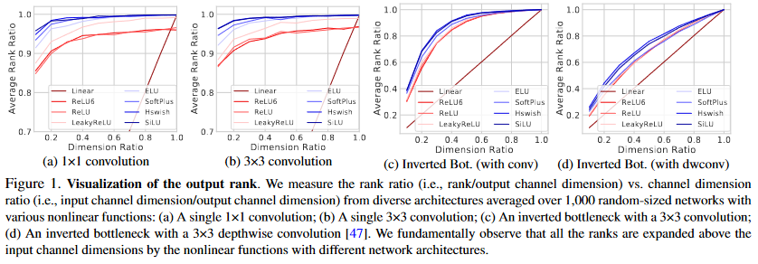
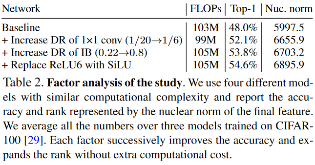

# [Rethinking Channel Dimensions for Efficient Model Design](https://arxiv.org/pdf/2007.00992.pdf)

Designing an efficient model within limited computational cost is challenging. Author argues the accuracy of a lightweight model has been further limited by the design conventions.

# Introduction

Designing a lightweight network architecture is crucial for both researcher and practitioners. Popular network share similar strategy where a low-dimensional input-channel is expanded by a few channel expansion layers toward surpassing the number of classes. Lightweight models also follow this strategies with some shrinking channels for computational efficiency. In general, the network start with low dimension then grows toward larger dimension. **see table below**

This Channel configuration was introduced by [MobileNetV2](../MobileNet/V2/) and became the design convention of configuring channel dimensions in lightweight networks. Even network architecture search (NAS)-based models were designed upon the convention or little more exploration within few option near the configuration and focused on searching building blocks.

Author hypothesized that compact model designed by the conventional channel configuration may be limited in the expressive power due to mainly focusing on flop-efficiency; there would exist a more effective configuration over the traditional one.

Author investigate an effective channel configuration of a lightweight network with additional accuracy gain. Upon Assumption that the expressiveness of a layer can be estimated by the matrix rank of the output feature, author search network architectures to identify the channel configuration yielding a better accuracy over the aforementioned convention. 

This paper contains following information:

1. Designing a single layer
2. a network architecture exploration concerning the channel configuration towards a simple yet effective parameterization
3. using proposed model to achieve remarkable results on ImageNet outperformed recent lightweight models including NAS-based models
4. Transfering trained model to different tasks, indicating high expressiveness of the model.

# Related Work

After appearance of AlexNet, VGG, GoogleNet and ResNet, lighter models have been proposed with lower computational budgets. Using new operator depthwise convolution, several architecture have been proposed with futher efficent architecture designs. Depthwise convolution reduces a large amount of trainable parameters and significant FLOPS reduction. Structured network architecture search(NAS) methods have been proposed to yield the lightweight models. EfficientNet, based on compound scaling of width, depth, and resolution, became a de facto state-of-art model.

This paper focus on finding an effective channel configuration for an inverted bottleneck module, which is an alternative to searching building blocks.

# Designing an Expansion Layer

This section explores how to design a layer properly considering the expressiveness, which is essential to design an entire network architecture.

## Preliminary

### Estimating the expresiveness

The softmax layer may suffer from turning the logits to the entire class probability due to the rank deficiency because of the low input dimensionality of the final classifier and the vanished nonlinearlity at the softmax layer when computing the log-probability. Enhancing the expresiveness improves the model accuracy. This implies that a network can be improved by dealing with the lack of expressiveness at certain layers. [Link to paper](https://arxiv.org/pdf/1711.03953.pdf)

Estimating the expressiveness was studied in a model compression work. The paper compressed a model at layer-level by a low-rank approximateion; investigated the amount of compression by computing the singular values of each feature. [Link to paper](https://arxiv.org/pdf/1411.4229.pdf)

Inspired by these two papers, Author conjecture that the rank may be closely related to the expressiveness of a network and studying it may provide an effective layer design guide.

### Layer Designs in practice

 ResNet Families ([1](../ResNet), [2](../ResNet/V2), [3](../ResNet/ResNext)) have bottleneck blocks doubling the input channel dimensions to make the final dimension above the number of classes at last. The efficient models increase the channel dimensions steadily in inverted bottlenecks, involving a large expansion layer at the penultimate layer. Both bottleneck and inverted bottleneck block have the convolutional expansion layer with the predefined expansion ratio.

Author propose a question about the building block used in many different network models. **Are these layers designed correctly and just need to design a new model accordingly?**

## Empirical Study

### Sketch of the Study

Lets first explore the design guide of a single expansion layer that expands the input dimension.

This experiment explores the trend between the rank ratio and the dimension ratio. The rank is originally bounded to the input dimension, but the subsequenct non-linear function will increase the rank above the input dimensions. However, a certain network fails to expand the rank close to the output dimensions and the feature will not be fully utilized. The study uncovers the effect of complicated nonlinear functions such as ELU and SiLU(Swish-1) and where to use them when designing lightweight models.

### Materials

Generate a network with the building block consists of

1. a single  convolution or  convolution
2. an inverted bottleneck block with a  convolution or  depthwise convolution

Building blocks is presented by following equation:

) where weight  and the input 

From this equation,  denotes different kinds of nonlinear function with normalization(in this paper used Batch Normalziation).  is randomly sampled to realize a random-sized network.  is proportionally adjusted for each channel dimension ratio() in the range .  denotes the batch-size, where .

After the building block is calculated, author computes the *rank ratio* ()/d_%7Bout%7D)) for each model and average them. For inverted bottleneck, input and output is assumed to be the input of the first convolution and output after the addition operation of the shortcut.

### Observations

Above image represents the rank changes with respect to the input channel dimension on average. Dimension ratio is on x axis is reciprocal of expansion ratio.

From the figure, we observe the following:

1. **Drastic Channel expansion harms the rank**
2. **Nonlinearities expand rank**
3. **Nonlinearities are critical for convolutions**

### What we learn from the observations

1. an inverted bottleneck is needed to design with the expansion ratio of 6 or smaller values at the first  convolution
2. each inverted bottleneck with a depthwise convolution in a lightweight model needs a higher channel dimension ratio
3. a complicated nonlinearity such as ELU and SiLU needs to be placed after  convolution or  convolution

### Verificaiton of the study

Author provide experimental backup to support current idea. The model trained in this paper consists of two inverted bottlenecks to ajust dimension ratio of IBs and the first  convolutions in each IB. Starting from the baseline with the low DR 1/20. Modified by increasing DR of the first  convolution to 1/6; 2) increasing DR at every IB from .22 to .8; 3) replacing the first ReLU6 with SiLU in each IB.

The above table presents the result. As each factor is included the rank and the accuracy increase together.