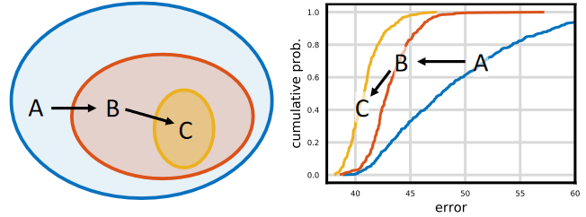
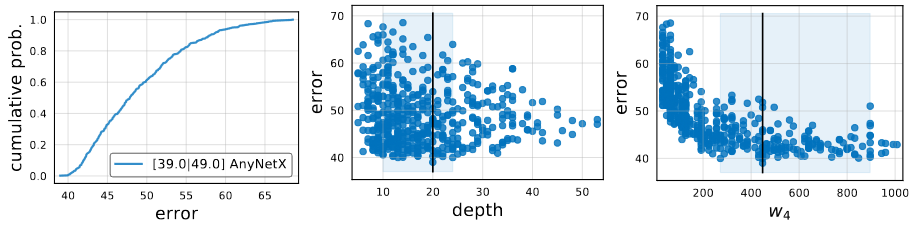

# [Designing Network Design Spaces](https://arxiv.org/pdf/2003.13678.pdf)

이 논문의 목표는 인공신경망 설계에 대한 이해를 도우는 것과, 범용적인 환경에서 사용가능한 설계 원칙을 찾는 것입니다. 인공신경망 하나를 설계하는 것에 집중하는 것이 아니라 저자는 인공신경망 집합을 paramterize하는 network design space를 설계합니다.

# Introduction

이 논문에서, 저자는 새로운 인공신경망 design paradigm을 소개합니다. 이 방식은 manual design의 장점과 인공신경망 탐색의 장점을 합쳤습니다. 인공신경망 하나를 설계하는 것에 집중하는 것이 아니라 저자는 인공신경망 집합을 paramterize하는 network design space를 설계합니다. Manual design 처럼, 저자는 해석가능성을 목표로 하고 있습니다. 이를 통해서 간단하며, 잘 장동하고, 모든 상황에서 사용가능 한 범용적인 design principle을 찾는 것을 목표로 합니다. 그리고 NAS 처럼 저자는 semi-automated procedure의 장점을 통해서 위의 목표를 이루려고 합니다.

범용적인 전략은 성능을 유지시키거나 향상시키면서 초기의 design space에서 점진적으로 간단한 방식으로 설계를 하는 것입니다. 위의 이미지에서 보는 것처럼, 가장 초기의 design space A에서 두개의 개선방식을 적용시켜 design space B와 C를 얻었습니다. 이러한 경우, 이고, Error Dristribution이 A에서 B, B에서 C로 갈때 향상되는 것을 확인 할 수 있습니다. Model population에 적용된 design principle이 더 효과적이고 범용적이라는 희망을 가지고 있습니다. 전체적인 방식은 manual design과 비슷합니다. 다만 population level에 적용을 하고 network design space의 distribution estimate를 통해서 설명합니다.

이 논문의 주제는 인공신경망의 model family가 VGG, ResNet, ResNeXt를 포함하고 있다는 가정아래 network structure를 탐색하는 것입니다. 이러한 제약이 없는 design space를 AnyNet이라고 부르고, 이 AnyNet에 Human-in-the-loop 방식을 사용해서 low-dimensional design space에 도달한 network를 RegNet이라고 부릅니다. RegNet은 간단한 "regular" network로 이루어졌기에 그와 같은 이름이 붙었습니다.

# Related Work

### Manual Network Design

유명한 인공신경망, VGG, Inception, ResNet, ResNeXt, DenseNet, 그리고 MobileNet의 설계 방식은 대부분 수동이었습니다. 또한 정확도를 증가시키는 새로운 설계 방식을 찾기위해 집중했습니다. 저자는 이러한 인공신경망들의 목표인 새로운 설계 원칙을 찾는 것을 공유합니다. 이러한 방식은 manual design과 유사하지만 design space level에서 이루어집니다.

### Automated network design

Network design process는 manual 탐색에서 NAS로 유명해진 automated network design으로 변화해왔습니다. 탐색 알고리즘에 집중하는 NAS와 다르게 이방식은 새로운 design space를 설계하는 방식에 집중합니다. 좋은 design space는 NAS 탐색 알고리즘의 효율을 높이고, design space의 질을 높임으로 더 좋은 모델이 있을 확율을 높여줍니다.

### Comparing network

[On network design space for visual recognition](../../NDSVR/Korean/)의 저자가 design space로부터 추출한 network의 집합을 비교하고 해석하는 새로운 방식을 소개합니다. 이 distribution-level의 관점은 범용적인 설계원칙을 찾는 것과 똑같습니다. 그럼으로 이 논문의 저자는 이 방식을 채용하고, distribution estimate가 design space를 설계하는 과정에서 유용한 도구가 될것이라고 설명합니다.

### Parameterization

Final quantized linear parameterization은 이전 논문들과 비슷합니다. 하지만 중요한 2개의 차이점이 있습니다.

1. design choice를 정당화 하는 empirical study를 재공합니다.
2. 전에는 이해하지 못하는 structural design choice에 영감을 제공합니다.

# Design Space Design

저자는 초기의 제한없는 design space로부터 점진적으로 간단하게 만드는 것을 제시합니다. 이를 Design space design이라고 말합니다. Design process의 각 단계는, initial design space를 입력값으로 수정한 design space를 출력값으로 여깁니다. 각 design step의 목표는 간단한 모델의 집합이나 더 좋은 성능을 가진 모델을 만드는 새로운 설계원칙을 찾는 것입니다.

## Tools for Design Space Design

Design space를 평가하고 비교하기 위해 저자는 [Radosavovic과 다른 저자들이 소개한 도구](../../NDSVR/Korean/)를 사용합니다. 이러한 방식은 design space에서 model의 집합을 추출하여 design space의 성능을 수치로 표현합니다. 그리고 구한 model error dsitribution을 characterize 하빈다.

Model의 distribution을 얻기위해서 저자는 design space로 부터 n개의 model을 sample하고 traniing 합니다. 효율성을 위해서 저자는 low-compute, low-epoch training 영역에서 사용합니다.

Deisgh space quality를 해석하기 위한 도구로 error empirical distribution function을 사용합니다. n개의 model에 대한 Error EDF를 error 를 사용해서 나타내면:

=%5Cfrac%7B1%7D%7Bn%7D%5Csum_%7Bi=1%7D%5E%7Bn%7D%7B1%5Cleft%5Be_i%3Ce%5Cright%5D%7D)

)는 error가 e보다 작은 model의 부분을 나타냅니다.

위의 이미지는 n=500을 AnyNetX design space로 부터 추출한 error EDF를 나타낸 것입니다. 훈련된 model의 집합이 주어졌을 때, network properties와 network error사이의 관계를 그래프로 만들고 분석하였습니다. 이러한 모델의 시각화는 복잡하고 높은 차원의 정보를 1차원으로 줄여 design space에 관한 이해를 얻을 수 있도록 도와 줍니다.

요약하자면,

1. model의 distribution은 design space로부터 n개의 model을 추출하고 훈련하여 얻습니다.
2. Error EDF를 계산하고 그래프로 정리하여 design space quality를 요약합니다.
3. design space의 다양한 특성을 시각화 하고 empirical bootstrap을 통해 insight를 얻습니다.
4. 이러한 insight를 활용해 design space를 개선합니다.

