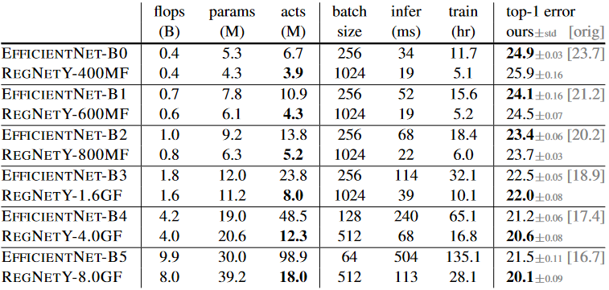

# [Designing Network Design Spaces](https://arxiv.org/pdf/2003.13678.pdf)

The goal of this paper is to help advance the understanding of network design and discover design principles that generalize across the setting. Instead of focusing on designing individual network instances, author design network design space that parameterize population of network.

# Introduction

In this work, author present a new network design paradigm that combines the advantages of manual design and NAS. Instead of focusing on designing individual network instances, author design design spaces that parameterize populations of network. Like in manual design, author aim for interpretability and to discover general design principles that describe network that are simple, work well, and generalize across setting. Like in NAS, author aim to take advantage of semi-automated procedures to help achieve these goal.

The general strategy is to progressively design simplified version of an initial design space while maintaining or improving its quality. As shown in the image above, the design started from initial design space A and apply two refinement steps to yield design space B and C. In this case, , and the error distributions are strictly improving from A to B to C. The hope is that design principles that apply to model populations are more likely to be robust and generalize. The overall process is analogous to manual design, elevated to the population level and guided via distribution estimates of network design spaces.

The focus of this paper is on exploring network structure assuming standard model families including VGG, ResNet, and ResNeXt. From relatively unconstrained design space called AnyNet, author apply human-in-the-loop methodology to arrive at a low-dimensional design space consisting of simple "regular" networks called RegNet.

# Related Work

### Manual Network design

The design process behind popular networks, such as VGG, Inception, ResNet, ResNeXt, DenseNet, and MobileNet, was largely manual and focused on discovering new design choices that improve accuracy. Author share the goal of discovering new design principles. This methodology is analogous to manual design but performed at the design space level.

### Automated network design

The network design process has shifted from a manual exploration to more automated network design popularized by NAS. Unlike NAS which focuses on the search algorithm, this methodology focus on a paradigm for designing novel design spaces. Better design space an improve the efficiency of NAS search algorithm and lead to existence of better models by enriching the design space.

### Network Scaling

Both manual and semi-automated network design typically focus on finding best-performing network instances for specific regime. The goal of this paper is to discover general design principles that hold across regimes and allow for efficient tuning for the optimal network in any target regime.

### Comparing network

The author of [On network design space for visual recognition](../NDSVR) proposed a methodology for comparing and analyzing populations of networks sampled from a design space. This distribution-level view is fully-aligned with goal of finding general design principles. Therefore, author adopt this methodology and demonstrate that it can serve as a useful tool for the design space design process.

### Parameterization

Final quantized linear parameterization shares similarity with previous work. There are two key difference:

1. provide empirical study justifying the design choices
2. give insights into structural design choices that were not previously understood.

# Design Space Design

Author propose to design progressively simplified versions of an initial, unconstrained design space, referred as *design space design*. In each step of design process the input is an initial design space and the output is a refined design space, where the aim of each design step is to discover design principle that yield populations of a simpler or better performing model.

## Tools for Design Space Design

To evaluate and compare design spaces, author used [the tools introduced by Radosavovic et al](../NDSVR). The method is to quantify the quality of a design space by sampling a set of models from that design space and characterizing the resulting model error distribution. 

To obtain a distribution of model, author sample and train n models from a design space. For efficiency author primarily do so in a low-compute, low-epoch training regime.

The primary tool for analyzing design space quality is the error empirical distribution function(EDF). The error EDF of n models with error  is given by:

=%5Cfrac%7B1%7D%7Bn%7D%5Csum_%7Bi=1%7D%5E%7Bn%7D%7B1%5Cleft%5Be_i%3Ce%5Cright%5D%7D)

) gives the fraction of model with error less than e. 

The above image show the error EDF for n = 500 sampled models form the AnyNetX design space. Given a population for trained models, we can plot and analyze various network properties versus network error. Such visualization show 1D projections of a complex, high-dimensional space, and can help obtain insights into the design space. 

To summarize:

1. distribution of models obtained by sampling and training n models from a design space
2. compute and plot error EDFs to summarize design space quality
3. visualize various properties of a design space and use an empirical bootstrap to gain insight
4. use these insights to refine the design space

## The AnyNet Design Space

The basic design of networks in AnyNet design space is straightforward, as shown in the image above. Given an input image, a network consist of a simple stem, followed by the network body that performs the bulk of the computation, and a final network head that predicts the output class.

The network body consists of 4 stages operating at progressively reduced resolution. Each stage consists of a sequence of identical blocks. In total, for each stage i,  the degrees of freedom include the number of blocks, block width, and any other block parameters.

Most of the experiments in this paper use the standard residual bottlenecks block with group convolution called X block. As represented in the image above, each X block consist of a  conv,  group conv and a final  conv.  convs alters the channel width. Batch normalization and ReLU follow each convolution. The block has 3 parameters: the width , bottleneck ratio , and group width . 

The AnyNet built with this structure is called AnyNetX. In this design space, there are 16 degrees of freedom as each network consist of 4 stages and each stage i has 4 parameters:

1. the number of blocks 
2. block width 
3. bottleneck ratio 
4. group width 

To obtain valid models, author perform log-uniform sampling of , ,  and divisible by 8, , and . From these parameters, repeat sampling until n=500, and train each model for 10 epochs.

Basic statistics for AnyNetX is shown in the above image.

From above parameters, there are %5E4%5Capprox10%5E%7B18%7D) possible model configurations in the AnyNetX design space. Rather than searching the best model from over  configurations, author explore to find general design principles that explains and refine the design space.

There are four purpose in approach of designing design space:
1. to simplify the structure of the design space
2. to improve the interpretability of the design space
3. to improve or maintain the design space quality
4. to maintain model diversity in the design space

### AnyNetXA

Initial unconstrained AnyNetX design space is AnyNetXA

### AnyNetXB

Shared bottleneck ratio  for all stage i for the AnyNetXA design space is called AnyNetXB. Same as AnyNetXA, author sampled and trained 500 models from AnyNetXB.

The EDFs of AnyNetXA and AnyNetXB, shown in the image above, are virtually identical in both in the average and best case. Therefore, this indicates when coupling the bottleneck ratio does not effect the accuracy. In addition to being simpler, the AnyNetXB is more amenable to analysis.

### AnyNetXC

The second refinement step closely follows the first. AnyNetXC use a shared group width  over AnyNetXB. Overall, AnyNetXC has 6 fewer degrees of freedom than AnyNetXA, and reduce the design space size nearly four orders of magnitude. 

### AnyNetXD

Examining the network structures of both good and bad network from AnyNetXC in image above. Top three graph represent good AnyNetXC Networks and bottom three represent bad AnyNetXC.

From these graphs, there is a pattern: good networks have increasing widths. Applying these design principle of  to AnyNetXC and refer to the design space as AnyNetXD. 

The graph above represent testing different constraints on the width of the network. When using increasing widths, AnyNetXD, EDF is improved substantially. 

### AnyNetXE

There is another interesting trend. The stage depth  tends to increase for the best models, although not necessarily in the last stage.

Applying constraints  on AnyNetXD is called AnyNetXE. AnyNetXE is slightly better than AnyNetXD.

The constraints on  and  each reduce the design space by 4!, with a cumulative reduction of ) from AnyNetXA.

## The RegNet Design Space

Above image show the best 20 models from AnyNetXE in a single plot. For each model, per-block width  of every block j up to the network depth d. There are significant variance in the individual models(gray curves). However, there is a trivial linear fit(), black solid line) that explain the trend of the growth of network widths for top models. *Note that the y-axis are logarithmic*

Since individual models have quantized widths (piecewise constant functions), author introduce a linear parameterization for block widths:

This parameterization has three parameters: depth , initial width , and slope . Using this generates a different block width  for each block . 

To quantize , author introduce an additional parameter  that controls quantization as follows. First given  from above equation, computes  for each block j such that the following holds:

Then, to quantize , simply round (denoted as )and compute quantized per-block widths  via :

From this per-block  representation, conversion to per-stage format by simply counting the number of blocks with constant width, where each stage i has block width as  and number of block . 

Author test this parameterization by fitting to models from AnyNetX. Given a model, compute the fit by setting d to the network depth and performing a grid search over , , and  to minimize the mean log-ratio(denoted by ) of predicted to observed per-block widths.

Result for two top networks from AnyNetXE are shown in the image above. The quantized linear fits(dashed curves) are good fits of these best models(solid curves).

Plotting the fitting error  versus network error for every network in AnyNetXC through AnyNetXE in the image above. From this image we could find two observations.

1. The best models in each design space all have good linear fits
	* Empirical bootstrap gives a narrow band of  near zero that likely contains the best models in each design space.
2. On average,  improves going from AnyNetXC to AnyNetXE
	* Showing that the linear parameterization naturally enforces related constrains to  and   increasing.

To further test the linear parameterization, author design a design space that only	contains models with such linear structure. Particularly, network structure is specified by 6 parameters:  d, , , , b and g. Given these parameters, author generate block widths and depth using equations written above. With these definition author defined resulting space as RegNet. Parameter is sampled from .

The Error EDF of RegNetX is shown in the leftmost image. Models in RegNetX have better average error than AnyNetX while maintaining the best models. The middle image represent two additional improvement. First is using , and Second is . However, to maintain the diversity of models, author did not impose either restrictions. The final image shows the random search efficiency for both AnyNetXA and RegNetX.

## Design Space Summary

Above table shows a summary of the design space sizes. For RegNet, the estimation is based on the size of quantization of its continuous parameters. In designing RegNetX, Author reduced the dimension of the original AnyNetX design space from 16 to 6 dimensions. The total size is reduced nearly 10 orders of magnitude.

## Design Space Generalization

The RegNet design space was designed in a low-compute, low-epoch training regime with only a single block type. Author checks if proposed principles works on different settings such as higher flops, higher epoch, with 5-stage networks and with various block types.

In all cases the ordering of the design space is consistent with . In other words, there is no signs of over fitting. The 5-stage results show the regular structure of RegNet can generalize to more stages, where AnyNetXA has even more degrees of freedom.

Above image show different block type used in this test cases. X block has the best result among various block design.

# Analyzing the RegNetX Design Space

Author further analyze the RegNetX design space and revisit common deep network design choices. These analysis yields surprising insights that do not match popular practice. As the RegNetX design space has a high concentration of good models, author sampled fewer models, but training them or longer. 

### RegNet trends

1. The depth of the best models is stable across regimes with an optimal block of ~20 blocks
	* This is contrast to the common practice of using deeper models for higher flop regime
2. The best model use a bottleneck ratio of 1.0
	* This removes the bottleneck
3. The width multiplier  of good models is ~2.5
	* This is similar to the popular recipe of doubling widths across stages.
4. Other parameters increase with complexity.

### Complexity analysis

In addition to flops and parameters, author analyze network activation which is defined as the size of output tensors of all convolution layers. Complexity measures of common convolution operators are described in the above table. Activations is not a common measure of network complexity but heavily affect runtime on memory-bound hardware accelerators, shown in the top-right image.

For the best models in the population, activations increase with the square-root of flops, parameters increase linearly, and runtime is best modeled using both linear and a square-root term due to its dependence on both flops and activations.

### RegNetX constrained

Using above findings, author refine the RegNetX design space.

1. Based on RegNet trend, RegNetX is set to have , , and .
2. Based on Complexity analysis, limit parameter and activations
	* This yields fast, low-parameter, low-memory models without affecting accuracy.

Constrained version of RegNetX, marked by RegNetX C, has better results for every different flops. 

### Alternate Design Choices

Modern mobile networks often employ the inverted bottleneck () along with depthwise convolution ().

The inverted bottleneck degrades the EDF slightly and depthwise convolution performs even worse. Also shown in the right image, scaling the input image does not help improving accuracy for RegNetX

### SE

RegNetX with popular Squeeze and Excitation operation, abbreviated as RegNetY, yields better result than when it is not used.

# Comparison to Existing Networks

Above graph and table represent best RegNetX models and RegNetY models for each flop regime. Through this linear structure of block index, we could observe an interesting pattern. The higher flop models have a large number of blocks in the third stage and a small number of blocks in the last stage. Group width g increase with complexity, but depth d saturates for large models.

## State-of-the-Art Comparison: Mobile Regime

The recent work on network design has focused on the mobile regime. When comparing RegNet models at 600MF to existing networks in above table. We observe that RegNet are effective in this regime considering the substantial body of work on finding better mobile networks via both manual design and NAS.

Author emphasize that RegNet models use only 100 epoch schedule without regularization except weight decay, while other models use longer schedules with various enhancement.

## Standard Baselines Comparison: ResNe(X)t

RegNetX models provide considerable improvements under all complexity metrics. Also RegNet model performs better under all complexity metrics. 

## State-of-the-Art Comparison: Full Regime

EfficentNet is reproduced using training setup used for RegNet. Therefore the Efficiency Net result is lower than the original results.

For Low flop models, EfficentNet outperforms both RegNet. At Intermediate flops, RegNetY outperforms EfficentNet. At Higher flops both RegNetX and RegNetY outperform EfficentNet.

For EfficentNet activations scale linearly with flops compared to activation scaling with the square root of flops for RegNet. Thus, EfficentNet is slow in both inference and training time.

# Conclusion

Author present a new network design paradigm. Designing network design spaces is a promising avenue for future research.