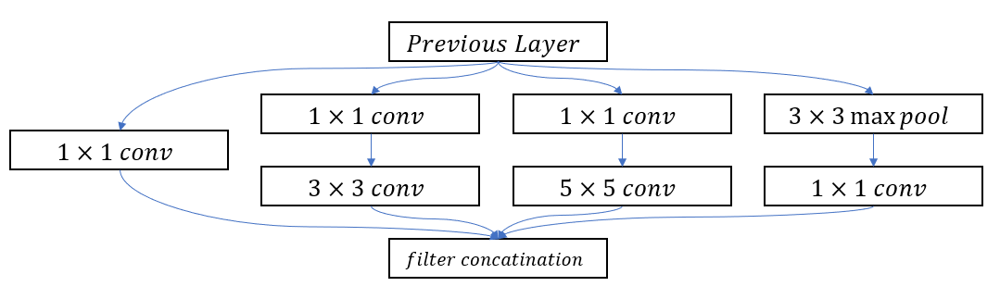
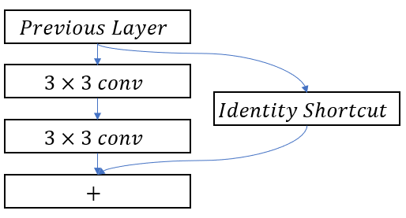
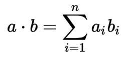
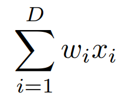
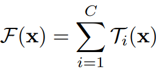
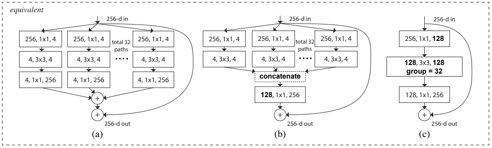

# [Aggregated Residual Transformations for Deep Neural Network](https://arxiv.org/pdf/1611.05431.pdf)

이 논문의 저자는 ResNet의 기본 단위인 Residual block을 Multi-branch를 활용하여 aggregated Residual block을 만드는 방식에 대해서 이야기합니다. 이러한 전략은 Neural Network에 새로운 차원을 소개하는데 저자는 이것을 Cardinality라고 명명했습니다.

# Introduction

최근 visual recogntion에 관련된 연구를 살펴보면, 특징을 찾는 feature engineering에서 network enigneering으로 옮겨 가고 있습니다. 인공신경망이 발전해 가면서, Large-scale data을 기반으로 neural network를 통해서 feature을 찾을 수 있게 되었습니다.

좋은 안공신경망을 만드는 것은 레이어의 갯수가 증가할수록 hyper-parameter의 수가 늘어갈수록 만들기 어려워졌습니다. 여기서 hyper-parameter란 인공신경망을 훈련하기 위해서 조절하는 값들을 의미합니다. 예를 들어서 width, filter size, stride, depth 등이 있습니다. VGG network처럼 간단하면서 효율적인 전략을 사용하는 ResNet은 같은 모양읠 레이어를 쌓아가는 technique를 사용합니다.

이 논문은 VGG/ResNet의 전략은 반복적인 레이어를 사용하면서, 새로운 split-transform-merge 전략을 첨가했습니다. 이 전략은 Inception ResNet과 비슷하게 여러가진 branch로 나뉘어지고 마지막에는 합쳐집니다. 하지만 이 둘의 가장 큰 차이점은, Inception ResNet은 다양한 종류의 레이어를 사용하는것에 비해, ResNeXt리거 불리우는 이 네트워크는 같은 종류의 레이어를 연속적으로 사용합니다. 이를 통해서 network에 영향을 주는 factor들을 독립적으로 확인할수 있게 되었ㅅ브니다.

저자는 이 논문에서 새로운 방식인 cardinality를 강조합니다. Cardinality는 set of transofrmation의 크기입니다. 여러가지 실험을 통해서 저자는 cardinality를 늘리는 것이 network를 깊게하는 것이나 넓게 하는 것에 비해서 효과적이라고 말합니다.

# Related work
## Multibranch convolutional networks

The Inception models are successful multi-branch architectures where each branch is carefully customized

Inception module | Residual Module
-----------------|-----------------
 | 

These two module use multibrach network, where Inception ResNet uses different types of convoluitonal layers and ResNet module uses Identity matrics and two convolutional layers.

## Grouped convolutions

The use of group convolution dates back to the AlexNet paper. The mobitation given by the author of AlexNet is for distributing the model over two GPUs. There has been little evident on exploiting grouped convolutions to improve accuracy.

## Compressing convolutional networks

Decomposition is widely adopted techinque to recude redundancy of deep convolutional networks and accelerate/compress them. 

## Ensembling

Averaginmg a set of independently trained netwroks is an effective solution to improving accuracy, widely adopted in recognition competitions. However, ResNeXt is not ensembling because the members to be aggregated are trained jointly not independently.

# Method
## Tempalate

Design of ResNeXt is adopted from highly modularized design following VGG/ResNets. This network consist of a stack of residual blocks, which have same topology and are subject to two simple rules.

 1. For the same output feature map size, the layers have the same number of filters.
 2. If the feature map size is halved, the number of filter is doubled so as to preserve the time complexity per layer

With these two rules, authors designed template modules and all modules in a newtork can be determined accordingly.

## Revisiting Simple Neurons.

The simplest neurons in artificial neural networks perform inner product(weighted sum), which is the elementary transformation done by fully connected nad convolutional layers.

Inner product equation, presented above, is similar to aggregated transformation shown below.

Where ![x=[x_1,x_2,...,x_D]](https://latex.codecogs.com/svg.image?x=[x_1,x_2,...,x_D]) is a D-Channel input vector to the neuron and  is a filter's weight for the i-th Channel. This equation could be represented as a figure below

The operations to build a neuron could be splitted in to three operations:

1. *Spliting*: the vector x is sliced as a low-dimensional subspace 
2. *Transforming* : the low-dimensional representation is transformed, 
3. *Aggregating* : the transformations in all embedding are aggregated by 

## Aggregated Transformations

Giving above analysis of simple neuron, Aggregated Transformation will be formally presented as equation below.

where ) can be any arbitrary function.

In this equation C is the size of the set of transformations to be aggergated, and is called Cardinatlity. Similar to value D in simple neuron architecture, value C can be an arbitrary number.

The structure of ResNext is using a simple design strategy: all ) have the same topology. This extends the style of VGG of repeating layers of same shape which is helpful for isolating a few factors and extending to any large number of trasnformations.

Above image represnet how ResNeXt blocks could be represented. In this image, a) is Aggregated Residual transformations, b) a block equivalent of a and implementing early concatenation, c0 a block equivalent of (a,b) implemented as group convolution.

### Relation to ***Inception-ResNet***

ResNeXt appears similar to the Inception-ResNet blovk in that it involves branching. Inception-ResNet uses different convolutional layers for different maths. On the other hand, ResNeXt uses same topoloy among the multiple path.

# Reference

https://takenotesforvision.tistory.com/12

## [Link to Original Version](../)
## [Link to ResNext](../ResNext/)
## [Link to English Version](../../ResNext)