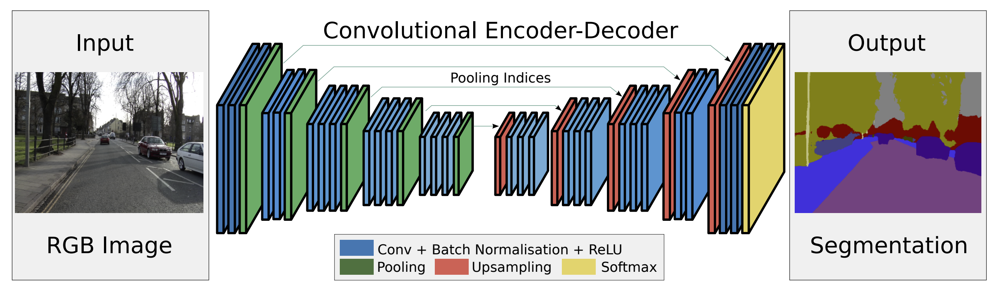
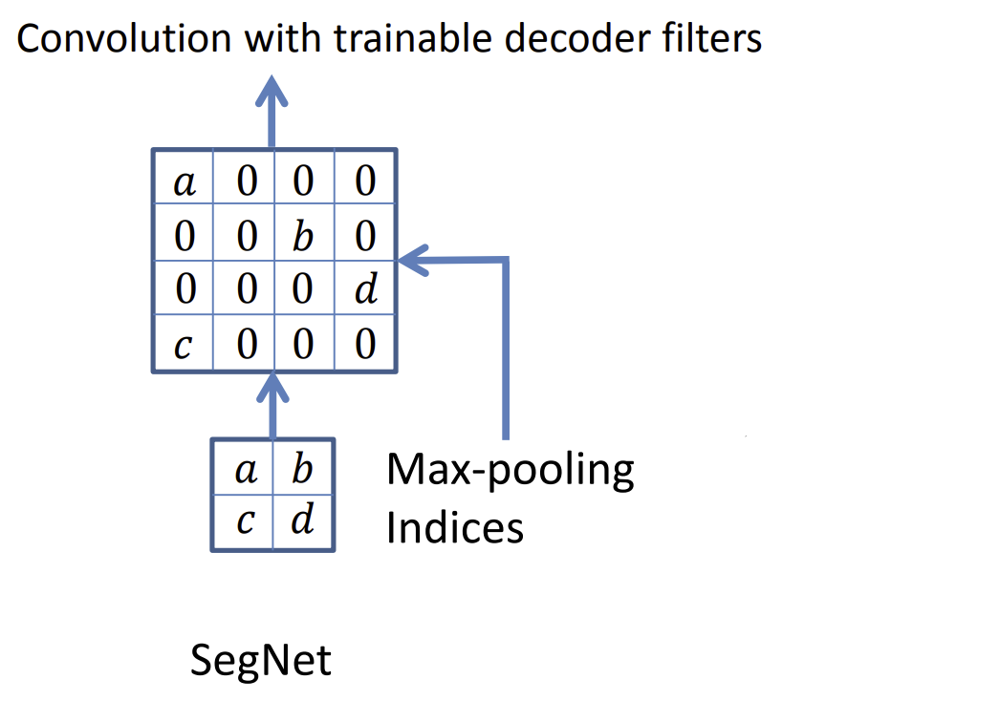

# [SegNet : A Deep Convolutional Encoder-Decoder Architecture For Image Segementation](https://arxiv.org/pdf/1511.00561.pdf)

SegNet is a deep fully convolutional neural network architecture for pixel-wise segmentation. SegNet consist of encoder and decoder. Encoder of the SegNet is topologically identical to VGG16 networks. Decoder is an mirror of the encoder. The max-pooling layer on encoder is changed to up-sampling layer using the indicies computed in the max-pooling layer. This eliminated the need of learning for up-sampling

# Introduction

SegNet is designed to be an efficient architecture for pixel-wise semantic segmentation. The primary purpose of this network is to understand the road scenes, identify model appearance (roads, building) and shapes (car, pedestrians, trees), and understanding the spatial-relationship (context) between different classes, such as road, sidewalks, crosswalk, etc.

# Architecture

The above image is the architecture of the SegNet. SegNet consist of two different parts: Encoder and Decoder.

## Encoder

The Encoder of SegNet consist of 13 convolutional layers that is identical to the convolutional layers in VGG16. From the VGG16, the fully connected layers are eliminated to retain the high resolution feature maps. Also, eliminating the fully connected layers decreased the number of parameters in the encoder of SegNet.

After each convolutional layer, batch-normalization and rectified linear non-linearity (max(x,0)) is applied. Pooling layer is consist of max-pooling with strides. In each pooling layer, pooling indicies are stored for up-sampling layer of decoder.

## Decoder

The Decoder of SegNet are mirror image of Encoder. In the decoder, the max-pooling layer is subsituted with the up-sampling layer.

The upsampling layer uses the Max-pooling indices from the max-pooling layer. They use the indices to set the values retained from the previous layers. The values that are not marked by the max-pooling indicies are set to zeros.

Compared to DeconvNet, SegNet does not contain fully connected layer. Eliminating the fully connected layer, SegNet have much less parameters and faster inference time. SegNet and DeconvNet uses similar non-trained up-sampling layer.

Compared to SegNet, Unet does not use pooling indices, but instead they store full feature map and concatenates with the up-sampled feature map. The up-sampling in U-net is using deconvolution.