# [Feature Space Optimization for Semantic Video Segmentation](http://vladlen.info/papers/FSO.pdf)

The visual sensory inputs are normally a video. In the video, there are two kinds of information that are present, Spaital and temporal informations. The video contains spatial information within individual frames. The temporal information could be gathered across multiple frames.

# Introduction

Long-range temporal regularization is difficult because both the camera and the scene are in motion. Simply appending the time dimensions to the feature space can lead to incorrect associations and cause misinterpretation in the presence of camera and object motion. These motion cans cause significant optimal flow in the visual field. 

The underlying problem of temporal regularization using simple append methods is that Euclidean distance in the space-time video volume is not a good approximation for correspondence. The solution, this paper present, is to optimize the feature space used by Dense CRF.

# Model

The model is a set of cliques that conver overlapping blocks in the video volume. 

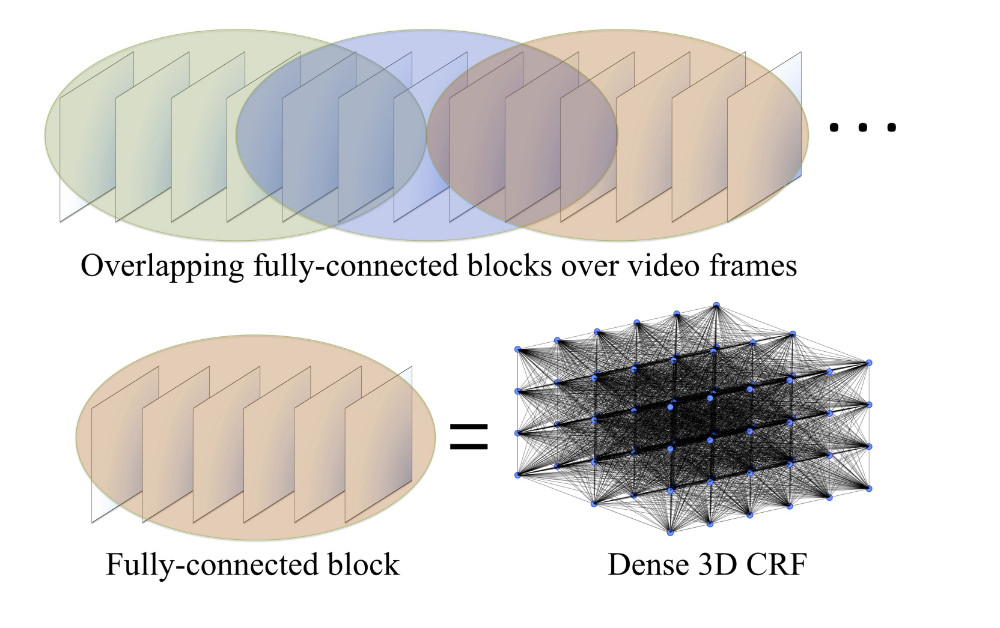

The video is covered by overlapping blocks. A dense CRF is defined over each block. Feature space optimization is performed within blocks. Structured prediction is performed over multiple blocks.

Each pixel in the video is identified by a vector &space;\in&space;\mathbb{R}^3). *b* i sthe block number, *t* is the frame number within block *b*, and *i* is the index of the pixel within the frame. The color of pixel **p** is denoted by  and the coordinates of pixel **P** is denoted by the . Let **P** be the set of pixels in the video.

Given pixel **p**, let  be a random variable with the domain , where state  is a label. The  will be a random field over **P** and let  be a label assignment. The random field  is characterized by Gibbs distribution }) and the corresponding Gibbs Energy }).

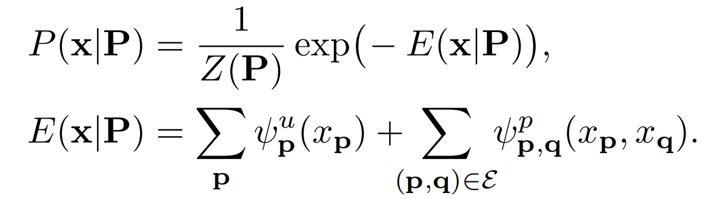

Here }=\sum_{x}\exp(-E\mathbf{(x|P)})) is the partition function and  is a neighborhood structure defined on pairs of variables. The neighborhood structure is a union of cliques: each block is covered by a clique, each pixel is covered by two blocks, and each variable is correspondingly covered by two fully-connected subgraphs in the random field. Our goal is to find a label assignment that minimizes the Gibbs energy.

The first term in the energy equation specifies the cost of assigning label to pixel. The second term couple pairs of variables and penalize the inconsistent labeling. These terms are defined using Gaussian kernels

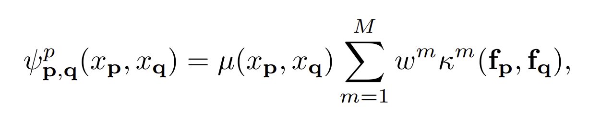

where the first term is a label compatibility term and the *w* are the mixture weights. *f* are the features associated with label respect to the pixel **p** and **q**. Each kernel has the following form:

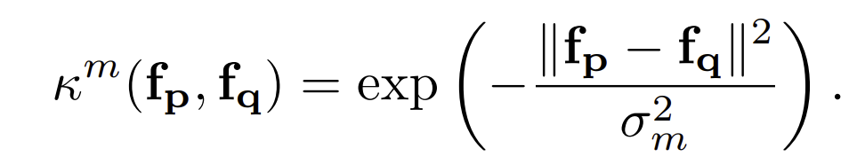

Given a point, the feature is a vector in a D-dimensional feature space. A natural feature space for semantic video segmentation is six-dimensional and combines time, color, and posistions : )

# Feature Space Optimization

A key difficulty of applying feature-sensitive models to space-time video volume is that both the camera nad the object may be in motion and can carry corresponding pixels apart. The natural six-dimensional feature space yields a distance measure that does not appropriately model spatio-temporal correspondence.

The paper's approach involves optimizing a subspace of feature space to reduce Euclidean distance between corresponding points while adhering to regularization terms that aim to preserve object shapes. The feature mapping ) is replaced by ).

Lets define the block *b* consist of . *T* is the number of frams in the block. *N* is the number of pixels in each frame. The optimization objective is defined as:

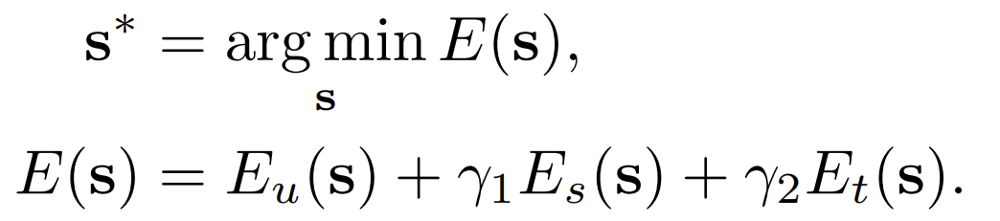

**s** are the position features for all pixels in the block, and **s*** are the optimal features.

### Data Term

The data term prevents the feature space embedding from drifting or collapsing under the strenth of the regularization terms. The middle frame in the block is used as an anchor. Let  be the frame number of the anchor frame.  Let  be the set of pixels in frame a.

The data term ensures that points in the anchor frame do not drift far from their natural positions:

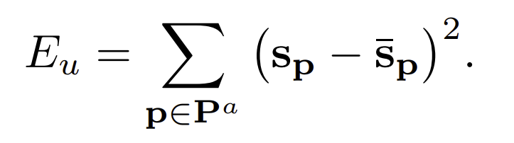

 is the unoptimized natural feature space.

### Spatial regularization term

The spatial regularizaer preserves the shpaes within color boundaries and detected contours. The regularizer is anisotropic second-order regularization over the 4-connected pixel grid.

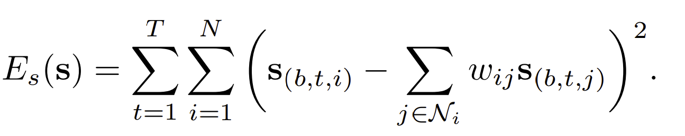

 is the set of neighbors of point ). The weight reduce the effect of neihboring pixel's value.

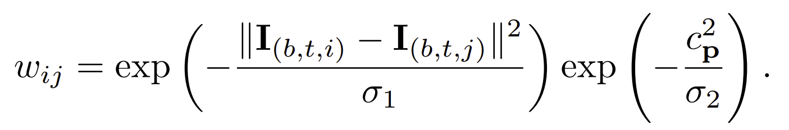

The first factor is based on the color difference between two pixel.. The second fector is based on the contour strength. The contour strength is calculated using structured forest such that the the value is between 0 and 1. Then the contour strength is 1 the pixel is at the boundary.

### Temporal regularization term

The temporal regularizer ulls correspondeing points in different frams to assume similar positions in feature space

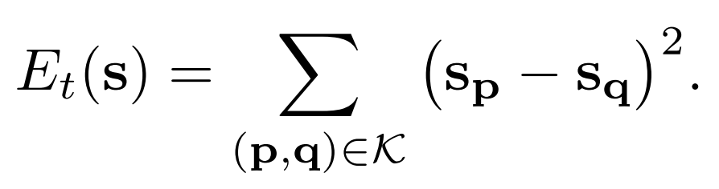

The term minimizes distance between corresponding points. *K* is the collection of correspondence pair where, **p** and **q** are established via optical flow and long term tracks.

### Optimization

Optimize the iobjective using the biconjugate gradient stabilized method with algebraic multigrid preconditioning.

# Inference

Inferenece is performed by an extension of the mean-field inference algorithm introduced by Krahenbuhl and Koltun [Link](https://arxiv.org/pdf/1210.5644.pdf). The model is a collection of overlapping cliques and is different from the fully-connected model considered by Krahenbuhl and Koltun.

Define a distribution Q that approximates the true distribution P, where similarity between distributions is measured by the KL-divergence, assuming Q factorizes over the individual variables: =\prod_{\mathbf{x}}{Q_{\mathbf{p}}(x_\mathbf{p})}). The *Q* is a distribution over the random variable. The mean-field updates have the following form:

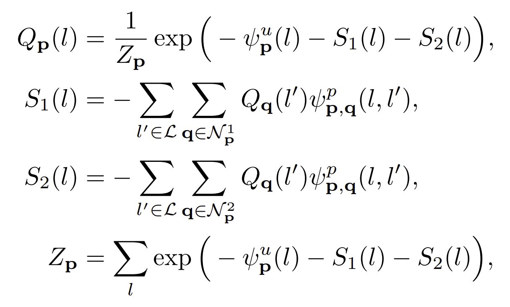

The  and  are the sets of neighbors of **P** in the two blocks that cover p. The updates can be performed efficiently using Gaussian filtering in feature space. Labeling can be obtained by assigning })

When the video length is large to fit in the memory, video can be splitted into chuncks of consecutive blocks. Consider two overlapping blocks b1 and b2, b1 is the last block in one chunk and b2 is the first block in the next chunck. Let Q1 and Q2 be the distribution produced by mean-field inference for these blocks in their repective chunks. Let [t1, t2] be the overlap region. Let Qt be the sought-after distribution for frame t in [t1,t2] and let Q1,t and Q2,t be the corresponding slices of Q1 and Q2. The transition between chunks with simple linear interpolation :

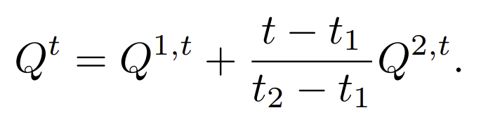

# Implementation

The paper used two different unary potentials. The first is the TextonBoost Classifier. The second is a convolutional network refered to as Dilation unary [Link](https://arxiv.org/pdf/1511.07122.pdf).

In all experiments, optimal flow is computed by LDOF. Controlled experiment with Discrete Flofw is conducted to evaluate the influence of the input flow. Long-term track are computed using the approach of Sundaram et al. CRF parameters are optimized using grid search on a subset of the validation set.

The video is decomposed in the block using long-term track, when the half of the tracks in the frame are not present at the beginning of the block. This increase the internal coherence of each block. When half of the image is new compared to the first image, we update the block.
