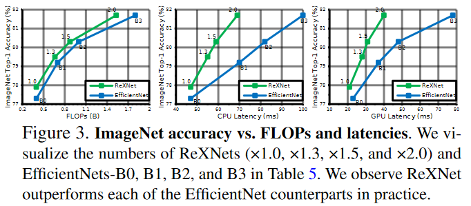

# [Rethinking Channel Dimensions for Efficient Model Design](https://arxiv.org/pdf/2007.00992.pdf)

연산량이 제한 된 모델을 만드는 것은 상당히 어렵습니다. 이 논문에서 저자는 현제 나와 있는 인공신경망들의 정확도가 design convention에 의해서 제한 된다고 이야기합니다. 이 논문을 통해서 저자는 정확도를 올리는 design에 대하여서 설명합니다. 

# Introduction

가벼운 인공신경망을 설계하는 것은 연구자와 실무자 모두에게 중요한 일입니다. 유명한 인공신경망들은 비슷한 설계전략을 사용합니다. Low-dimension의 입력값을 class의 개수보다 더 많은 수의 channel을 가지도록 증폭시킵니다. 가벼운 인공신경망은 이러한 전략에 bottleneck을 결합시켜, 연산 효율을 올립니다. 대체적으로 대부분의 네트워크들은 low-dimension에서 시작해 high-dimension으로 증가시키는 방향으로 만들어집니다. **아래에 있는 이미지를 확인하세요**

위에서 표기된 channel configuration은 MobileNetV2(../MobileNet/Korean/V2/)에서 확인 할 수 있습니다. 이러한 channel dimension의 설계방식은 가벼운 인공신경망의 설계의 토대가 되었습니다. 인공신경망 구조 검색(Network Architecture Search(NAS))방식의 인공신경망들도 이러한 channel 설계방식을 기반으로 약간의 병형을 통해서 만들어졌습니다. 그리고 대부분의 검색은 인공신경망을 구성하는 building block에 한정되었습니다.

저자는 현제 compact한 인공신경망의 channel 구조가 표현력을 제한 한다고 추론하였습니다. 이는 compact한 신경망이 FLOP-효율성에만 집중하기 때문이라고 표현합니다. 이를 통해서 저자는 더 효과적인 구성이 있을 것이라고 예측합니다.

저자는 정확도의 향상을 얻을 수 있는 가벼운 인공신겸망의 효과적인 channel configuration에 대해서 연구합니다. 레이어의 표현력은 출력 행렬의 계수(Rank)에 의해서 표현된다는 가정을 기반으로, 저자는 위에서 이야기한 channel configuration 보다 더 높은 정확도를 가진 channel configuration을 탐색하였습니다. 

이 논문은 아래와 같은 정보들을 가지고 있습니다.

1. 레이어의 설계
2. Channel configuration을 위한 효과적이고 간단한 parameterization 인공신경망 구조의 탐색
3. 제안된 인공신경망의 ImageNet에 관한 실험 결과
4. 이 인공신경망을 다른 작업에 전이한 결과.

# Related Work

AlexNet, VGG, GoogleNet, 그리고 ResNet가 나타난 이후로, 연산량이 적은 가벼운 인공신경망이 제안되었습니다. Depthwise Convolution이라는 새로운 연산자를 사용해서, 몇몇 인공신경망들은 효율적인 연산을 성취했스	ㅂ니다. Depthwise convolution은 많은 양의 훈련가능한 parameter 수를 줄였고, FLOPs 또한 상당히 줄였습니다. 인공신경망 탐색(NAS model)도 가벼운 인공신경망을 만들기 위해서 나온 것입니다. 인공신경망의 넓이 깊이 그리고 해상도를 조절하는 EfficientNet는 최상의 결과를 만들어내는 인공신경망입니다.

이 논문에서는 inverted bottleneck의 효과적인 channel configuration을 찾는 것에 집중하고 있습니다. 이는 NASnet에서 building block을 찾는 것과는 다른 방식입니다.

# Designing an Expansion Layer

이 부분에서는 레이어의 표현력을 생각하면서 어떻게 레이어를 설계하는 방법을 연구합니다. 이는 전체 인공신경망을 설계하는데 가장 필수적인 것입니다.

## Preliminary

### Estimating the expresiveness

Softmax layer는 logit을 entire class probability로 바꾸는 것을 어려워 할 수 있습니다. 이는 Rank deficiency 때문입니다. 마지막 classifier의 입력값이 저차원인 것과, softmax에서 log-probability를 구할때 nonlinearlity가 사라는 것때문에 Rank deficiency가 일어난다고 했습니다. 이를 통해서 행렬의 표현력을 증가시키는 것이 인공신경망의 정확도의 향상을 얻을 수 있습니다. 이를 통해서 특정한 layer의 표현력을 조절한다면 인공신경망의 성능을 향상시킬수 있습니다. [이 논문에서 확인할 수 있습니다.](https://arxiv.org/pdf/1711.03953.pdf)

표현력을 추정하는 방법은 model compresison work에서 연구되었습니다. 논문에서는 인공신경망을 low-rank approximation을 통해서 레이어 레벨에서 압축하였습니다. 압축량은 각 feature 마다의 singular value를 연산하는 것으로 확인하였습니다. [이 논문에서 확인할 수 있습니다.](https://arxiv.org/pdf/1411.4229.pdf)

이 두가지 논문을 기반으로, 저자는 추론합니다. 행렬의 계수는 인공신경망의 표현력과 매우 관련이 있고, 이에 관해서 연구를 하는 것은 효과적인 layer의 설계 지침을 제공합니다.

### Layer Designs in practice

ResNet 계열의 인공신경망들은([1](../ResNet/Korean), [2](../ResNet/Korean/V2), [3](../ResNet/Korean/ResNext)) bottleneck block을 사용합니다. Bottleneck 구조는 입력 channel을 두배씩 늘려서 마지막 레이어의 channel의 수가 class의 갯수를 넘기는 것을 목표로 하였습니다. 이보다 더 효율적인 인공신경망들은, inverted bottlenck의 channel의 크기를 천천히 늘립니다. 또한 마지막에서 두번쩨 레이어에서는 channel dimension의 크기를 키워 사용합니다. Bottleneck과 Inverted Bottlenek 모두 미리 정해진 expansion ratio를 가진 convolutional expansion layer를 포함하고 있습니다.

저자는 다양한 인공신경망 모델에서 사용된 기본 구조에 대해서 의문을 가집니다. **여기서 사용된 기본구조의 레이어는 정확하게 설계가 되어있고, 새로운 인공신경망은 이러한 기본구조를 기반으로 만들면 되는 가?**

## Empirical Study

### Sketch of the Study

입력값의 dimension을 늘리는 expansion layer에 대한 고찰을 해보자.

이 실험은 rank ratio와 dimensio ratio 사이의 관계를 확인하는 실험입니다. 여기서 Rank는 일반적으로 입력값의 dimension에 의해 제한되어왔습니다. 하지만 non-linear 함수를 사용함에 따라 Rank는 입력값의 크기보다 더 커질 수 있습니다. 하지만 몇몇 인공신경망은 rank를 출력값의 dimension에 가깝게 만드는 것을 실패했습니다. 이는 feature가 fully utilized 되지 않는 것을 의미합니다. 이 연구는 ELU나 SiLU(Swish-1)등의 복잡한 non-linear 함수의 영향과, 가벼운 인공신경망을 설계할때 사용하는 방식에 관한 설명을 합니다.

### Materials

인공신경망을 구성하는 기본적인 구조를 다음과 같이 설정합니다.

1. 하나의  convolution 또는  convolution
2.  convolution 또는  depthwise convolution을 사용하는 inverted bottleneck

기본적인 구조는 다음과 같은 수식으로 표현할 수 있습니다.
Building blocks is presented by following equation:

) 여기서 weight 이고 입력값은 입니다.

이 수식에서 는 normalization(이 논문에서는 batch normaliztion)을 포함한 다양한 non-linear 함수를 의미합니다. 은 현실적인 값들을 사용하기 위해서 random하게 선택하였습니다. 은 ()가 의 값을 가지도록 비율적으로 조절하였습니다. 은 batch-size를 의미합니다. Batch size는 반드시 의 제한을 지킵니다.

기본적인 구조가 만들어졌다면, 각 인공신경망의 *rank ratio* ()/d_%7Bout%7D))를 계산한 후에 평균값을 찾습니다. Inverted bottleneck에서는 입력값의 크기는 첫번째 convolution의 입력값으로 계산하고, 출력값의 크기는 skip connection이 더해진 후의 출력값의 dimension을 기반으로 만들어졌습니다.

### Observations

위의 이미지가 rank의 변화를 입력 channel의 크기와 비교한 것입니다. Dimension ratio는 x출에 있고 이는 expansion ratio의 역수로 생각하면 됩니다.

위의 그래프를 통해서 여러가지를 알 수 있습니다.

1. **Channel 크기의 급격한 변화는 Rank가 감소합니다**
2. **Nonlinearities가 Rank를 증가시킵니다**
3. **Nonlinearities는 convolution에 사용하는 것이 중요합니다.**

### What we learn from the observations

위에서 관찰한 것을 기반으로, 3가지 중요한 설계 원칙을 배울 수 있습니다.

1. Inverted Bottleneck 구조에서 첫번째  convolution의 expansion ratio는 6이하의 값을 사용해야 합니다. 
2. Depthwise convolution을 사용하는 Inverted Bottleneck은 channel dimension ratio가 높은 것을 사용해야 합니다.
3. 복잡한 nonlinerlity(ELU, SiLU)는  convolution or  convolution뒤에 사용되어야 합니다.

### Verificaiton of the study

위에서 설명하는 이점을 확인하기 위해서 실험을 설계했습니다. 실험에 사용한 인공신경망은, 2개의 Inverted Bottleneck을 사용했고, Dimension ratio와 the first  convolutions in each IB 를 변경하였습니다. 처음으로는 expansion ratio를 20에서 6으로 줄였습니다. 다음으로는 DRfmf .22 에서 .8로 증가시켰습니다. 마지막으로는 ReLU6를 SiLU로 바꾸었습니다.

위의 표에서 나타난 결과값을 확인하면, 새로운 변화를 줄때마다 정확도와 계수(Rank)가 증가하는 것을 볼 수 있습니다.

# Designing with Channel Configuration

## Problem Formulation

이 논문의 목표는 제한적인 연산량에서 효과적인 Channel Configuration을 찾는 것입니다. 이 문제는 아래와 같이 표현될 수 있습니다.

),%5C:%5C:%5C:%5Ctextrm%7Bs.t.%20%20%7Dc_1%5Cleq%20c_2%5Cleq%5Ccdots%5Cleq%20c_%7Bd-1%7D%5Cleq%20c_d,%20%5Ctextrm%7BParams%7D(N)%20%5Cleq%20P,%20%5Ctextrm%7BFLOPs%7D(N)%5Cleq%20F)

여기서 함수 는 top-1정확도를 의미합니다. 는 i번째 block의 출력 channel의 크기를 의미합니다.  and 는 각각 parameter의 크기와 FLOPs를 의미합니다. Channel 크기는 단조롭게 증가합니다.

이 논문에서 inference latency대신에 FLOPs에 집중하는 이유는 범용성에 있습니다. 또한 NASNet과 비교를 했을 떄, NASNet이 channel 크기를 고정한 상태에서 Network를 찾았다면, 이 ReXNet은 Network의 크기를 고정시킨 상태에서 를 탐색합니다.

## Searching with channel parameterization

Channel dimension은 &plus;b)을 표현할 수 있습니다. 여기서 a와 b는 탐색해야 하는 값입니다. 여기서 )는 a piecewise linear function으로 )의 부분집합으로 에서 선택된 값입니다.

탐색은, NASNet과 비슷하게, CIFAR-10과 CIFAR-100에서 이루어졌습니다. 다른 값들을 제한하기 위해서, 다른 값들을 제한하였습니다. 또한 Expansion ratio 또한 6으로 고정하였습니다.

Optimization은 인공신경망의 탐색과 훈련을 통해서 구했습니다. 또한 하나의 모델은 각각 30epoch씩 훈련되었고, early stopping 또한 사용하여 빠른 훈련을 하게 만들었습니다. 한 인공신경망은 3번 훈련하였습니다. 이는 random initialization을 통해서 발생하는 정확도의 fluctuation을 잡기 위함입니다.

## Search Results

위의 그래프에서 보는 것처럼, 저자는 4가지 제한점을 준 상태에서 훈련을 하였습니다. 제한에 대한 자세한 설명은 위의 표를 참고해주시기 바람니다. 이러한 제한을 사용해서 상위 10%, 중간 10%, 하위 10%의 결과 값을 모았습니다.

Figure 2에서 보는 것처럼, channel dimension이 Linear 할 경우, 비슷한 연산량에서 더 높은 정확도를 가지고 있는 것을 볼 수 있습니다. 파란색 선은 위에서 설정된 일반적인 channel configuration과 비슷합니다. 이를 통해서 conventional configuration에서 이 논문에서 제시하는 channel configuration으로 바꿀 경우, 정확도의 향상이 있는 것을 확인 할 수 있습니다.

## Network Upgrade

현제 사용되고 있는 channel configuration의 관습을 소개한 MobileNetV2에 기반하여, 저자는 inverted bottleneck의 output channel의 크기만 parameterization을 기바능로 바꾸었습니다. Stem의 구조 또한  convolution with BatchNormalization and ReLU6) and inverted bottleneck with the expansion ratio 6로 똑같이 맞추어주었습니다. 하지만 차이점이 있다면, ReLU6를 SiLU로 바꾼것과, SE를 추가한 것입니다.

Section 3에서 확인한 실험 결과에 기반하여, 첮번째  convolution 뒤에 있는 ReLU6만 SiLU로 바꾸었습니다. Depthwise convolution은 Dimenison ratio가 1임으로 ReLU6를 바꾸지는 않았습니다.

# Experiment

## ImageNet Classificstion

### Training on ImageNet

인공신경망은 ImageNet data를 기반으로 훈련되었습니다. Data augmentation은 기본적인 것으로 적용했고, SGD와 mini-batch 512를 4개의 GPU에서 사용하였습니다. 이 ReXNet의 결과를 다른 것과 비교한 표는 아레에 표현되었습니다.

위의 표에서 확인한 결과 ReXNet이 가장 높은 정확도를 가진 것을 확인 할 수 있습니다.

### Comparison with Efficientnets

ReXNet과 EfficientNet을 scalability에 관해서 비교한 것입니다.

이 표의 그래프는 아레에 표현되었습니다.

둘을 비교한 결과 ReXNet이 대체로 더 정확하고 latency는 물론 FLOPs도 작은 것을 확인 할 수 있습니다.

## COCO object detection

### Training SSDLite

ReXNet을 기반으로 object detection을 실행한 결과입니다. ReXNet에 SSDLite를 사용한 것입니다.

### Training Faster RCNN

ReXNet에 RCNN을 추가하여 성능을 확인 한 것입니다.

## Fine-grained classification

다양한 데이터셋에서 ImageNet에서 구한 모델을 기반으로 찾은 결과입니다.

## COCO Instance Segmentation

Mask RCNN 을 사용해 ReXNets의 instance segmentation에 대한 성능을 확인한 것입니다..

# Discussion

### Fixing network depth and searching models

Linear channel parameterization을 다양한 제한 상황에서 탐색한 것입니다. 인공신경망의 크기를 18과 30으로 고정한 다음 FLOPs에 다양한 성능의 제한을 준 것입니다. 위의 이미지에서 확인 할 수 있다싶이, channel의 크기가 linear하게 증가하는 것을 확인 할 수 있습니다. 이를 통해서 관례처럼 사용되던 channel configuration보다 높은 성능을 가지고 있는 것을 학인 할 수 있습니다.

## Link to NeuralNet(../../)
## Link to English Version(../)