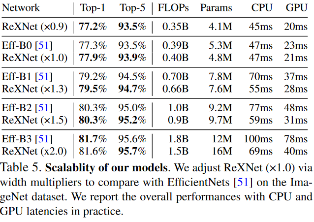
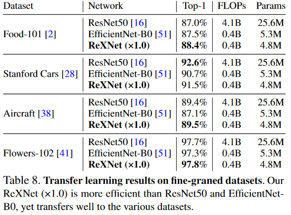
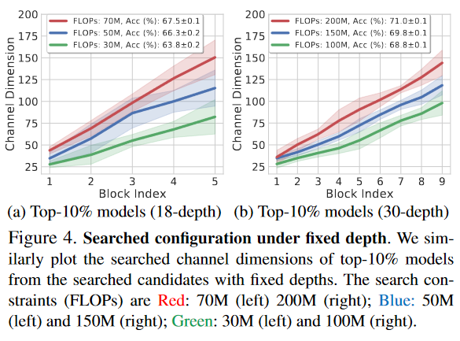

# [Rethinking Channel Dimensions for Efficient Model Design](https://arxiv.org/pdf/2007.00992.pdf)

Designing an efficient model within limited computational cost is challenging. Author argues the accuracy of a lightweight model has been further limited by the design conventions.

# Introduction

Designing a lightweight network architecture is crucial for both researcher and practitioners. Popular network share similar strategy where a low-dimensional input-channel is expanded by a few channel expansion layers toward surpassing the number of classes. Lightweight models also follow this strategies with some shrinking channels for computational efficiency. In general, the network start with low dimension then grows toward larger dimension. **see table below**

This Channel configuration was introduced by [MobileNetV2](../MobileNet/V2/) and became the design convention of configuring channel dimensions in lightweight networks. Even network architecture search (NAS)-based models were designed upon the convention or little more exploration within few option near the configuration and focused on searching building blocks.

Author hypothesized that compact model designed by the conventional channel configuration may be limited in the expressive power due to mainly focusing on flop-efficiency; there would exist a more effective configuration over the traditional one.

Author investigate an effective channel configuration of a lightweight network with additional accuracy gain. Upon Assumption that the expressiveness of a layer can be estimated by the matrix rank of the output feature, author search network architectures to identify the channel configuration yielding a better accuracy over the aforementioned convention. 

This paper contains following information:

1. Designing a single layer
2. a network architecture exploration concerning the channel configuration towards a simple yet effective parameterization
3. using proposed model to achieve remarkable results on ImageNet outperformed recent lightweight models including NAS-based models
4. Transfering trained model to different tasks, indicating high expressiveness of the model.

# Related Work

After appearance of AlexNet, VGG, GoogleNet and ResNet, lighter models have been proposed with lower computational budgets. Using new operator depthwise convolution, several architecture have been proposed with futher efficent architecture designs. Depthwise convolution reduces a large amount of trainable parameters and significant FLOPS reduction. Structured network architecture search(NAS) methods have been proposed to yield the lightweight models. EfficientNet, based on compound scaling of width, depth, and resolution, became a de facto state-of-art model.

This paper focus on finding an effective channel configuration for an inverted bottleneck module, which is an alternative to searching building blocks.

# Designing an Expansion Layer

This section explores how to design a layer properly considering the expressiveness, which is essential to design an entire network architecture.

## Preliminary

### Estimating the expresiveness

The softmax layer may suffer from turning the logits to the entire class probability due to the rank deficiency because of the low input dimensionality of the final classifier and the vanished nonlinearlity at the softmax layer when computing the log-probability. Enhancing the expresiveness improves the model accuracy. This implies that a network can be improved by dealing with the lack of expressiveness at certain layers. [Link to paper](https://arxiv.org/pdf/1711.03953.pdf)

Estimating the expressiveness was studied in a model compression work. The paper compressed a model at layer-level by a low-rank approximateion; investigated the amount of compression by computing the singular values of each feature. [Link to paper](https://arxiv.org/pdf/1411.4229.pdf)

Inspired by these two papers, Author conjecture that the rank may be closely related to the expressiveness of a network and studying it may provide an effective layer design guide.

### Layer Designs in practice

 ResNet Families ([1](../ResNet), [2](../ResNet/V2), [3](../ResNet/ResNext)) have bottleneck blocks doubling the input channel dimensions to make the final dimension above the number of classes at last. The efficient models increase the channel dimensions steadily in inverted bottlenecks, involving a large expansion layer at the penultimate layer. Both bottleneck and inverted bottleneck block have the convolutional expansion layer with the predefined expansion ratio.

Author propose a question about the building block used in many different network models. **Are these layers designed correctly and just need to design a new model accordingly?**

## Empirical Study

### Sketch of the Study

Lets first explore the design guide of a single expansion layer that expands the input dimension.

This experiment explores the trend between the rank ratio and the dimension ratio. The rank is originally bounded to the input dimension, but the subsequenct non-linear function will increase the rank above the input dimensions. However, a certain network fails to expand the rank close to the output dimensions and the feature will not be fully utilized. The study uncovers the effect of complicated nonlinear functions such as ELU and SiLU(Swish-1) and where to use them when designing lightweight models.

### Materials

Generate a network with the building block consists of

1. a single  convolution or  convolution
2. an inverted bottleneck block with a  convolution or  depthwise convolution

Building blocks is presented by following equation:

) where weight  and the input 

From this equation,  denotes different kinds of nonlinear function with normalization(in this paper used Batch Normalziation).  is randomly sampled to realize a random-sized network.  is proportionally adjusted for each channel dimension ratio() in the range .  denotes the batch-size, where .

After the building block is calculated, author computes the *rank ratio* ()/d_%7Bout%7D)) for each model and average them. For inverted bottleneck, input and output is assumed to be the input of the first convolution and output after the addition operation of the shortcut.

### Observations

Above image represents the rank changes with respect to the input channel dimension on average. Dimension ratio is on x axis is reciprocal of expansion ratio.

From the figure, we observe the following:

1. **Drastic Channel expansion harms the rank**
2. **Nonlinearities expand rank**
3. **Nonlinearities are critical for convolutions**

### What we learn from the observations

1. an inverted bottleneck is needed to design with the expansion ratio of 6 or smaller values at the first  convolution
2. each inverted bottleneck with a depthwise convolution in a lightweight model needs a higher channel dimension ratio
3. a complicated nonlinearity such as ELU and SiLU needs to be placed after  convolution or  convolution

### Verificaiton of the study

Author provide experimental backup to support current idea. The model trained in this paper consists of two inverted bottlenecks to ajust dimension ratio of IBs and the first  convolutions in each IB. Starting from the baseline with the low DR 1/20. Modified by increasing DR of the first  convolution to 1/6; 2) increasing DR at every IB from .22 to .8; 3) replacing the first ReLU6 with SiLU in each IB.

The above table presents the result. As each factor is included the rank and the accuracy increase together.

# Designing with Channel Configuration

## Problem Formulation

The goal of this paper is to reveal an effective channel configuration of designing a network under the computational demands. This problem can be formulated by following:

),%5C:%5C:%5C:%5Ctextrm%7Bs.t.%20%20%7Dc_1%5Cleq%20c_2%5Cleq%5Ccdots%5Cleq%20c_%7Bd-1%7D%5Cleq%20c_d,%20%5Ctextrm%7BParams%7D(N)%20%5Cleq%20P,%20%5Ctextrm%7BFLOPs%7D(N)%5Cleq%20F)

The funciton  denotes the top-1 accuracy of the model.  is ouput channel of i-th block among d building blocks.  and  each denotes parameter size and FLOPs. The channel dimension is monotonically increasing as denoted in Table 1(Image in the Introduction). 

In this paper, author consider FLOPs rather than inference latency because of it's generality. Moreover, compared to NASnet, which finds Network with fixed channel width, this model search for  while fixing the Network.

## Searching with channel parameterization

Parameterized channel dimensions as &plus;b), where a and b are to be searched. ) is a piecewise linear function by picking a subset of ) up from . 

The search is done on CIFAR-10 and CIFAR-100 data as done in NAS methods. To control the variables, other is set to have fixed channels. Also expansion ratio for the bottleneck layer is fixed to 6.

Optimization is done alternatively by searching and training a network. Each model searched is trained for 30 epochs for faster training and early stopping strategy. Each training is repeated three times for averaging accuracy to reduce the accuracy fluctuation caused by random initialization.

## Search Results

As shown in the image, in this paper, author searched for four different constraints described in the Table 3. From these constrains, author collected top-10%, middle-10%, and bottom-10% to compare the model interms of accuacy.

From the Figure 2, author have found that linear parameterization has higher accuracy rates while maintatining similar compuational costs. The Blue line is similar to the conventional configuration described in the Table 1. Though this experiment, we must select new channel configuration rather than conventional channel configuration.

## Network Upgrade

From the baseline MobileNetV2 which introduced the convention of channel confoiguration, the author only reassigned output channel dimension of inverted bottlenecks by following the parameterization. The design schemetic is similar to the MobileNetV2. Using same stem( convolution with BatchNormalization and ReLU6) and inverted bottleneck with the expansion ratio 6. Same large expansion layer at the penulimate layer. After replacing ReLU6 with SiLU, adopted SE in the inverted Bottlenecks

Based on the experiment found above at section 3, ReLU 6 is replaced only after the first  convolution in each inverted bottleneck. Depthwise convolution has dimension ratio of 1 thus does not replace ReLU6.

# Experiment

## ImageNet Classificstion

### Training on ImageNet

The model is trained on ImageNet dataset using standard data augmentation and Stocastic Gradient Descent and mini batch size of 512 on four GPUs. The result of this Network with comparison is shown in the table below.

Looking at the table, ReXNet have the highest accuracy among the model searched by NAS.

### Comparison with Efficientnets

Comparing with ReXNet and EfficientNets about model scalability with performances.

The graph version of above table is presented below.

Comparing EfficiencyNet and ReXNet, ReXNet is generally more accurate and have lower latency.

## COCO object detection

### Training SSDLite

Using the ReXNet backbone through object detection on the COCO dataset in SSDLite.

### Training Faster RCNN

Adopted RCNN to explore maximal performance of ReXNet.

## Fine-grained classification

Finetune the ImageNet-pretrained models on the datasets Food-101, Stanford Cars, FGVC Aircraft, and Oxford Flowers to verify the transferability.

## COCO Instance Segmentation

Use Mask RCNN to validate the performance of ReXNets on instance segmentation.

# Discussion

### Fixing network depth and searching models

Linear channel parameterization by searching for new models under different constraints. Fixing network depth as 18 and 30, and given constraints with FLOPS. Above image presents that linear channel configurations outperforms the conventional configuration for vairous computational demends.

## Link to NeuralNet(../)