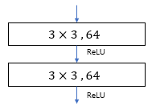
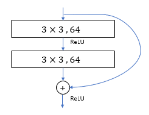

# [Deep residual learning for image recognition](https://arxiv.org/pdf/1512.03385.pdf)

인공신경망의 깊이가 깊어질수록 인공신경망을 훈련시키는 것에 대한 어려움을 해소하기 위해서 저자 Keiming He는 [Deep residual learning for image recognition](https://arxiv.org/pdf/1512.03385.pdf) 논문을 통해서  Residual Unit을 소개했습니다. 새로운 기반 기술인 Residual Unit은 인공신경망의 훈련을 쉽게 만들었습니다.

# Residual Network을 사용하는 이유

인공신경망의 훈련이 끝에 다가올때 degradation 문제가 발생합니다. 다른 말로는 gradient vanishing이라고 하는데, 인공신경망의 깊이가 깊어질수록, 미분값이 점차적으로 작아집니다. 그레서 출력값이 인공신경망의 wieght에 다른 영향력을 행사하지 못하는 것을 의미합니다.

저자의 말에 따르면, degradation은 overfitting이 아니며, 인공신경망의 깊이를 늘릴 수록, training error가 높아지는 것을 의미합니다.

# Deep Residual Learning이란?

## Residual Learning.

)를 인공신경망의 수식이라고 표현하자. 이때 )는 하나의 레이어이거나 혹은 여러가지 레이어들을 한 번에 표현한 것이라고 할 수 있다. 이때  는 이 레이어의 입력값이다.

우리가 만약 )의 근사값을 구할수 있다면, 이 함수에 대한 나머지 값도 구할수 있습니다. 그 값은 =H(x)-x)라고 표현합니다.

나머지값이 =H(x)-x)이고, 원래의 함수값이 ) 이니 이 두개의 식을 이용해서 우리는 원래 구하고자 했던 함수 값 =F(x)+x)를 구할 수 있습니다.

만약 )이 identity mapping 이라면, =x) 라고 가정을 한다면, )가 x 값을 가지게 만드는 것 보다는,  =0)으로 만드는 것이 더 쉬울 것이라는 직관에 따라서 만들어진 것입니다.

## Identity mapping by shortcuts
 
Residual Block은 +x)라는 수식으로 정의 된다. 이 수식에서 x는 입력값, y 는 출력값을 의미하며, )는 학습되어야 될 나머지 값이다.

이 Residual Block은 여러가지 방면으로 해석될 수 있는데, 위에서 적혀져 있던 기본적인 수식으로 나타내거나, &plus;W_s&space;\cdot&space;x)으로 나타낼 수 있는데 여기서  입력값과 출력값의 dimension을 맞춰 주는데 사용하고 있습니다..

그리고 )에서 는 여러가지 레이어를 포함할 수 있습니다.

예를 들어 만약 하나의 레이어를 사용한다고 가정한다면, 라는 식을 구할 수 있습니다.

그리고 만약 F(x)가 두개의 레이어를 사용한다고 하면 으로 표현할 수 있습니다.

## 인공신경망 구조

### 기본적인 신경망 구조

Plain network는 VGG networks를 기반으로 해서 만들어졌습니다. 기본적인 2개의 Rule은 아래에 표현되어 있습니다.

 1. 만약 입력과 출력의 Channel 수가 같다면, Convolution layer도 같은 filter의 수를 가진다.  
 2. 만약 필터의 사이즈가 반으로 줄어든다면, 필터의 갯수는 두배로 상승합니다. 이는 각 레이어당 time complexity를 동일하게 유지하기 위해서 입니다.

Downsampling은 convolutional layer 레이어에서 stride값을 2로 만들어 사용합니다.

### Residual Network

Plain network와 비교했을 때, residual network는 shortcut connects을 가집니다.

Identity shortcut는 입력과 출력의 dimension이 같을 때 사용합니다.

만약 출력값의 dimension이 상승한 경우, 두 가지 옵션을 사용해서 해결할수 있습니다.:
 1. identity mapping을 사용하고, 부족한 dimension은 0으로 padding 합니다.
 2. 위에 표기된 weight 값을 사용해서 projection을 통한 dimension matching을 해줍니다.

## 참조
https://m.blog.naver.com/laonple/221259295035  
https://sike6054.github.io/blog/paper/first-post/  
https://github.com/taki0112/ResNet-Tensorflow

## [Link to Neural Net](../../)
## [영문 버전으로](../)
## [ResNet 버전 2 로](./V2/)
## [ResNext](./ResNext/)