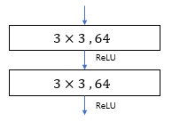

# [Deep residual learning for image recognition](https://arxiv.org/pdf/1512.03385.pdf)

Author of the paper [Deep residual learning for image recognition](https://arxiv.org/pdf/1512.03385.pdf) have introduced Residual Unit because deeper neural networks are more difficult to train. Thus presents a new framwork that makes training easier which is Residual Unit.

# Why residual Network

When deeper network converges, degradtion problem is emarged. In other word, gradient vanishing problem occurs. As layer increases the derivitive of the value decreases significantly, thus output has less or sometime have no effect on the weights.

Degradation is not caused by overfitting, and using more layers leads to higher training error.

# What is Deep Residual Learning.

## Residual Learning.

Let us consider ) as underlying mapping to be fit by a few stacked layers.  is an input of the layers.  

If we could approximate ), then we could also approximate the residual function which is =H(x)-x).

Since the residual function is =H(x)-x), original function ) should be calculated as =F(x)+x).

With the residual Learning reformulation, if the identity mapping is optimal, the solvers may simply derive the weights of the multiple non-linear layers to zero.

## Identity mapping by shortcuts

Residual Block is defined as +x). In this equation, x is input layer and y is output layer. ) is residual mapping to be learned.

There is a different way to define residual block. The equation is &plus;W_s&space;\cdot&space;x). Where  is used when matching dimensions.

Also for ),  could be multiple layers.

For example, if using single layer, equation would be .

If using two layers, equation would be .

## Network Architectures

### Plain Network

Plain network is inspired by the philosophy of VGG networks

 1. For the same output feature map size, the layers have the same number of filters.  
 2. If the feature map size is halved, the number of filter is doubled so as to preserve the time complexity per layer

Downsampling is done by using convolutional layer that have stride of 2

### Residual Network

Compared to Plain network, difference is that residual network have shortcut connects

Identity shortcut is inserted when input and output have same dimensions

When dimensions increase, consider two options:
 1. Using identity mapping with extra zero entried for increasing dimensions
 2. The projection shortcuts in equation 2, which is added weights for identity matrix. For example, 1x1 convolutions with stride 2 to match dimensions.

# Experiment

Experiment is done using CIFAR-10 and Tensorflow. Code is available in [GitHub Repository](https://github.com/SehwanHong/ResNet).

## Reference
https://m.blog.naver.com/laonple/221259295035  
https://sike6054.github.io/blog/paper/first-post/  
https://github.com/taki0112/ResNet-Tensorflow  

## [Link to Neural Net](../)
## [Link to ResNet version 2](./V2/)
## [Link to ResNeXt](./ResNext/)
## [Link to Korean Version](./Korean/)