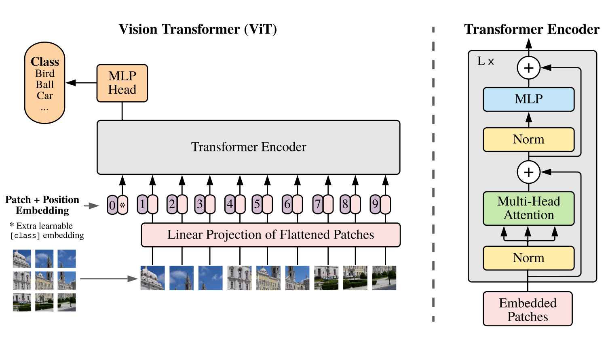
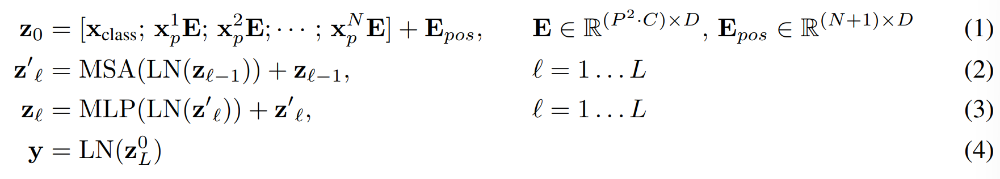

# [An Image is Worth 16x16 Words: Transformers for Iamge Recognition](https://arxiv.org/pdf/2010.11929.pdf)

Self-attention-based architectures, in particular Transformers, have become the model of choice in natural language processing. The dominant approach is to pretrain on a large text corpus and then fine-tune on a smaller task-specific dataset.

In computer vision, convolutional architecture remains dominant. Multiple works try combining CNN-like architetures with self-attention.In large-scale image recognition, classic ResNet like architecture are still state of art.

When trained on mid-sized datasets such as ImageNet without strong regularization, the model yield modest accuracies of a few percentage point below ResNets of comparable size. This is because Transformers lack some of the inductive biases inheret to CNNs. Therefore do not generalize well when trained on insufficient amounts of data.

If the models are trained on larger datasets (14M-300M images), Vision Transformer attains excellent results when pre-trained at sufficient scale and transferred to tasks with fewer data points. Through this, large scale training trumps inductive bias.

# Related Work.

Transformer have become the state of the art method in many NLP tasks. Large Transformer-based models are often pre-trained on large corpora and then fine-tuned for the task at hand.

Naive application of self-attention to image would require that each pixel attends to every other pixel. This does not scale to realistic input size. Many of specialized attention architecture demonstrate promissing results on computer vision task, but require complex engineering to be implemented efficiently on hardware accelerators.

Most Related to ViT is model of [Cordonnier et al(2020)](https://arxiv.org/pdf/1911.03584.pdf). The model extracts patches of size 2x2 from the input images and applies full self-attention on top.

There has been a lot of interest in combining convolutional neural networks with forms of self-attention or by further processing the output of a CNN using self-attention.

Image GPT(iGPT) applies Transformers to image pixels after reducing image resolution and color space. The model is trained in an unsupervised fashion as a generative model, and the resulting representation can then be fine-tuned or probed linearly for classification performcace.

The use of additional data sources allows to achieve state of the art results on standard benchmarks.

# Method

ViT follow the original Transformer as closely as possible.

## Vison Transformer (ViT)

The standard Transformer receives as input a 1D sequence of token embedding. To handle 2D images, the image is reshaped into a sequence of 2D Patches.

The Transfromer uses constant latent vector size D through all of its layers. Similarly, the patch is flattened and mapped into D dimensions with trainable linear projection. This is called patch embedding.

The models prepend a learnable embedding to the sequence of embedding patches. This patch serve as the image representation y. Both during pre-training and fine-tuning, a classificiation head is attached to the learnable embedding patch. The classification head is impleneted by MLP with one hidden layer at pre-training time and by a single linear layer at fine-tuning time.

Position embeddings are added to the patch embedding to retain positional information. Standard learnable 1D position embedding. The result sequence of embedding vectors serves as input to the encoder.

The Transformer encoder consist of alternating layers of multihead self-attention and MLP blocks. Layernorm is applied before every block, and residual connection after every block. and residual connection after every block.

The MLP contains two layers with a GELU non-linearity.

### Inductive bias

Vision Tranformer has much less image-specific inductive bias than CNNs. In Vit Only MLP layers are local and translationally equivariant, while the self-attention layers are global. The two-dimensional neighborhood structure is used very sparingly: in the beginning of the model by cutting the image into patches and at fine-tuning time for adjusting the position embedding for images of different resolution. The position embedding at initialization time carry no information about the 2D positions of the patches and all spatial relations between the patches have to be learned from scratch.

### Hybrid Architecture.

The input sequence can be formed from feature maps of a CNN. In this hybrid model, the patch embedding proejction is applied to patches extracted from a CNN feature map.

## Fine-Tuning and Higher Resolution

We pre-train ViT on large datasets, and fine-tune to (smaller) downstream tasks. The pre-trained prediction head is removed. Zero-initialized feed-forward layer is attached. It is often benefitial to fine-tune at higher resolution than pre-training.

When feeding images of higher resolution, we keep the patch size the same, which results in a larger effective sequence length.

The Vision Transformer can handle arbitrary sequence lengths. However, the pre-trained position embedding may no longer be meaningful. The model perform 2D interpolation of the pre-training position embeddings, according to their location in the original image. 

Note that this resolution adjustment and patch extraction are the only points at which an inductive bias about the 2D structure of the images is manually injected into the vision Transformer